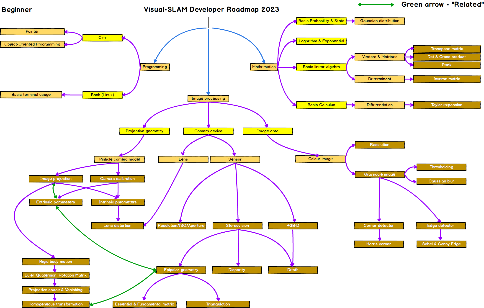
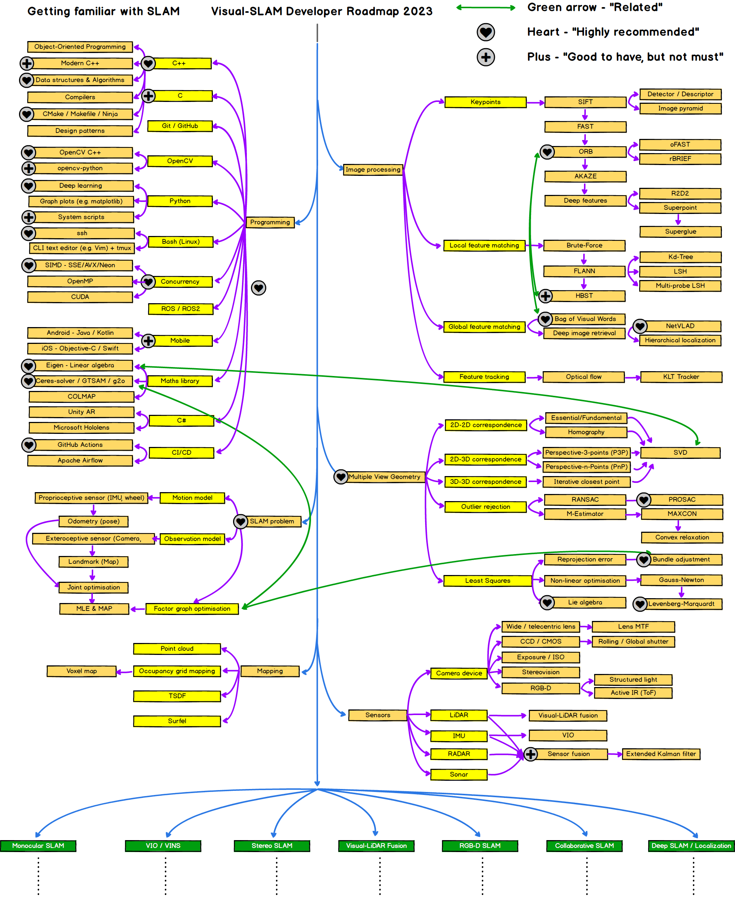

* this unordered seed list will be replaced by the toc
{:toc}

`참고로 이 글에 관련되서는 매일 또는 계속 Update 를 할 예정이다.`

## Problem

- 메모를 하지 않는다. (죽이 됬든 밥이됬든 메모를 할수 있는 방식은 여러가지이다.)
- 메모를 하지 않고, 머리속으로만 생각하고 쉽게 잊어버린다.
- 어떤 일들을 그냥 쉽게 생각해버리는 경향이 있다.
- 최근에 인터뷰를 보면서, 나는 뛰어나다라는 근거없는 자신감으로 밀어 붙였던것 같다.
- 그리고 마지막으로 나는 Domain 지식만 쌓고 있는중, 이거할까 저거 할까에 대한 생각을 너무 많이 썻기때문에, 굉장히 지치고 어떤걸 먼저 시작해야될지의 방향성을 잘모르는것 같다.

## 해결할수 있는 방법 & 더 좋은 Software Engineer 로 거듭나는 방법

- 메모를 하고 정리를 해보는 버릇을 가져보자.
- 내가 습득할수 있는 내용들을 정리해보고, 이해해보자.
- Communication 을 하려면, Listen carefully and meticulously.
- 처음에는 오래걸리는게 당연하다라고 생각하고, 덤벼라. 나중에는 더큰게 온다.
- 꼼꼼해져라, 남들처럼 쉬운길이 있다고, 남들의 길을 밟지말자. 쉬운길도 혼자서 하는 습관을 들자.
  - Reinventing the wheel is very important as just making a wheel.
  
## Careerwise Simple Plan

### Computer Vision

이러한 상황을 봤을때, 확실한 Roadmap 이 필요하다.

`어떤한 영상이 들어왔다고 하자!` 할수 있는걸 생각을 해보자

1. 영상이 들어왔다면, 영상을 처리하는 방식 또는 매 Frame 당 처리를 할 수 있어야된다.
   - Image 처리 및 영상 처리 (Filter 및 Edge Detection)
   - 고전적인 Methods

2. 영상이 들어왔다면, 컴퓨터 비전을 통해서 고급적인 묘사를 하고, 컴퓨터 그래픽스로 다시 영상을 보여준다.
   - Rendering 기술
     - Ray Tracing (기초)
     - Rasterization
     - Neural Rendering 및 Deep Learning 을 사용한 Rendering 기술

3. 영상이 들어왔다면, 어떻게 Pattern 인식으로 할건지에 관한 문제.

모든건 다할수 없다. 하지만 구현이 가능한것과 Domain 지식을 어떻게 이해하고 넘어갈지에 관해서 생각을 그려볼 필요가 있다.

아래의 그림을 한번 참고 할 필요가 있고, 어떠한 부분을 정확하게 알고 있는지에 대해서 Check 할 필요가 있다. 모든걸 Deep 하게 알 필요는 없다 하지만 Core 부분에 대해서는 알고 넘어가자.

<figure>
  
</figure>

여기에서 내가 채워나가야할 부부은 Image Processing 안에 Projective Geometry 와 Camera Device 이다. Image Data 같은 경우 이미 대학원때 많이 했었던 부분이다. 그럼 여기에서 정리해야될 부분을, TODO 처럼 적어나간다.

- Projective Geometry
  - Pinhol Camera Model
    - Intrinsic Parameters : Pinhole Camera Model, 내부에 의한 parameter (주로 Correction 을 할때 사용)
    - Extrinsic Parameters : Pinhole Camera Model, 외부에 의한 parameter (주로 Correction 을 할때 사용)
    - Image Projection
      - Orthgraphic Projection              (***)
      - Perspective Projection              (***)
      - Rigid Body Motion                   (- )
      - Euler, Quaternion, Rotation Matrix  (**)
      - Projective Space & Vanishing        (**)
      - Homogeneous Transformation          (**)
    - Lens Distortion
  - Sensor
    - Resolution/ISO/Aperature              (- )
    - Streovision                           (* )
      - Epipolar Geometry                   (- )
        - Essential & Fundamental Matrix    (- )
        - Triangulation                     (- )
      - Disparity                           (* )

<figure>
  
</figure>

### Computer Graphics

Computer 로 결국 어떠한 물체를 묘사를 하려고 한다고 한다면 어떤것들이 필요할까에 대한 생각이 필요하다.

- Computer Graphics #1
  - Ray Tracing
  - Rasterization
  - Graphics Pipeline
  - Sampling
  - Shader -> Rendering Equation / Refelection(Diffuse / Specular)
  - Visual Perception
  - Computer Animation
  - Tone Reproduction
  - Mapping -> Texture / Bump / Parallax / Horizon

- Computer Graphics #2
  - Lighting and Shadow
    - Shadow Map (2D / Cube / Cascade)
    - Stensil Shadow
    - Light Source (Directional Light / Point Light / Spot light)

  - Visibility and Occlusion
    - Occluder (Fog)
    - Culling -> Frustrum / Light / Shadow

- Advanced Rendering # 1
  - Decal
  - Billboard -> Spherical / Cylindrical / Polyboard
  - Structure Buffer
  - Volumetric Effect
  - Ambient Occulusion
  - Isosurface Extraction -> Marching Cube

- Advanced Rendering # 2
  - Real Time Ray Tracing
    - DirectX Ray Tracing
    - Vulkan Ray Tracing
  - Physical-Based Rendering
    - Translucency and Tranceparency
    - Metallicity

- Linear Algebra
  - Image Projection
  - Coordinates Systems & Transform.
  - Affine Space / Affine Transform
  - Eular Angle / Quaternion
  - Curve -> Spline -> Bezier / Cotmuli-Rom / Hermite

이 이후에는 Graphics 에 사용되는 Library

- Eigen
- Vulkan
- Boost
- DirectX11 / DirectX12 (SimpleMath -> DirectX Math Library)

- Deep Learning
  - Sampling 기법
  - Neural Rendering 에 대한 이해

### Software Engineer

- Bash Script
- CMake / Makefile /Ninja
- Design Pattern
- Compilers
- Algorithms

### Resource
- [Visual SLAM Roadmap](https://github.com/changh95/visual-slam-roadmap/tree/main)

### 해야할 일 // 6/22/2023

- Udacity Lidar 에 관련된 부분 정리하기
- sfm 간략하게 공부
  - Camera Intrinsic / Extrinsic / Calibration

### 해야할 일 // 6/23/2023

- Cy

### 해야할 일

- Udacity - Intro to self-driving cars 결제 해서 나중에 ***
- Scenario Runner 개발 보고서 (3-5)
- SLAM 에서 공부했었던거 Deep Learning 이라들지 잘준비해서
- 과거에 했던걸 Deep Learning Projects 및 OS project
- ROS 해서 했었던거 다시 한번 봐보기
- Game Engine 만들기
- Computer Vision 강의 듣기
- RANSAC 알고리즘
- Sfm (Structure from Motion) 에 대해서 공부하고, 이해한 이후에 구현
- Calibration