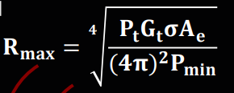
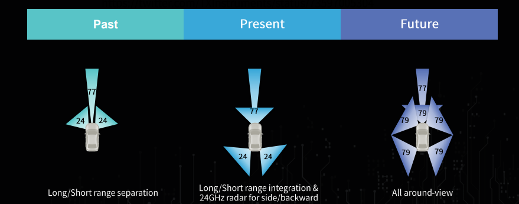
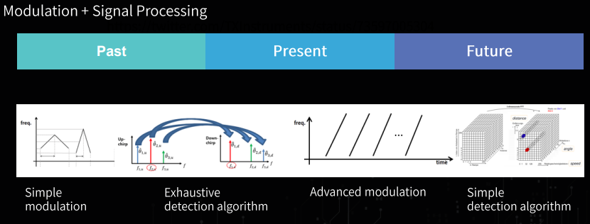
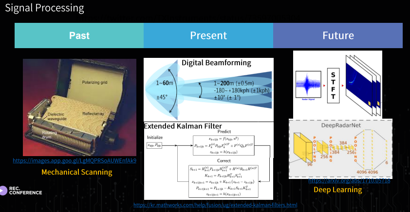
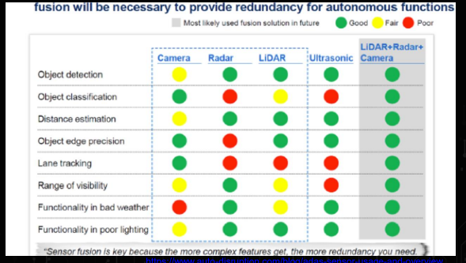

* this unordered seed list will be replaced by the toc
{:toc}

## 강의 내용 및 후기

사실 나는 자율 주행과는 조금 가깝지도 멀지도 않은 직종에서 Simulator 와 그의 부가 되는 내용들을 개발을 하고 있다. 물론 실제 차량에 쓸수 있을지는 전혀 알지도 모르고, on-time 으로 뭔가를 할수 있다는것과도 거리가 멀지만, Autonomous Vehicle Simulator 이기에 또 가깝기도 하다. 그래서 뭔가 개요? Perception 에 대한 대체적인 것 들을 배우기 위해서 이 강의를 듣게 됬다. 그리고 SOS Lab 의 이용이님과 bitsensing 이재은, Seoul Robotics 의 이한빈님들의 알려주는 이야기를 짧게 또는 개요를 듣고 싶어서, 이 강의를 선택하게 되었다.

대부분의 이야기는 Perception 에 살짝 치우쳐져 있다는 느낌이 있었고, 인지 부터 시작해서 제어까지의 총 통틀어 하나로 나오는 Fullstack 은 어떻게 진행하고 있는지와 그리고 자율 주행에서의 큰 문제점을 어떻게 해결할지 (Perception Module 에서 부터 센서 퓨전 한 이후에 Command 까지 보내주는데에 있어서의 Latency 를 줄여야한다.) 등을 이야기 했고, Data-Driven 이 rule-based 보다 좋을수 밖에 없다라는 말도 조금 받아들이기는 쉽지 않았다.

일단 센서의 종류 부터 보자면, 아래와 같다. 딱히 HDmap 은 센서의 종류라고 말은 할수 없지만, 또 자율주행에 있어서 빼놓을수 없는 것이다.

* Camera
* Lidar
* Radar
* GPS / IMU
* Hdmap

즉, 자율 주행 자동차가 주변 환경을 인지해 주행에 필요한 정보들을 획득 및 취득하고, 그리고 이렇게 다양한 센서가 필요한 이유는 각 센서별로의 장단점이 있기 때문이다.

### GPS

* 차량의 위치를 위성으로 부터 지구 좌표계의 절대 위치 정보(lat, long, altitude)를 받아온다.
* 1 ~ 10 HZ 의 느린 주기를 가지고 있다.
* 지하 / 터널 / 도심등에서 음영 지역이 발생한다.(***)
* 일반적인 GPS 는 수 m 오차가 있으므로, 자율주행에서는 부적합하다. (DGPS, GPS-RTK 사용)

(***) GPS 의 단점이므로 이걸 해결하기 위해서는 IMU 의 센서가 보완할수 있게 이용된다.

### IMU

* 결국엔 차량의 위치를 절대적 좌표만으로 볼수 없기 때문에, 차량의 가속도, 각속도, 지자기 를 측정해서 자기의 위치를 판단할수 있게 한다.
* 200 HZ 이상의 빠른 주기 이다.
* 추측 항법을 통해 이동 거리 및 방향 추정 가능
* 외부 환경에 대해서 강건하나, 시간에 따른 누적 오차가 발생한다.

### HD Maps (센서 X) 

* IMU 와 GPS 들의 단점을 마지막 매칭하기 위해서, 자율 주행 차량이 필요한 도로 정보를 정밀하기 기록 되어있늕 지도
* 도로 규칙이나 도로의 형상, 교통 정보, 센서 데이터등이 포함도니다.

### Camera 

* 개체 인지 및 위치 추정에 활용
* 풍부한 텍스처 정보를 포함
* 30 ~ 60 HZ 의 빠른주기 
* HD 급 카메라를 다수 장착해 FOV (Field of View) 확보.
* 조명 환경 변화에 취약, 정확한 깊이 추정 불가 (***)

### RADAR

* 장애물 회피 및 충돌 감지에 활용
* 전자기파를 이용해 측정한 거리, 속도 정보를 제공
* 근거리와 원거리에 대해 모두 측정가능
* 눈, 비 조명 등 외부 환경에 강건
* 작은 물체 측정에 취약, 낮은 해상도. (4D Imaging RADAR 로 발전해 가는중)

### LiDAR

* 개체 인지 및 위치 추정에 활용
* 레이저를 이용해 고해상도의 정확한 3차원 거리 정보 제공
* 10 ~ 20 Hz 의 주기
* 대상체에 대한 반사도 정보 제공 
* 조명 환경 변화에 강건
* 눈, 비, 안개 등 약천후에 민감하고, 높은 비용

위와 같은 센서를 이용해서 하나의 모듈을 같이 쓰기도 하고, 다같이 쓰기도 한다. 하지만 LiDAR 에 대한 설명으로서는 아래와 같이 비교가 나와있다.

LiDAR 를 약천후가 제외한다고 하고, 많은 채널을 사용한다고 하면, 높은 해상도를 얻을수 있다고 한다. LiDAR 의 원리같은 경우는 빛의 이동 시간 (Time of Flight) 으로 측정하는 원리를 이용해서 높은 정밀도의 3차원 공간정보를 고속으로 획득할수 있다는거에 대해서 큰 장점을 가지고 있다. 대표적으로는 Velodyne 64 channel 이 있고, 이건 Scanning Lidar 인데, Scanning LiDAR 같은 경우 Motor 로 Physically 하게 돌아가게 때문에, 기계적인 요소로 인해서 Maintain 하기도 쉽지가 않아서 MEMS (Mirror Scanning LiDAR) 을 사용한다고 한다. 결국에는 빛을 Mirror 에 쏘아서 스캐닝을 한다고 한다. 물론 여기에는 단점이 있는게 FOV 이다. 그래서 여러대를 달아서 모아놓고 정합하는 작업을 후처리로 한다고 한다.

또 LiDAR 의 단점으로서는 Transmitter 에 있는데, 파장을 905 또는 1550 사이에서 적당하게 laser source 를 사용해야된다는거다. 파장을 905 를 사용하게 되면, 사람의 눈에 피해가되고, 1550 를 사용하게 되면 카메라가 파괴될수도 있다고 하기에 모든건 적절? 하게 사용해야한다라는걸 알게됬다.

### Radar in Deep

RADAR (RAdio Detection And Ranging) RADAR 는 사실 학부때 들었었는데 기억나는건 RADAR 공식 밖에 기억은 안나지만 결국에는 전자기파를 송신해서, 물체에 반사된 수신신호를 통해 물체의 위치(거리, 속도, 각도)를 감지 할수 있다. 

앞에서 말했던것 처럼 RADAR 의 장점으로서는 기후에대해서 굉장히 강건하다, 하지만 작은 물체에 대해서는 Detection 이 불가능하고, 이 물체가 있는지 없는지만 판별이 가능하지 이게 사람인지, 차선인지, 차량인지는 알수가 없다.

주로 사용되는 Frequency 는 77 GHZ (1Ghz Bw / 55dBm) 이고 나중에는 79 GHz(4GHz Bw, 55dBM, -3DBm/MHz)
정도 된다. 그리고 아래의 그림 처럼 현재와 미래에 대한 RADAR 가 달리는걸 보면 대체적으로 어떻게 RADAR 가 개발될지는 알수 있다.

그리고 인지쪽을 결국에 하려면, Hardware 가 Support 가 되어야하며, 그거에따른 Modulation 과 Signal Processing 이 따로 필요하다는걸 강조하셨다. 또 여기서 볼수 있는건 결국엔 Data-Driven 의 강조가 보였다.

그리고 앞서 말했듯이 각 센서들의 단점들이 존재 하지만 결국엔 어떻게 쓰는지에 따라서 였는데, 앞에서는 LiDAR 로 해결할수 있는 부분이 있다고 말씀하셨지만, 이번 bitsensing 에 계시는 분은 Camera 와 Radar 두개를 한꺼번에 융합하는 시스템이 있다고 하면, 서로 단점을 더 잘보완할거다? 라는 말씀을 하셨다.

물론 자율주행이라는게, 굉장히 상용적이여야하면서, 완성이 되려면 보수적으로 볼수 밖에 없다고 한다.

사실 다른건, 조금 Career 적으로 인것같아서 적진 않겠지만, 그래도 좋은 자료와 어떻게 자율주행쪽에서 살아가려면 어떤게 필요하고, 어떤 마음가짐으로 임해야겠다라는 생각이들었다. 그래고 Data-Driven.. 정말 rule-based 를 선호했지만, 성능차이에서는 무조건적으로 좋을수도 있지만 이게 Model 이라는게 되게 Light 해야되고, 조금 더 사용할수 있게끔 될때까지는 오래걸리기에, 조금더 넓은 안목을 가지고 자율주행쪽으로 임하는 마음을 가지게 되었다.

## Picture

