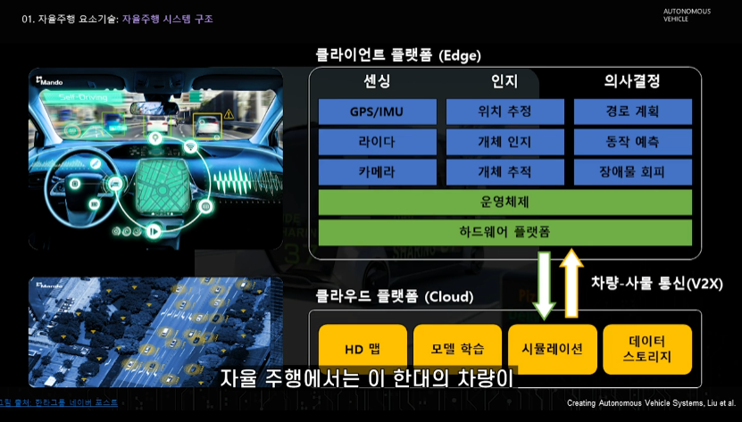
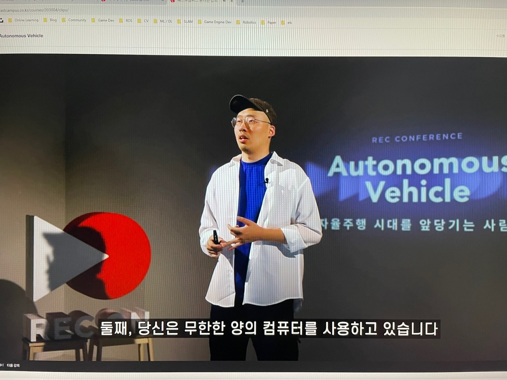

## 강의 내용 및 후기

사실 나는 자율 주행과는 조금 가깝지도 멀지도 않은 직종에서 Simulator 와 그의 부가 되는 내용들을 개발을 하고 있다. 물론 실제 차량에 쓸수 있을지는 전혀 알지도 모르고, on-time 으로 뭔가를 할수 있다는것과도 거리가 멀지만, Autonomous Vehicle Simulator 이기에 또 가깝기도 하다. 그래서 뭔가 개요? Perception 에 대한 대체적인 것 들을 배우기 위해서 이 강의를 듣게 됬다. 그리고 SOS Lab 의 이용이님과 bitsensing 이재은, Seoul Robotics 의 이한빈님들의 알려주는 이야기를 짧게 또는 개요를 듣고 싶어서, 이 강의를 선택하게 되었다.

센서 감지 (주변 센서)

* Camera
* Lidar
* Radar
* GPS / IMU
* Hdmap

GPS 차량의 위치 추정에 필요, 위성 신호를 이용해서 어떤 절대 위치 정보 제공을 하고 (lat, long, altitude)
1 ~ 10 Hz 느린 주기, 지하/ 터널 / 도심 등에서 음영 지역 발생 

모든 판단을 위치 정보를 기반으로 하는 자율 주행같은 경우는, 이렇게 짧게 신호가 끊길수도 있기 때문에 다른 센서의 정보를 받아올 필요가 있음. 그래서 IMU 가 필요함, 순간순간 속도, 가속도 등 차량의 위치를 측정. 근데 오차가 생길수 있으므로, Camera 또는 Lidar 를 통해서 더 정확하게 추정가능케 해야함

일단 MEMS 이야기도 하는거 좋을듯

트랜스 미터: 태양광의 영향을 가장 적게 받을수 있는 905 nm 나 1550 nm laser source 를 사용

## Picture

