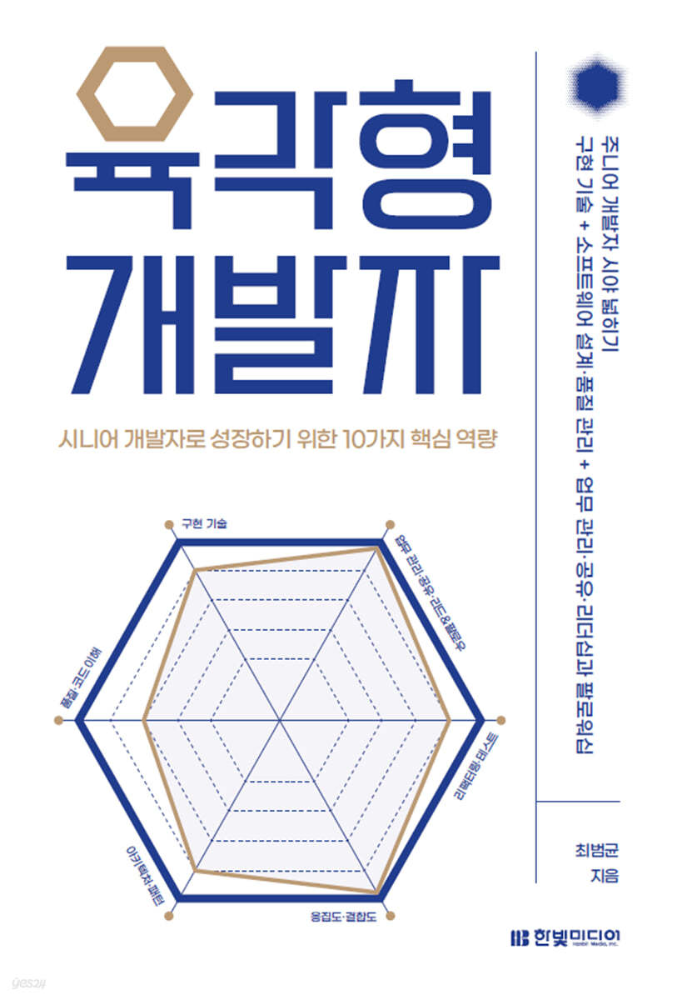

## Hexagon Developer

이 책을 보기 시작한 보게된 계기는, 내 직장 동료가 신기해서 구매 요청을 올렸다고 해서 책을 한번 빌려봤다. 육각형 개발자 책의 표지는 아래와 같다.

책의 표지만 봐도 개발자로서 밸런스를 맞출려고 하는 것 들이 보인다. 일단 대체적인 이 책에 내용과 느낌은 일단 이번 년도를 가만히 돌아보게 되었고, 주니어로서 내가 멈춰있다고 생각했는데, 이걸 계기로 뭔가 더 성장할수 있겠다라는 마음이 들었다. 몇 부분은 생각나는대로 적어보려고 한다.

일단 나는 소프트웨어 엔지니어로서, 새로운 기술과 배우는거에 있어서는 누구 보다 빠르게 적용을 해보고 싶어하고, 공부하고 도전해보고 싶은 생각이 많다. 하지만 나는 이것에 대한 위험함을 잘 모르고 있었다. 실제 product 로 녹여내는 일은 쉬울수는 있다. 하지만 녹여내기 이전에 팀장과 그리고 팀원들과 합의하고, 성능만으로 좋다? 가 아니라 더 디테일을 가지고 접근하고 조금 더 보수적으로 가져가는 시선이 필요하다. 하지만 이 의미가 보수적으로 모든것을 바라보아야한다는 의미는 아니다. 물론 혼자서 여러 기술을 꾸준히 탐색하면서 구현도 해보고, 지금 당장 사용하지 않더라도 주기적으로 요즘은 어떤 기술이 주목받고 있는지 조사하고 핸즈온이나 별도의 학습을 빠르게 경험을 해봐야한다. 여기서 굉장히 중요한건 모든 개발자라면 알겠지만 `쉽게 얻은건 쉽게 사라진다.` 그 의미는 한번 실습해봤다고 해서 특정 기술을 완벽하게 제대로 구사하기 힘들수도 있다. 하지만 대체적으로 해보면서 노력하다 보면 결국 언젠가 내가 이 기술을 적용을 하려고 할때 수월해질수 있고, 이런 끊임 없는 노력이 결국엔 개발자 또는 엔지니어로서 미래 경쟁력을 유지 할 수 있다. 

하지만 항상 이러한 새로운 기술력에는 기본적인 Base 가 깔린다. 어떤 언어를 구사하고 발표하려면 기본적인 언어의 구성이나 문법을 알고, 그 다음에 Idion 을 찾아서 자유롭게 쓸수 있게끔 해야한다. 이런 만큼 기본기는 충실하되, 어떤 새로운 기술력을 바라보게 되면 새로운 Insight 가 생길것 같다.

이 책을 읽으면서 내가 놓친 부분은 정말 많다. 나는 항상 구현해 대한 욕심만 있었을뿐, Archiecture Design 그리고 코드 Refactoring 작업, Test 코드에 관해서 되게 신중하게 접근을 하지 못했다. 심지어 구현 완료가 될것 같다라는 위험한 말들을 했었고, 바쁘고 장벽이 높다라는 이유로 갈팡 질팡했었고, 내 미래에 대해서 Career 을 잘못쌓고 있다라는 기분에 정말 다 하기 싫었다. 하지만 이건 나의 오만과 욕심이 컷었고, 하고 싶은 일만 할수 없었기에 정말 위에서 보기에는 어려웠을 것 같다. 이제 팀을 옮기고 나서 조금 말을 하기전에 아래와 같은 생각을 해보려고 한다.

1. 코드의 완료는 정확하게 이해하고, 왜 그렇게 짲는지의 의도를 자세하게 설명을 할수 있어야한다. (코드의 Archiecture 는 왜 이렇게 될수 밖에 없었는지, 더 좋은 방법이 있으면 물어보고, 왜 그게 좋은지 역질문을 하는 적극성이 필요하다.)
2. 코드의 완성은 테스트 코드까지다 (절대로 함부로 끝났다라고 말을 하면 안된다.)
3. 팀원들끼리 협업 또는 다른 그룹과 협업을 하기 위해서 자기 방어로서 말을 하는게 아니라, 조금 더 추상적인 면에서 적극적으로 이야기 할것
4. 팀장이 있다면, 팀장님의 말은 법이 아니라 제시하는것 이고, 왜 그런지를 자주 물어보아야 나도 그 의도를 파악을 할수 있다. (물론 코드로 이해하는것도 좋지만, 더 정확한걸 대화로 마무리를 지어야한다.)
5. 리더를 할수 있는 사람은 완벽하지 않다. 그리고 그 전의 리더가 했던 일을 그대로 할 필요가 없다. 나는 나로서 그리고 코드는 코드로서 꼭 분활해서 생각해보자.
6. 절대 두번 작업 할 일을 하지말자.
7. 꼭 왜? 라는 말에 공격적으로 듣지말자. 왜라고 하면 당당하게 이야기하면 되고, 그 배경과 근거에대해서 정확하게 말을 할수 있는 사람이 되도록 하자.

물론 더 있겠지만, 대표적으로 이 7가지일 것 같다. 내가 해매왔던 시간 들이 아쉽기도 하지만, 이제 알아갔다라는 사실이 참 다행이면서 좀더 좋은 환경을 만들수 있는 엔지니어로 성장하게 될것 같은 기대감이 있다. 이 책에서는 정말 경험으로 부터 나오는 조언들이 많았다. 다른 좋은 책들의 인용을 써서 조금 더 신뢰있는 말을 했다. 쓰다 보니 신뢰라는 단어를 써서 생각 나는 말이긴 한데, 신뢰를 얻는 거는 정말 어려운 일이다. 엔지니어로서 신뢰를 얻을 수 있는 방법은 개발 실력 뿐만아니라 조리 있게 말하고 문서 정리도 잘하는게 엔지니어다. 그리고 고객의 요구 사항을 빠르게 파악하는것도 엔지니어의 일이 아니라고 무시할수 있지만, 결국엔 회사라는건 이익을 창출 해야하는 곳이며, 창출을 하기 위해서 더많은 개발자와 엔지니어를 뽑는거고, 나는 엔지니어이기에 절대로 무시할수 없는것이라는걸 배웠다. 

나는 가끔씩 내 말이 흐려질때가 가끔씩 있다. 뭔가 머리속으로 정리해서 말을 하고 있다고 했는데 순간적으로 내가 무슨말을 학소 있는지 모를때가 종종 있는데 그럴 때마다 내가 영어와 한국어의 생각을 왔다갔다해서 생각을 했는데, 제일 중요한 건 내가 필요 이상의 말을 할때가 많다라는것이 있다. 그래서 결국엔 내가 커뮤니케이션 스킬이 굉장히 좋지 않구나라는 결론에 다다르게했다. 그래서 이 부분이 정말 내가 간지럽고 너무 힘들었던 부분인데 이 책은 일단 author 도 말에 재능이 없다고 했었다. 이 부분에 있어서 공감이 갔었고, 여러 책과 경험이 필요하다고 했다. 핵심만 말하는건 결국 짧게 말하는게 아니다. 하나의 작은 음식이더라도 말은 푸아그라 처럼 맛있는 맛이 있어야 전달도 잘되고 의미 있는게 된다. 그래서 나와 같이 똑같은 경험을 하고 있는 개발자나 엔지니어에게 꼭 읽어야할 책 들을 author 가 소개를 해줬다. 

말을 잘할수 있고 나의 커뮤니케이션을 잘할수 있게 연습 할수 있는 책!

* 유시민의 글쓰기 특강
* 엔지니어를 위한 문장의 기술
* 마케터의 문장
* 내 문장이 그렇게 이상한가요

물론 글쓰기의 책이지만, 나는 이렇게 생각한다. 글을 잘쓰기 시작하면, 이제 머리로 글을 자연스럽게 쓰다보면 나의 말하기가 잘 다듬어지지 않을까? 의 생각도 있다. 결론적으로 `주제가 분명한 말을 해야하며, 주제를 다루는 데 꼭 필요한 사실과 중요한 정보를 담아야한다. 사실과 정보사이에 어떤 관계가 있는지 분명하게 나타내야 한다. 주제와 정보, 논리를 적절한 어휘와 문장으로 표현해야한다. 그리고!! 많이 쓸수록 더 잘쓰게된다.` 이 문장은 굉장히 추상적이면서도 바로 꽃힐수 있는 말이다. 꼭 뭔가를 말하기전에 이러한 연습을 하다보면 쓰기 뿐만 아니라 나의 말이 더 명료 해지지 않을까? 의 생각이 든다.

그리고 다른 하나는 사실 대학원에 있었을때 지도 교수님이 말씀해주신것 중에 하난데 바로 `Mind Map` 이다. 나는 Plan 을 세울때, 약간 오만일수도 있지만 머리속에서 할수 있는데 왜저런걸 하지라는 생각이 있었다. 하지만 늘 공부할때, 실제 내 손을 거친것과 머리속에서 스치는것과는 큰 차이를 만들어낸다. 일단 생각할 내용이 많거나 계층을 가지게 될때는 하나씩 하나씩 정리하면서 마인드 맵을 활요하면 좋을것 같다라는 생각이 들었다. [XMIND](https://xmind.app/)

리더쉽에 관한책은 많고, 너무나 황당한 책들도 굉장히 많아서 다 쓸데가 없다고 생각했지만, 이 책은 Author 가 추천해준 책이기 때문에 꼭 읽어볼 필요는 있을것 같다. [테크니컬 리더](https://www.yes24.com/Product/Goods/8301368) 꼭 MOI (Motivation, Organization, Innovation) 을 생각을 해보자. 개발자 또는 엔지니어는 기술로 문제를 해결한다. 이런 관점에서 보면 개발자에게 필요한 리더십이 문제 해결 리더십인 것은 당연해보인다. 테크니컬 리더 책에 따르면 뛰어난 기술 리더는 혁신, 즉 "더 좋은 방법으로 무언가를 한다' 라는 가치로 사람들의 능력을 발휘한다고 한다. 그리고 현신을 위해서 다음 3 가지 활동에 초점을 맞춘다고 한다.

1. 문제 이해하기
2. 아이디어 흐름 관리하기
3. 품질 유지하기

그리고 마지막으로 동기 부여에 관련된 이야기를 하고 싶다. 물론 개발을 하다보면 동기부여가 안되고 특히나 개발 문서 만들때는 정말 지루하고 힘들다. 하지만, 이 또한 중요하고 뒤에 더 귀찮은 일을 만들면 안된다. Author 는 다니엘 핑크의 드라이브 라는 책을 소개 했는데, 인용을 하자면 `내적 동기를 일으키는 요인으로는 주도성, 전문성 그리고 목적이 있다고한다. 주도성은 자신의 삶을 결정하고 싶어하는 욕망이고, 전문성은 의미 있는 것을 더잘하고 싶다는 용막이며, 목적은 자신보다 더 큰 무언가를 향해 뭔가 하고 싶다는 열망이다.` 이 3 가지에 집중을 하다 보면, 내적 동기 부여를 높일 수 있다고 한다. 물론 외적 동기부여가 중요할수 있다. 예를 들어서 회사의 복지나 급여가 있지만 하지만 이러한것들은 장기적으로 영향을 주지 못한다. 단기가 아닌 중장기적으로 개발자에게 동기를 부여하고 싶다면 외적 동기 부여와 함께 내적 동기 부여를 끌어 올려야한다. 물론 리더로서 또는 자기 자신에게 할수 있는 말이다. 자기를 성장 시키는 건 자신이여야하며 자신의 교육은 자신이 책임져야 한다. 꼭 더 성장하고 싶은 개발자라면 명심할 필요가 있다고 생각한다.

기타는 팔로워십이 있는데, 이건 조금 추상적이기도 하고 와닿지는 않지만 생각보다 중요한 이야기인것 같다. [스태프 엔지니어](https://www.aladin.co.kr/shop/wproduct.aspx?ItemId=301411563)

1. 관리자를 놀라게 하지말자. 관리자를 놀라게 하면 신뢰가 사라질 수 있다.
2. 관리자에게 놀라지 말자. 관리자가 모든 세세한 사항을 챙길 것이라고 기대하지 말자. 대신 관리자와 적극적으로 소통해서 정보 및 피드백을 얻자.
3. 관리자에게 관련 정보를 제공하자. 유용하다고 생각하는 정보가 있다면 관리자에게 전달한다.

이 책 정말 주옥같은 말들이 많이 있다, 그리고 엔지니어 또는 개발자로 살아가면서 꼭 누군가가 말로 정리한게 아닌, 글로 정리가 되어있어서 더더욱 공감을 할수 있었던것같다.

## Reference

* [육각형 개발자](https://www.yes24.com/Product/Goods/120215040)