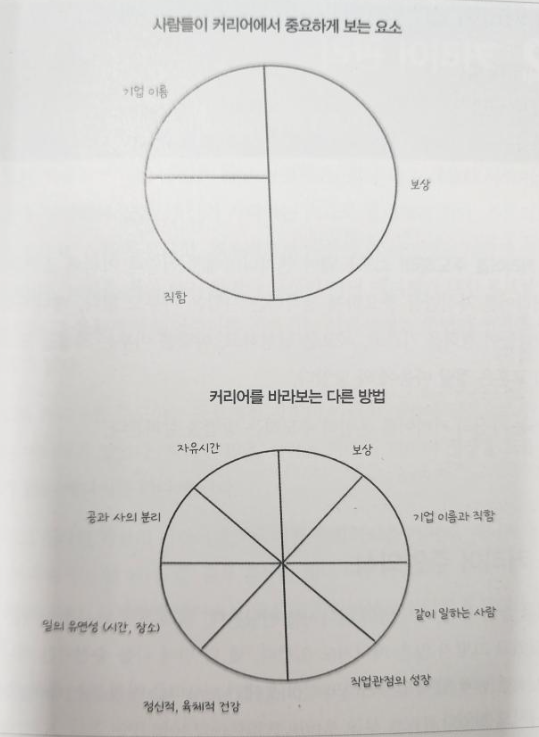

* this unordered seed list will be replaced by the toc
{:toc}

## The Engineer's Guide book

이제 퇴사한지도 거의 한달이 다가오고, 설도 눈깜빡할사이에 지나갔다. 12 월부터 읽었던 책을 공유하려고 하는데, 내가 "소프트웨어" 회사에 다니고 있었을때 바랬던 부분들이 있었는데, 첫번째로는 시니어가 없는 회사에서, 일단 Roadmap 에 맞게 이것저것 해보고, 다른 Resource 도 찾아보고, Process 를 채택하려고 했었던 부분도 있었고, Managing 하는것도 없어서 굉장히 곤란해서, Burn out 이 왔었었다. 이러한 부분들을 정말 가볍고 포근하게 이 책은 다 풀어주었다.

### About Author of this book

일단 이책의 Author 부터 소개하겠다. 리뷰를 할때, 주로 이책을 쓴사람은 별로 궁금하지 않았다. 이사람은 The Programatic Engineer's New Letter 를 발행하고 있으며, Uber, Microsoft, Skype, SkyScanner 에서 Engineer 또는 Engineering Manager 로 직종을 변화시키면서 바라본 시점들을 글로 정말 시원하게 풀어주고 있으며, Software Engineer 가 성장하면서 멘토링을 정말로 필요한 사람 또는 정말 현업에서 잘하거나 못하거나 간에 꼭 보면 그 사람을 성장시켜주는 책이다고 볼수있다. 물론, 사람마다 일하는 스타일등 다르고, 어떤거에 정답이 없는거는 확실하다. 하지만 항상 권장이라는건 의견은 내세울수 있는거기 때문에, 이걸 중요시하고 보면 이 책이 정말 사람을 성장 시킬수 있는 책으로 시점이 바뀔것 이다.

### About this book

이책은 총 6 부로 아래처럼 이루어져 있다. 이책을 딱 폈을때, 정말 좋았던건 이 부록이 였다. 개발자, 엔지니어, 매니저 별로 커리어 수준에 초점을 맞춰서 읽게끔 되어있어서, 내 커리어 지금 이 순간에 승진을 위해서, 더 나은 엔지니어로 성장하려면 어떻게 해야되는지 총 26장으로 나누어져있다.

1. 개발자 커리어의 기본 사항
2. 유능한 소프트웨어 개발자
3. 다재다능한 시니어 엔지니어
4. 실용주의 테크리드
5. 롤모델로서의 스태프 및 수석 엔지니어
6. 결론
7. 부록 (한국의 개발자들의 가이드)

### Things I learn from this book

내가 뜻깊게 읽었던 부분을 정리하려고 한다. 사실 이 책에서 딱 이 부분이 핵심이다라고 말을 할수 없다. 약간 모든 챕터마다 어떤 챕터를 참고해라 라는 의미도 많기 때문에, 뭔가 회고록을 작성하거나, 승진을 하기 위해서 그 다음 Step 이 뭘지를 고민이 될때, 보면 정말 괜찮은 책이다.

첫번째로는 커리어 발전을 위한 대안적 사고 방식이다. 커리어 발전을 직장의 만족도에 영향을 끼치는 요소들을 알아보자.

* 함께 일하는 사람 및 팀의 역학 관계
* 매니저 및 매니저와의 관계
* 팀 및 기업에서 본인의 위치
* 기업 문화
* 기업의 사명 및 사회에 대한 기여도
* 전문적 성장 기회
* 업무 중 정신적, 신체적 건강
* 유연성(원격 근무 가능 여부)
* 온콜 (온콜 업무의 강도)
* 일과 삶의 균형
* 개인적 동기

사실은 어디에서나, 새 회사에 취직한다고 하면, 그 회사의 일의 업무 양과 좋은 개발자가 있다는건 확실히 알수 없다! 그래서 "회사 가봐야 알아?" 이런말들이 많이 나온다. 하지만 전체적으로 현업에서 일을 하다보면, 저 위에 있는 목록을 다한 내용들이 아래와 같은 이미지로 표현이 될수 있다. 아무리 AI 가 나오라고 한들, 개발자 또는 엔지니어는 새로운 기술을 배워야하고, 그리고 더 나아가서 성장해야한다. 그러기위해서는 긴호흡을 가지기위해서는 아래와 같은걸로 기준을 세울수 있다.

### Reference

* [The Software Engineer's Guidebook: Navigating senior, tech lead, and staff engineer positions at tech companies and startups](https://www.amazon.com/Software-Engineers-Guidebook-Navigating-positions-ebook/dp/B0CV6ZNLLP?ref_=ast_author_dp)