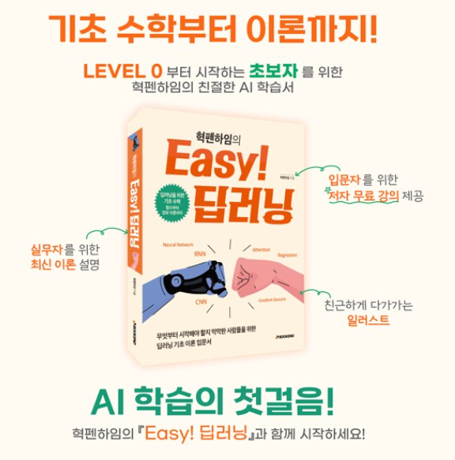
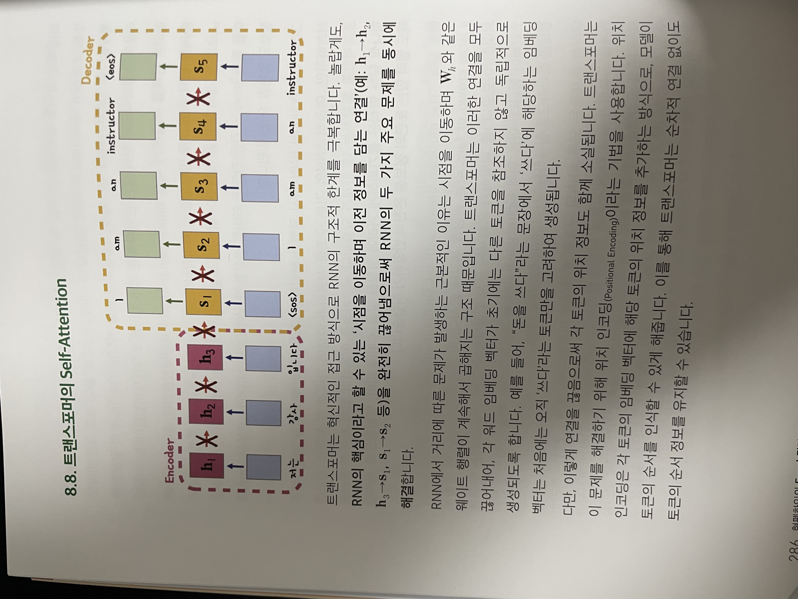
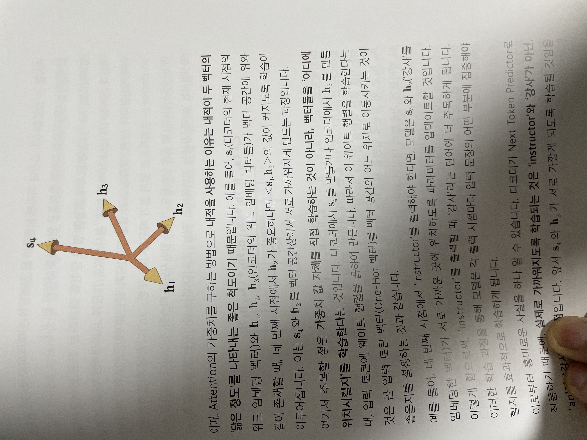

## Hyukppenheim's Easy Deep Learning

### Motivation

대학원때 나는 Deep Learning 에 대해서 배우고, Protein Folding 관련되서도 연구를 해보았었다. 그때 참 나는 Deep Learning 이라는게 딱히 편하지 않았다. Data 뽑는것 부터해서, 교수님한테 Data 더 필요해야될것 같아요! 이러면서 굽신 굽신까지는 하지는 않았지만, 뭔가 마음도 편하지 않았고, 너무 오래걸린다는 의미에서는 참 굉장히 거리감이 느꼈었다. 그래서 개발로 변경하고 이렇게 왔었는데, 워낙 요즘 기술의 발전이 빠르다 보니, 나도 모르면 안되겠다라는 생각이 든다. 특히나 Parallel Processing 쪽으로 GPU 연산 쪽으로 더 가고 싶기 때문에, 기본적인 기본을 다시 Review 한답시고 요청을 드렸었다. 너무 친절하게도, 책 전체를 Review 하는게 아닌 챕터 별로 Review 를 하기 떄문에, 부담감을 덜었었다. 내가 Review 할 부분은 "Attenion 과 Self-Attention" 이 부분이다. (나는 Attention is all you need 의 읽기를 사실 포기 했었다... ㅎㅎ)

### Comments & General Review

일단 경험상으로, Deep Learning 수업시간에 이야기 했던 부분이 뭐였냐면, 너가 어떤 Project 를 할건지에 따라서, Architecture, Loss function, Softmax, etc 등이 구분이될거다. 예를 들어서 one-to-many 를 하려면, softmax 를 사용해야한다 등.. 이 activation function (tanh) 이 (relu) 보다 좋은 이유는... 이러면서 이야기를 했었는데, 이런 Category 를 주어지면, 우리가 직접 찾지 않아도, 일단 이렇게 만들어보자 라는게 먼저 나온는데, 이 책은 그걸 확실하게 정리해준다. (확실하게 정리 해준 부분은 이전 챕터를 이해하다보면 정리가 된다.) 그리고 간결하다. RNN 을 거슬러 올라가면 LSTM 하고 GRU 가 있는데 이것부터 알아야하는것도 중요하다. 물론 어떤 역활을 하는건지는 중요하지만, 이 부분을 `잠깐 알아두기` 라는 방식으로 참고해서, 책을 읽었을때 집중력을 흐리지 않게 하는 부분은 참 좋았다.

다른 한점은 용어적인 부분을 Bold 식 또는 색깔을 다르게 해서, 이 부분이 핵심이라는걸 짚어주는데, 확실히 요즘 ChatGPT, DeepSeek 에 비롯된 AI 들이 OpenSource 로 많이 나와있고, 인터넷에 많은 Source 들이 돌아다니는데, 항상 용어의 문제가 있다. 어떤게 정확하게 맞는지 이해를 피해가는 용어들이 생각보다 많이 돌아다닌다. 예를 들어서, Tokenizing 과 Token, Tokenizer 에 대해서, 용어의 의미가 정확한 예제가 없으면, 잘 이해하기가 힘들다. (물론 Compiler 쪽을 공부했다면, 이해가 가능하지만, 입문서에서 다른 Resource 를 보고 공부하다보면 뜻이 흐려진다. 마치 RNN 의 한계점 처럼…)

* Tokenizing: 데이터를 적절한 단위로 나누는 과정
* Token: 나눠진 각 단위
* Tokenizer: 데이터를 어떤 단위로 나누는 객체
* Next Token Prediction: 그다음 Token 을 예측 (예제: 자동완성)

그리고 이에 덧붙여서, 이책에서는 Architecutre 를 정확하게 예시를 들어서 말해준다. RNN 같은 경우 각각의 h1, h2 표시, Input/output 문자등을 쉽게 설명을 해줘서 이부분에 있어서는 굉장히 잘표현했다.

RNN 부분에 있어서, 왜 한계점이 있는지를 두가지로 잘 표현했는데
Loss 부분의 편미분을 했을때, Gradient 가 각 입력 시점에 대해 불균형적 가중합으로 구해지는 문제
Activation Function: tanh 의 문제점 - Data 의 정보가 점점 뭉개지는 현상 
이 부분을 수학적으로 잘표현되었다는게, 독자들에게 훨씬 쉽게 다가서려고 많이 노력했구나 라고 말을 해준다.

Test 환경과 Train 했을때의 문제점을 Case 별로 잘 설명해준다. 이건 사실 경험이 없으면 요약하기 정말 어려운 부분이다. 근데 장황하게 안쓰셨지만, 확실히 이건 전략적으로 작성한게 보인다. (너무 train 된것만 쓰다 보면, 말에 신뢰가 떨어질수 있으니)

제일 좋았던건 transformer 에 대한 설명을 천천히 한계로부터 발전되어왔고, 그것에 대한 원리를 잘 설명 해주었던것 같다. 예를 들어서, context vector 와 Encoding 에서의 embeding vector h_n 들 Decoding 에서의 s_n 들을 그림으로 잘설명을 해주셔서 확실히 이해했던 부분이 있었지만, 갑작스런 C4 는 조금 집중을 흐리게했다. (c1, c2, c3 는 뭔데? 라는 질문을 할수 있는데) 이 부분은 확실히 attention 부분에 있어서, 간소화하기 힘든 부분들을 어쩔수 없이 하나의 예제로 가져간걸로 보인다. 하지만 아래의 그림을 보면, 이 부분을 자세하게 어떤 부분이 Query 고 이부분이 Key, 고 이부분이 Value 인지를 통해서 확실히 이해했다고 볼수 있다.

전반적으로 문제, 그리고 Resercher 들의 해결 방법, 하지만 또 한계점에 대해서는 확실히 표현하고 있어서, 이부분을 딥러닝을 입문하는 사람이 보았을때 이해가 안될수도 있지만 흐름을 이해할수 있고, Detail 한 부분은 독자들에게 맡기는 부분도 있을것 같다. 이렇게 사실 좋은 입문서가 있었더라면, 장황한 동영상 하나보다는 훨씬 나은 점이 있다! 예제 Figure 그리고 피할수 없는 수학들을 잘 설명 해주다 보면, 아 뭐 이정도면 알겠다라는 식으로 쉽게 지식을 확장하거나, Application 을 만드는데 사용하거나 할수 있을것 같다라는게 총평이다.

조금 아쉬웠을수도 있고, 최대한 입문서에 맞게 쓰려고 하는것도 기준점을 두고 있으니까라고 이해했지만, 내적을 사용하는 이유에 대해서는 배경설명이 조금 필요한것 같기는 하다. 이건 어느정도 선형 대수의 Background 를 이야기하면 좋았지 않을까이다.

### Reference 
* [헥편하임 공식 홈페이지](https://hyukppen.modoo.at/?link=8ex77q4p)
* [책구매 사이트](https://product.kyobobook.co.kr/detail/S000214848175)