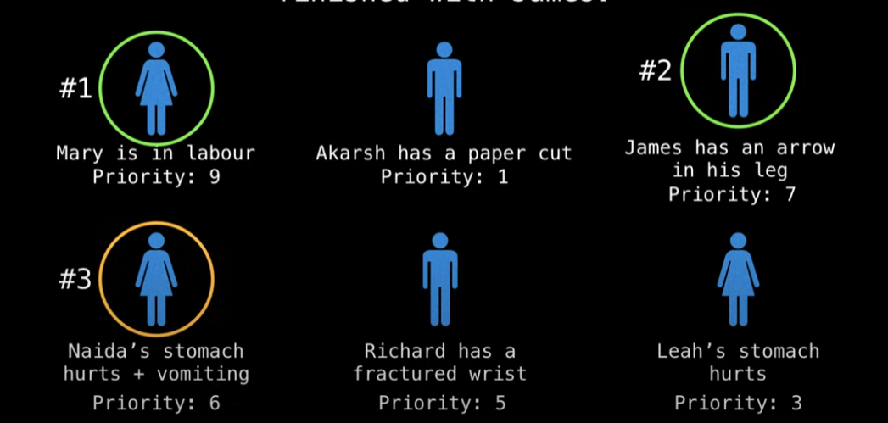
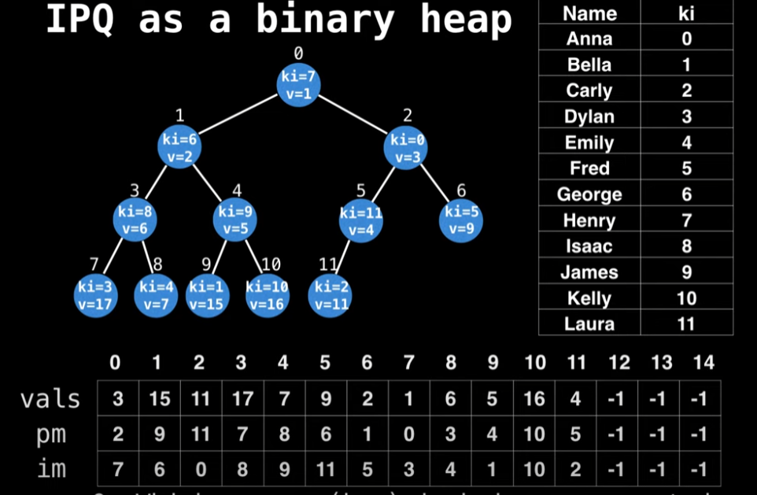

## Index Min Priority Queue

* Reviewing what I studied, how this work will be explained as well. 
---

## Index Min Priority Queue
We've covered binary heap, priority queue and so forth, but one of the useful priority queue we're going to look at is Index Min Priority Queue. This is a traditional priority queue variant which on top of the regular PQ operations supports quick updates and deletions of key-value pairs (for example, key can be double type, and value is int type).

### Problems: Hospital Example
Suppose we have people who need to be taken care of, and it really depends on their conditions. For example, Mary is in labor, which has a higher priority than the others. Here is the issue: Richard went to a different hospital, and doesn't really need to be taken care of anymore, and Nadia's stomach pain + vomiting turned out to be an infectious disease, so she moved to high priority. This means our priority queue needs to be updated.

In the hospital example, we saw that it's crucial to be able to **dynamically update** the priority (values) of certain people (keys). The **Indexed Priority Queue (IPQ)** data structure lets us do this efficiently. The first step in using an IPQ is to assign index values to all the keys, forming a bidirectional mapping.



Create a bidriectional mapping between your N keys and the domain `[0, N)` using a bidrectional hashtable.
```bash
Key             |   Key Index
"Marry"        <->    0
"Akarsh"       <->    1
"James"        <->    2
"Naida"        <->    3
"Richard"      <->    4
"Leah"         <->    5
```

There are several operations in IPQ as following and their time complexity:
| Operations | Time Complexity |
|------|------------|
| Empty() | O(1) |
| Contains(key) | O(1) |
| Size() | O(1) |
| Insert() | O(log N) |
| MinIndex() - Peek | O(1) |
| MinKey() - Peek| O(1) |
| DelMin(key) | O(log N) |
| KeyOf() & ValueOf(key) | O(1) |
| ChangeKey() | O(log N) |
| DecreaseKey(key, value) & update | O(log N) |
| IncreaseKey(key, value) & update | O(log N) |
| Delete() & Update() | O(log N) |
| Exch(key, key) | O(1) |
| Greater() | O(1) |
| Swim(value) | O(log N) |
| Sink(value) | O(log N) |

Then why do I metion, it's bidrectional mapping? Given the key value, we should be able to find the where this node is positioned in heap(position mapping). Also, Given the index value in `value` table, we should also be able to find the key value.

To show what is bidrectional, look at the image below:


## Implementation
```c++
template<typename Key>
class IndexMinPQ
{
public:
    IndexMinPQ(int cap)
    {
        capacity = cap;
        size = 0;
        keys.resize(capacity + 1);
        pq.resize(capacity + 1);
        inverseMap.resize(capacity + 1, -1) // InverseMap
    }

    bool Empty()
    {
        return size == 0;
    }

    bool Contains(int i)
    {
        return inverseMap[i] != -1;
    }

    int Size() { return size; }

    void Insert(int i, Key key) 
    {
        size += 1;
        inverseMap[i] = size;
        pq[size] = i;
        keys[i] = key;
        Swim(size);
    }

    int MinIndex()
    {
        return pq[1];
    }

    Key MinKey()
    {
        return keys[pq[1]];
    }

    int DelMin()
    {
        int m = pq[1];
        Exch(1, size--);
        Sink(1);
        inverseMap[m] = -1;
        keys[m] = 0.0;
        pq[size + 1] = -1;
        return m;
    }

    Key keyOf(int i)
    {
        return keys[i];
    }

    void ChangeKey(int i, Key key)
    {
        if (!Contains(i)) {
        	throw::std::invalid_argument("index does not exist");
        }

        if (key < keys[i]) {
        	keys[i] = key;
        	Swim(qp[i]);
        }
        else if (key > keys[i]) {
        	keys[i] = key;
        	Sink(qp[i]);
        }
    }

    void DecreaseKey(int i, Key key)
    {
        keys[i] = key;
        Swim(qp[i]);
    }

    void IncreaseKey(int i, Key key)
    {
        keys[i] = key;
        Swim(inverseMap[i]);
    }

    void Delete(int i)
    {
        int index = inverseMap[i];
        Exch(index, size--);
        Swim(index);
        Sink(index);
        keys[i] = 0.0;
        inverseMap[i] = -1;
    }

    void Exch(int i, int j) // swap
    {
        int swap = pq[i];
        pq[i] = pq[j];
        pq[j] = swap;
        inverseMap[pq[i]] = i;
        inverseMap[pq[j]] = j;
    }

    bool Greater(int i, int j)
    {
        return keys[pq[i]] > keys[pq[j]];
    }

    void Swim(int k)
    {
        while(k > 1 && Greater(pq[k/2], pq[k])){
            Exch(k / 2, k);
            k /= 2;
        }
    }

    void Sink(int k)
    {
        while(2 * k <= size)
        {
            int j = 2 * k;
            if (j < size && Greater(j, j+1))
                j++;
            if (!Greater(k, j)) break;
            Exch(k, j);
            k = j;
        }
    }

private:
    int size = 0;
    int capacity = 0;
    vector<int> pq;
    vector<int> inverseMap;
    vector<Key> keys;
}
```

The most important operation would be `Swim` and `Sink`.

The Swim operation works as follows:
1. Start with the element at index k that needs to be "swum up" the heap
2. Loop until either:
    * We reach the root of the heap (k > 1)
    * The parent is not greater than the current element (!Greater(pq[k/2], pq[k]))

3. In each iteration:
    * Compare the current element with its parent (located at index k/2)
    * If the parent is greater than the current element (in a min heap), exchange them (Exch(k/2, k))
    * Update k to the parent's position (k /= 2) to continue moving up the heap

Sink Operation needs to go down the heap, which means we need to check both children. Here's the complete process:
1. Loop until we reach the bottom of the tree (while 2*k <= size)
2. Calculate the index of the left child (j = 2*k)
3. Compare left and right children (if j < size && Greater(j, j+1))
4. If the right child exists (j < size) and is smaller than the left child (Greater(j, j+1)), select the right child by incrementing j
5. This ensures we select the smaller of the two children in a min heap
6. Check if the current node is already smaller than the selected child (!Greater(k, j))
7. If so, the heap property is satisfied, so break out of the loop
8. If not, exchange the current node with the selected child (Exch(k, j))
9. Update k to the position of the child (k = j) and continue the process

### Resource
* [IndexMinPQ Youtube](https://www.youtube.com/watch?v=jND_WJ8r7FE&ab_channel=WilliamFiset)