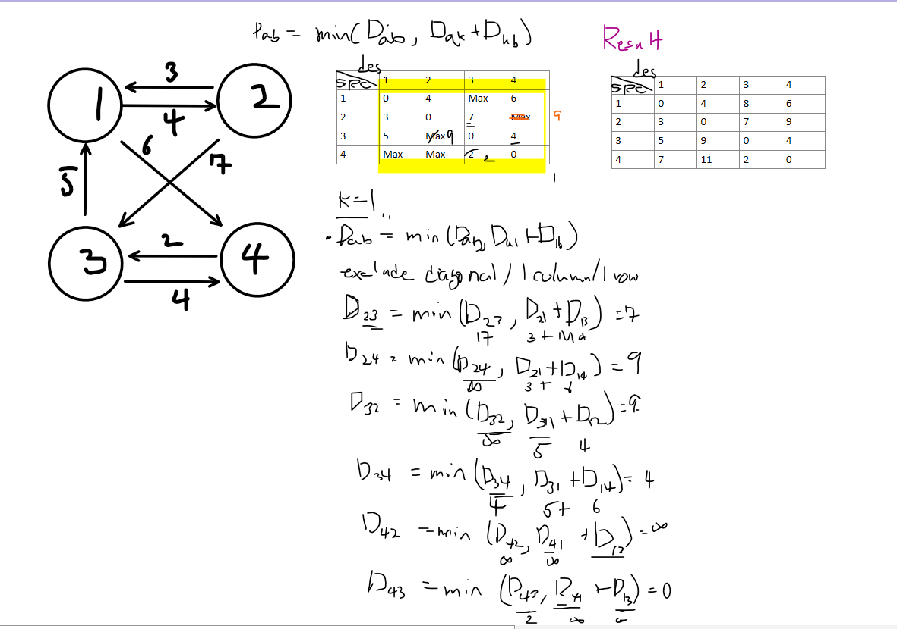

## Floyed-Washall Algorithm

* Reviewing what I studied, how this work will be explained as well. 
---

### Introduction

As we saw with Dijkstra's and Bellman-Ford algorithms, we need to check if DP can be applied by identifying optimal substructure and overlapping subproblems. In the context of shortest paths, a portion of a shortest path is itself a shortest path, and overlapping subproblems occur when we reuse partial shortest paths. The approach involves finding three nodes u, v, and k where the path from u to v becomes shorter by going through k.

The key difference between Floyd-Warshall and the other two algorithms is that Floyd-Warshall isn't fixed to a single starting vertex - it finds the shortest paths between all pairs of vertices. While the algorithm proceeds in stages based on intermediate nodes, it doesn't require finding the unvisited node with the minimum distance at each step. Due to the graph's characteristics, Floyd-Warshall can be implemented using an adjacency list, but it's typically implemented with an adjacency matrix. This makes a bottom-up approach quite feasible.

### Recurrence Relation:

Being able to solve a problem with Dynamic Programming means we can define a recurrence relation. At each step, we check if going through a specific node k provides a shorter path. We compare the direct path a->b with the path a->k->b:

>> `Dab = min (Dab, Dak + Dkb)` 이런식으로 세울수 있다.

Let's look at an example using this recurrence relation. The right side shows the graph being updated when k = 1. By applying this process for each node k, we can see the final result in the upper right of the algorithm.



we can infer that the time complexity will be O(n³).

### Implementation
코드를 확인해보자... 

```c++
constexpr double kInf = numeric_limits<double>::infinity();
vector<vector<double>> graph =
{
	{0.0, 3.0, 8.0, kInf, -4.0},
	{kInf, 0.0, kInf, 1.0, 7.0},
	{kInf, 4.0, 0.0, kInf, kInf},
	{2.0, kInf, -5.0, 0.0, kInf},
	{kInf, kInf, kInf, 6.0, 0.0}
};

void FloyedWarshall(const vector<vector<double>>& graph) {
    vector<vector<dobule>> dist = graph;
    int V = graph.size();

    // The graph is already initialized above
    // If not, diagonal values should be 0 and other indices
    // should be filled with appropriate values
    for (int k = 0; k < V; k++) {
        auto dist_k = dist;

        for(int i = 0; i < V; i++) {
            for(int j = 0; j < V; j++) {
                if (dist[i][k] + dist[k][j] < dist[i][j]) {
                    dist_k[i][j] = dist[i][k] + dist[k][j];
                }
            }
        }
    }
}
```
The implementation is surprisingly simple. We perform updates when necessary. Here's a Python implementation which might be more straightforward, though it differs in indexing:

```python
INF = int(1e9)

node = int(input())
edge = int(input())
graph = [[INF] * (n+1) for _ in range(n+1)]

for a in range(1, n+1):
    for b in range(1, n+1):
        if a == b:
            graph[a][b] = 0

for _ in range(edge):
    a, b, c = map(int, input().split())
    graph[a][b] = c

for k in range(1, n+1):
    for i in range(1, n+1):
        for j in range(1, n+1):
            graph[i][j] = min(graph[i][j], graph[i][k] + graph[k][j])
```

To summarize, the Floyd-Warshall algorithm has a time complexity of O(n³).

### Resource 
* [FloydWarshall Algorithm](https://www.youtube.com/watch?v=hw-SvAR3Zqg&ab_channel=%ED%95%9C%EB%B9%9B%EB%AF%B8%EB%94%94%EC%96%B4)