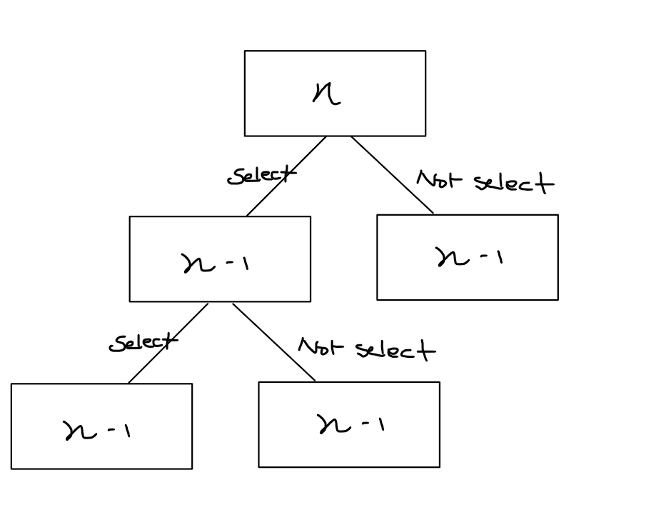

### Knapsack Problem
* Reviewing what I studied, how this work will be explained as well. 
---

The description of this problem is like you have a bag can hold certain number of weights. But here are two stories, one story is that you are in hurry, so you only need to get valuable items from bank. The other story, you have a lot of times to pick everything you want, and you need to think about what are the most valuable item you can steal. In our perspective, it's greedy algorithm versus dynamic programming.

The Knapsack Problem is a classic optimization challenge where you need to select items to maximize value while respecting a weight constraint. The problem has several variations based on how items can be selected. Knapsack Problem can be divided into multiple problems: fractional knapsack, zero-one knapsack, and unbounded knapsack problem.

The description of poblem is following:
>> Given a set of items O = {O1, O2, O3, ..., On} where each item Oi has a weight Wi and a value Vi, along with a knapsack that can hold a maximum weight T. The goal is to select items to put in the knapsack such that the total value is maximized while ensuring the total weight does not exceed T.

### 0-1 Knapsack Problem && Unbounded Knapsack Problem

This is typical dynamic programming, because you either have to take an item completely or leave it (no fractions are allowed), and this can be easily solvable by naive recursive function or dynamic programming (Top-Down and Bottom up).
Normally, when we encounter recursive problem, you can easily find the optimal substructure and overlapping subproblems. Both are key properties that enable dynamic programming solutions. Also you may find the recurrence relation, which we will discuss.

As opposed to 0-1 Knapsack problem, in the Unbounded Knapsack problem, you can select the same items over and over till your bag can hold no more. Basically select any items multiple times. The implementation approach is similar but with a key difference in how we handle the recursive cases.

Let's first implement the 0-1 Knapsack in a recursive fashion. We are given two vectors: one for values(prices) vector<int> values = {6, 5, 3} and vector<int> weights = {3, 2, 1}.
What we can see is we have to select items until the bag can hold no more weights. We have a choice not to select the nth item or to select it as well as consider n-1 items. By using these characteristics, we can implement recursive version in following way:

```c++
int RecursiveZeroOneKapsack(const vector<int>& weight, const vector<int>& values, int W, int n) {
    if (n == 0 || w == 0) { return 0; }

    if (weight[n-1] > W) {
        return RecursiveZeroOneKapsack(weight, values, W, n - 1);
    } else {
        return max(RecursiveZeroOneKapsack(weight, values, W - weight[n -1], n-1), RecursiveZeroOneKapsack(weight, values, W, n-1));
    }
}

int main() {
    vector<int> values = { 6, 5, 3 };
    vector<int> weights = { 3, 2, 1 };
    int W = 5;

    cout << RecursiveZeroOneKapsack(weights, values, W, int(weights.size())) << endl;
}
```

The time complexity in this recursive way can be deduced by the tree, whether we select n item or not, it becomes O(2^n). Again, Optimal substructure would be:
1. For the case of not including the nth item: The problem becomes considering only n-1 items with the same capacity (the case of going down the "Don't include" path in the figure below)
2. For the case of including the nth item: The problem becomes considering only n-1 items with the remaining capacity after including the nth item (the case of going down the "Include" path in the figure below)



**Dynamic Programming (Bottom-Up Approach)**
You can create a cache to solve this problem with Top-Down Approach, but let's look at the bottom-up approach. One way is to make tabulation. Item i's weight is weights[i-1] and Item i's value is values[i-1]. table[w][n] is the maximum value considering we select from items 1 to n with weight capacity w.

```c++
int ZeroOneKapsack(vector<int> weights, vector<int> values, int W) {
    vector<vector<int>> table(W + 1, vector<int>(weights.size() + 1, 0));

    for (int w = 1; w <= W; w++)
    {
        for(int n = 1; n <= weight.size(); n++) 
        {
            // if it exceeds weights ...
            if (weight[n - 1] > w) 
            {
                table[w][n] = table[w][n-1];
            }
            else 
            {
                // Case 1: whether we are going to select the next item, if weight is too much, we just skip (don't select)
                if (table[w][n-1] > table[w - weight[n-1][n-1] + values[n-1]) 
                {
                    table[w][n] = table[w][n-1];
                }
                else  
                {
                    // Case 2. Otherwise, we select the item
                    table[w][n] = table[w - weights[n-1]][n-1] + values[n-1];
                }
            }
        }
    }

    return table[W][weights.size()];
}
```

You can make a simple like that for unbounded knapsack

```c++
int UnboundedKnapsack(vector<int> weights, vector<int> values, int W) {
    vector<int> dp(W + 1, 0);
    
    for (int w = 1; w <= W; w++) {
        for (int i = 0; i < weights.size(); i++) {
            if (weights[i] <= w) {
                dp[w] = max(dp[w], dp[w - weights[i]] + values[i]);
            }
        }
    }
    
    return dp[W];
}
```

The time complexity would be O(n x W). (n = number of items, and W in weight)

### Fractional Knapsack Problem
* This is the greedy algorith because you don't really have time to steal, you just have to pick up the most valuable one, which means we are going to sort by the value / weight or sort then find the most valuable one, and add it to the sum.

```c++
double FractionalKnapsack(vector<Item> items, double W)
{
	sort(items.begin(), items.end(), Compare);
	double vsum = 0.0;

	for (auto& i : items)
	{
		double take = std::min(W, i.weight);
		W -= take;
		vsum += take * i.value / i.weight;
		i.weight -= take;
		if (W <= 0.0) break;
	}

	return vsum;
}
```

Time complexity will depend on only for sort, in which max would be O(n*logn)

### Resource
* [C++ Data Structures and Algorithm Design Principles: Leverage the power of modern C++ to build robust and scalable applications](https://www.amazon.com/Data-Structures-Algorithm-Design-Principles-ebook/dp/B07SYJSGVD?ref_=ast_author_mpb)