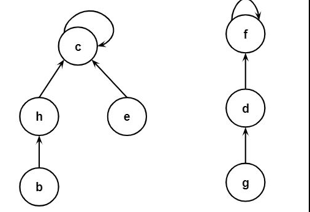

## Union-Find

* Reviewing what I studied, how this work will be explained as well. 
---

### Disjoint-set .. 

In order to understand Union-Find Operation, definition-set must be explained, `disjoint-set is a collection of sets that are mutually exclusive, meaning they have no elements in common.` Then, there are two operations with Disjoint-set, `find` and `Union`.

`Find` is to find where the specific element is in group, and `Union` is to add two groups. Let's explore how disjoint-set tree. The disjoint-set tree is a tree, but it's not regular tree. The node represent the one of the group, then the child is points to parents. Also, the the root node is pointing itself.



Let's look at the the UnionFind in Code. There are several different

```cpp
int root[max_size];

// Similar to Make-Set function
for (int i = 0; i < max_size; i++) {
    parent[i] = i;
}

int find(int x) { // O(1)
    if (root[x] == x) {
        return x;
    }
    else {
        return find(root[x]);
    }
}

void union(int x, int y) { // O(N)
    x = find(x);
    y = find(y);

    root[y] = x;
}
```

```cpp
struct UnionFind {
    vector<int> parent; // parent link
    vector<int> rank;   // depth information

    UnionFind(int n): parent(n), rank(n, 0) {
        // set all element pointing to itself.
        for(int i = 0; i < n; i++)
            parent[i] = i;
    }
}
```

### Optimization on Find / Union.

* Path Compression
* Union-By Rank