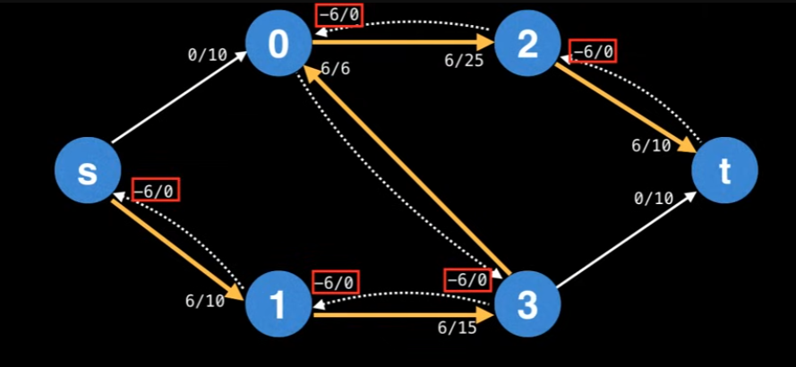
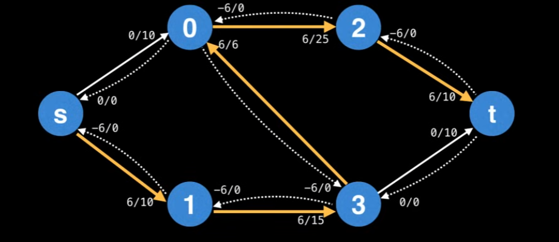

## Ford Fulkerson Method

* Reviewing what I studied, how this work will be explained as well. 
---

### Network Flow & Flow Graph

A flow graph (flow network) is a directed graph where each edge (also called an arc) has a certain capacity which can receive a certain amout of flow. The flow running through an edge must be less than or equal to the capacity. Think of this way, we have a path from the Chicago to Boston, and Boston to New York. From Chicago to Boston (6 cars allowed per min) & Boston to New York (3 cars allowed per min). Then after 1 min, the state would be 3 cars are still waiting to go to Boston, and 3 cars are already in New York. So, how do we solve it? we just send 3 cars in the beginning. In this case, we are going to define some terms 'flow' / 'capacity'. 

### Ford Fulkerson Method & Edmonds-Karp
Problem Statement:

One of the special thing about Ford Fulkerson Methods is that there are sink node and source node (think of source node as fauset, and the sink is drainer). 
To find the maximum flow (and min-cut as a by product), the Ford-Fulkerson method repeatedly finds **augmenting path** through the **residual graph** and **aguments the flow** untin no more augmenting paths can be found. Then what the heck is augmenting path, the definition of augmenting path is a path of edges in the residual graph with unused capacity greater than zero from the source to sink.

The reason why it's not stating the method, not algorithm is because of flexibility of selecting augmenting paths (unspecified by Ford Fulkerson Method). If the DFS algorithm is choose to get the augmenting path, every agumenting path has the bottleneck. The **Bottleneck** is the "smallest" edge on the path. we can use the bottleneck value to augment the flow along the paths. You can actually look at the image below, and the operation is min(10-0, 15-0, 6-0, 25-0, 10-0) = 6. (bottle neck value on below)

By augmenting the flow means *updating* the flow values of the edges along the augmenting path. The forward edges, this means `increasing the flow` by the bottleneck value. Also, when agumenting the flow along the augmenting path, you also need to **decrease the flow** along each **residual edge** by the bottleneck value. Then why are we decreasing the flow, because what we want to achieve is to get the max flow, which we need to consider all case to fill the flows. By using the decrease, residual edges exist to "undo" bad augmenting path which do not lead to a maximum flow.

Then we can define the **residual graph**. The residual graph is the graph which contains residual edges, and the graphs are shown below

Then, the question we could ask ourself is "Residual edges have a capacity of 0? Isn't that forbidden? How does that work?". You might be able to think **remaining capcity** of an edge e(residual or not) as: `e.capacity` - `e.flow`, This ensures that the remaining capacity of an edge is always non-negative.

So, let's kinda wrap it up, the ford-fulkerson method continues finding augmenting paths and augments the flow until no more augmenting paths from s->t exist. So the sum of the bottlenecks found in each augmenting path is equal to the max-flow. (So it doesn't really matter how you find the augmenting path). The basic steps are following

1. find an augmenting path
2. compute the bottleneck capacity
3. augment each edge and the total flow.

### Implementation

### Resource 
* [Max Flow Ford Fulkerson](https://www.youtube.com/watch?v=LdOnanfc5TM&ab_channel=WilliamFiset)
* [Max Flow](https://blog.naver.com/ndb796/221237111220)