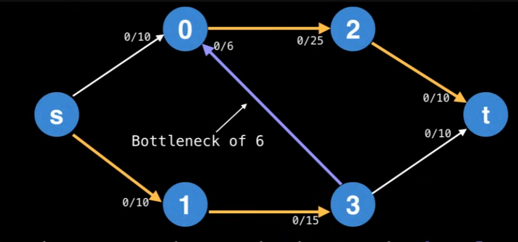

## Ford Fulkerson Method

* Reviewing what I studied, how this work will be explained as well. 
---

### Network Flow & Flow Graph

A flow graph (flow network) is a directed graph where each edge (also called an arc) has a certain capacity which can receive a certain amount of flow. The flow running through an edge must be less than or equal to the capacity. Think of this way, we have a path from Chicago to Boston, and Boston to New York. From Chicago to Boston (6 cars allowed per min) & Boston to New York (3 cars allowed per min). Then after 1 min, the state would be 3 cars are still waiting to go to Boston, and 3 cars are already in New York. So, how do we solve it? We just send 3 cars in the beginning. In this case, we are going to define some terms 'flow' / 'capacity'.

### Ford Fulkerson Method & Edmonds-Karp
Problem Statement:

Problem Statement:

One of the special things about Ford Fulkerson Methods is that there are sink node and source node (think of source node as faucet, and the sink as drainer).
To find the maximum flow (and min-cut as a byproduct), the Ford-Fulkerson method repeatedly findsaugmenting paths through the residual graph and augments the flow until no more augmenting paths can be found. Then what the heck is an augmenting path? The definition of an augmenting path is a path of edges in the residual graph with unused capacity greater than zero from the source to sink.

The reason why it's stated as a method, not an algorithm is because of flexibility in selecting augmenting paths (unspecified by Ford Fulkerson Method). If the DFS algorithm is chosen to get the augmenting path, every augmenting path has a bottleneck. The Bottleneck is the "smallest" edge on the path. We can use the bottleneck value to augment the flow along the paths. You can actually look at the image below, and the operation is min(10-0, 15-0, 6-0, 25-0, 10-0) = 6. (bottleneck value shown below)



we mean updating the flow values of the edges along the augmenting path. For the forward edges, this means increasing the flow by the bottleneck value. Also, when augmenting the flow along the augmenting path, you also need to decrease the flow along each residual edge by the bottleneck value. Then why are we decreasing the flow? Because what we want to achieve is to get the max flow, which requires considering all cases to fill the flows. By using the decrease, residual edges exist to "undo" bad augmenting paths which do not lead to a maximum flow.


we can define the residual graph. The residual graph is the graph which contains residual edges, as shown below:


Then, we could ask ourselves is "Residual edges have a capacity of 0? Isn't that forbidden? How does that work?". You might be able to think of **the remaining capacity** of an edge e (residual or not) as: e.capacity - e.flow. This ensures that the remaining capacity of an edge is always non-negative.

So, let's wrap it up: the Ford-Fulkerson method continues finding augmenting paths and augments the flow until no more augmenting paths from s->t exist. The sum of the bottlenecks found in each augmenting path is equal to the max-flow. (So it doesn't really matter how you find the augmenting path). The basic steps are:
1. Find an augmenting path
2. Compute the bottleneck capacity
3. Augment each edge and the total flow

### Edmonds-Karp Algorithm

The Edmonds-Karp algorithm is a specific implementation of the Ford-Fulkerson method. The key difference is that Edmonds-Karp uses Breadth-First Search (BFS) to find augmenting paths, whereas the general Ford-Fulkerson method doesn't specify how to find these paths.

By using BFS, Edmonds-Karp guarantees finding the shortest augmenting path (in terms of number of edges) at each step. This leads to a better time complexity than using arbitrary path-finding methods.

The time complexity of Edmonds-Karp is O(V × E²), where V is the number of vertices and E is the number of edges in the graph. This is a significant improvement over the general Ford-Fulkerson method, which has a time complexity of O(E × f), where f is the maximum flow value (which could be very large if edge capacities are large).

### Implementation
```cpp 
class FordFulkerson
{
public:
	vector<bool> marked;
	vector<FlowEdge*> prev;
	double value;

	FordFulkerson(FlowNetwork& g, int s, int t)
		: marked(g.V), prev(g.V), value(0.0){
		while (HasAugmentingPath(g, s, t))
		{
			// Find the minimum Flow from the path
			double bottlNeck = numeric_limits<double>::max();
			for (int v = t; v != s; v = prev[v]->Other(v)) {
				bottlNeck = min(bottlNeck, prev[v]->ResidualCapacityTo(v));
			}

			for (int v = t; v != s; v = prev[v]->Other(v)) {
				prev[v]->AddResidualFlowTo(v, bottlNeck);
			}

			value += bottlNeck;
			Print(g);
		}
	}

	bool HasAugmentingPath(FlowNetwork& g, int s, int t) {
		fill(marked.begin(), marked.end(), false);

		queue<int> q; // BFS

		marked[s] = true;
		q.push(s);

		while (!q.empty())
		{
			int v = q.front();
			q.pop();

			for (FlowEdge* e : g.Adj(v))
			{
				int w = e->Other(v);
				if (!marked[w] && e->ResidualCapacityTo(w) > 0) // <- TODO: BFS와의 차이 확인
				{
					prev[w] = e;
					marked[w] = true;
					q.push(w);
				}
			}
		}

		return marked[t];
	}
};
```

### Min-Cut Theorem
One of the most important results in network flow theory is the Max-Flow Min-Cut Theorem. This theorem states that the maximum flow in a network equals the capacity of the minimum cut.

A cut in a flow network is a partition of the vertices into two disjoint sets S and T, where the source s is in S and the sink t is in T. The capacity of a cut is the sum of the capacities of the edges going from S to T.

After the Ford-Fulkerson algorithm terminates, the min-cut can be found by:
1. Running a DFS or BFS from the source in the residual graph
2. Vertices reachable from the source form set S, the rest form set T
3. The edges going from S to T in the original graph form the min-cut

This min-cut represents the bottleneck in the network - the set of edges that, if removed, would disconnect the source from the sink.

### Resource 
* [Max Flow Ford Fulkerson](https://www.youtube.com/watch?v=LdOnanfc5TM&ab_channel=WilliamFiset)
* [Max Flow](https://blog.naver.com/ndb796/221237111220)
* [Edmonds-Karp Algorithm](https://en.wikipedia.org/wiki/Edmonds%E2%80%93Karp_algorithm)