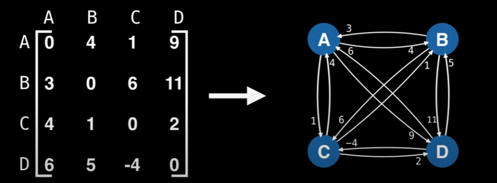

## Traveling Sales Person Problem

* Reviewing what I studied, how this work will be explained as well. 
---

### What is TSP
In other words, the pblem is: given a complete graph with weighted edges (as an adjacency matrix). What is the Hamiltonian cycle (path that visits every node once) of minimum cost.

### Resource
[TSP Problem](https://www.youtube.com/watch?v=cY4HiiFHO1o&ab_channel=WilliamFiset)