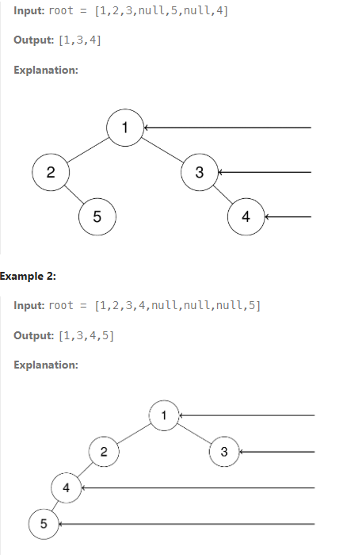

## 199. Binary Tree Right Side View.

### Description 

Given the root of a binary tree, imagine yourself standing on the right side of it, return the values of the nodes you can see ordered from top to bottom. The detail images are below:


### Implementation
This is basically, we're looking at the binary tree from right side. In the first example, the output would be [1,3,4]. In here, we can think that we can just traverse right side, but the next example shows that we can't just look at the right traversal. nodes that are hide, show in the left root tree. So how do we approach to this problem. Since binary tree is part of complete binary tree, we can do level-order traversal. 

The level traversal is basically below in c++.
```cpp
vector<vector<int>> levelOrder(Node *root) {
    if (root == nullptr)
        return {};

    // Create an empty queue for level order traversal
    queue<Node *> q;
    vector<vector<int>> res;

    // Enqueue Root
    q.push(root);
    int currLevel = 0;

    while (!q.empty()) {
        int len = q.size();
        res.push_back({});

        for (int i = 0; i < len; i++) {

            // Add front of queue and remove it from queue
            Node *node = q.front();
            q.pop();

            res[currLevel].push_back(node->data);

            // Enqueue left child
            if (node->left != nullptr)
                q.push(node->left);

            // Enqueue right child
            if (node->right != nullptr)
                q.push(node->right);
        }
        currLevel++;
    }
    return res;
}
```

Then let's solve it. let's use deque instead because it's efficient! What we want is we are going to use levelLength which it comes from the idea of complete tree. If the size is not equal to q.size() - 1, it's the left view, and if it's same it's going to be right view. 

```cpp
/**
 * Definition for a binary tree node.
 * struct TreeNode {
 *     int val;
 *     TreeNode *left;
 *     TreeNode *right;
 *     TreeNode() : val(0), left(nullptr), right(nullptr) {}
 *     TreeNode(int x) : val(x), left(nullptr), right(nullptr) {}
 *     TreeNode(int x, TreeNode *left, TreeNode *right) : val(x), left(left), right(right) {}
 * };
 */
vector<int> rightSideView(TreeNode* root) {
    vector<int> result;
    if (root == nullptr) return result;
    deque<TreeNode*> q;
    q.push_back(root);
    
    while(!q.empty()) {
        int lvlLength = q.size();
        for (int i = 0; i < lvlLength; i++){
            TreeNode* node = q.front();
            q.pop_front();
            // forces to get the right value 
            if (i == lvlLength - 1) {
                result.push_back(node->val);
            } 
            if (node->left != nullptr) {
                q.push_back(node->left);
            }
            if (node->right != nullptr) {
                q.push_back(node->right);
            }
        }
    }
    return result;
}

```

### Resource 
[BST in Right Side View](https://leetcode.com/problems/binary-tree-right-side-view/description/)11