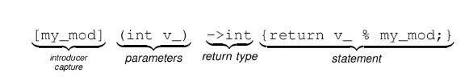

## Introduction

어쩌다 보니, Jpub 에서 Python Rust 책을 리뷰 하게 되었는데, Function 과 Closure 에 대해서 이야기를 하는데, 뭔가 배웠는데 기억이 안나서 작성하게 됬다. 

Lambda 함수에 대해서 잠시 이야기를 해보자. 소스코드는 [모두의 코드 C++](https://modoocode.com/196) Resource 를 가지고 왔다.

```c++
vector<int>::const_iterator iter = cardinal.begin();
vector<int>::const_iterator iter_end = cardinal.end();
int total_elms = 1;
while(iter != iter_end){
    total_elms *= *iter;
    ++iter;
}
```

위의 코드는 cardianl 이라는 `std::vector<int>` 타입이 존재 했을때, const_iterator type 으로 begin 과 end 를 각각 `iter` 와 `iter_end` 로 변수로 지정해놓았다. 그리고 while 문 에서는 total element 에다가 vector 에 있는 모든 `int` 을 곱해서 결국은, 벡터의 모든 원소들의 곱을 나타낸다.

이런 방법도 있지만, 조금 더 Modern C++ 로 다른 방법으로 해결한다면 `Functor` 를 이용할수 있다.

```c++
int total_elms = 1;
for_each(cardinal.begin(), cardinal.end(), product<int>(total_elms));

template<typename T>
struct prodcut {
    product(T& storage) : value(storage){}
    template <typename V>
    void operator()(V& v){
        value *= v;
    }
    T& value;
}
```

하지만 위의 코드는 `product` 라는 struct 를 만들고, for_each 로 while 문을 대신해서 사용된다. 하지만 struct 에 대한 operator 그리고 constructor 를 지정하므로 코드가 생각보다 길어진다. 그렇다면 어떻게 더 간단하게 만들수 있을까? 아래의 코드를 보자. 아래의 코드가 바로 lambda 로 구성한 코드이다. 

```c++
int total_elms = 1;
for_each(cardinal.begin(), cardinal.end(), 
    [&total_elm](int i) {total_elms *=i; });
```

lambda 식은 아래와 같다.


각각의 부분은 introducer(capture), parameters, return type, statement 로 구성이 되어있다. introducer 같은 경우는 `[]` 안에 있는 `my_mod` 라는 변수를 람다 내부에서 사용할 수 있게 된다. 그리고, parameter: `()` 안에서는, 받을 인자를 적게 되는데 위의 예에서는 int 형을 가지고 와서 lambda 내부에서 사용할 수 있게 된다. trailing_return type 같은 경우는 따로 말하지는 않겠다. 이런 한 lambda 식을 결국은 쓰게된다. 여기서 바로 closure 과 lambda expression 에서 이야기를 하게 된다. 

lambda expression 을 쓰긴 하지만, Runtime 에는 이름이 없지만, 메모리 상에 임시적으로 존재하는 Closure 가 생성이된다. 예를 들어보자. 아래의 `=` 옆에 부분에 lambda expression 이 있다고 가정하면, 결국 Runtime 에 closure 가 생성이되고, f 는 closure 에 대한 복사값이 될것이다. 물론 closure 를 복사하는 부분은 `std::move` 로 넘길수 있지만 f 가 closure 는 아니다.

```c++
auto f = [&](int x, int y){ return fudgeFactor * (x + y); };
```

실제 closure object 는 이 statement 가 끝났을때, 파괴된다. 즉 closure 과 lambda 의 차이는 정확하게 클래스와 클래스 인스턴스의 차이인거다. 결국 class 같은 경우는 정의를 한거고, closure 는 class 의 instance 이다. 결국 class 는 소스코드에만 존재하고, runtime 에서는 존재 하지않고, class instance 들은 run time 에 존재하게 되는것들이다. 

```c++
void addDvisionFilter()
{
    auto calc1 = computeSomeValue1();
    auto calc2 = computeSomeValue2();

    auto divisor = computeDivisior(calc1, calc2);

    filters.emplace_back(
        [&](int value){ return value & divisor == 0; }
    )
}

```

여기에서 문제가 되는건 runtime 에서 filter 라는 컨테이너에 클로져가 local variable 보다 오래살기 때문에, divisor 의 값이 이 함수가 끝나면 사라진다. 그래서 Reference Error 가 나올것이다.


## Resource
* [Lambda_Closure](https://lunchballer.com/archives/284)
* [Lambda Function](https://modoocode.com/196)