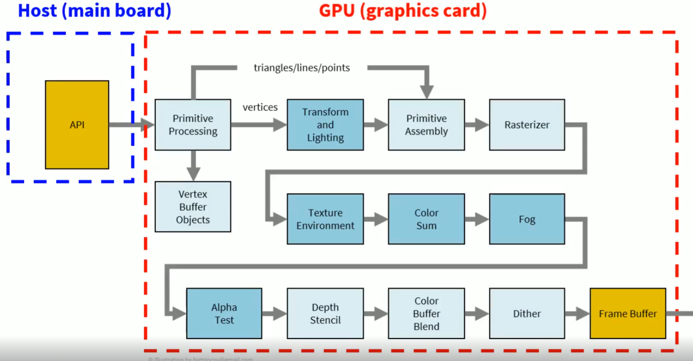
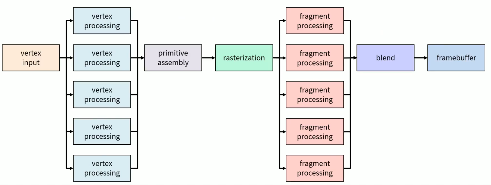
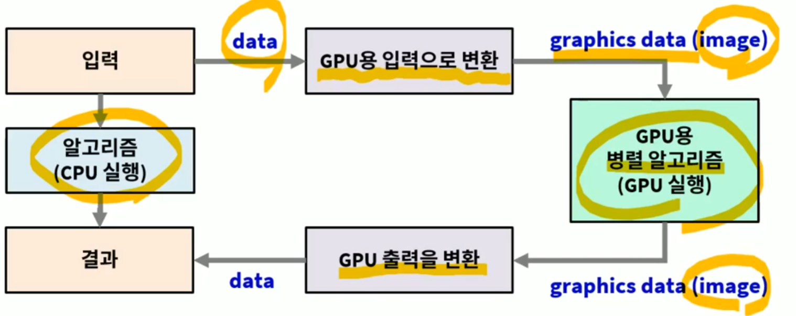
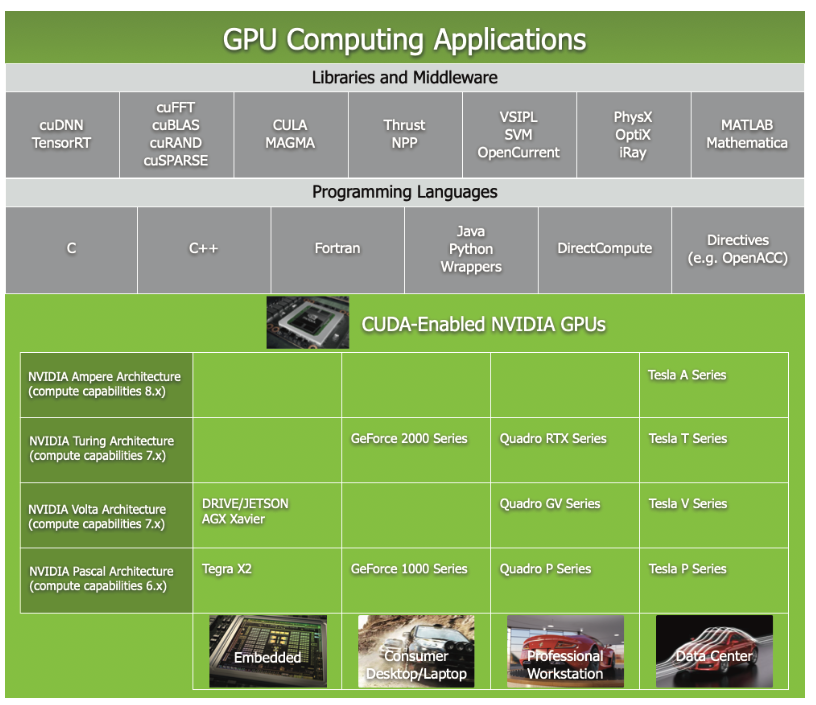

## Motivation
###
가끔씩 현업에서 Unreal Engine 이나, 대학원때 공부했었던 Parallel Computing System 을 공부했었을때, 뭔가 부족한 점도 많았고, Wording 이 친숙하지 않아서 인지 아쉬움이 많았다. 그래서 GPU 를 다뤄보는 내용으로 블로그를 쓰려고 한다.

---
## Index

### CPU / GPU 설계 철학

* 반응 시간 (Latency) 우선
* 처리량 (throughput) 우선

### 대규모 병렬 컴퓨팅(massively parallel computing)

* MPC = massivlely parallel computing

## Introduction

알다 싶이, CPU (Central Processing Unit) 처음에는 폰 노이만 구조를 가지고 있는 Single Core CPU 로 이루어져있었다. 하나의 긴 Data Bus 아래에 Memory, Processor( CU + ALU ), and I/O Device 로 되어있었다; Control Unit (ALU 의 제어 담당) and Arithemetic-logic unit. 즉 이게 하나였던 Architecture 이였다. 그리고 Dual Core 로 CU / ALU 가 두개가 생겨났었다. 이게 점점 더 늘어나면서 32+ Core 들이 만들어졌다. 하지만 GPU 는 many core 이라고 해서, 애초에 1024~8192+ core 로 GPU 를 만들게 되었다.

고성능 멀티 코어 CPU 같은 경우의 철학 같은 경우, 반응 시간 (Latency) 단축 시키는 철학을 가지고 만들었으며, 그 이유로는 순차 처리 sequential processing 에 적합 하게끔, 그리고 기존 고성능 코어를 추가하는식으로 만들어져있다. 

하지만 대규모로 만들어지는 Many-Core 을 철학으로 만든 GPU 같은 경우, 처리량 Thoughput 확대를 위주로 만드는 철학을 가지고 있었다. 즉 Parallel processing 에 집중을 했었고, 성능과는 무관하게, 코어 숫자 증가에 집중을 했다. 즉 Control Unit 와 Cache 는 작지만, 1 개의 Control Unit 자체가 여러개의 ALU 를 관리하고 동시에 실행이 되니 Thread Pool 에 효과적으로 집중을 할수 있고, 이 결과로 단위시간당 처리량 대폭 확대를 할수 있게 됬다.

### Models
여기서 Model 은 결국 Device + Programming Language + Compiler + Library 를 뜻한다. 예를 들어서 종류는 아래와 같다.

1. OpenMP : Open Multi-Processing
   1. 멀티 코어 CPU 용 
   2. GPU 로 확장중
2. CUDA: Compute Unified Device Architecture
   1. NVIDIA GPU 전용 으로 사용되고, 현재는 Cloud Computing 을 사용 가능
3. OpenCL: Open Computing Language
   1. CPU / GPU / FPGA 모두 제공
   2. Apple, Intel, AMD/ATI, NVIDIA ...
   3. 범용성을 추구 하고, 좀 더 복잡한 모델, 교육용으로는 레벨이 높다.

## CUDA (Compute Unified Device Architecture) Programming

CUDA 라고 하면 주로 Computer Vision 이나 Computer Graphics 쪽에서 많이 이야기 하게 된다. 여기서는 Computer Graphics 를 조금 집중적으로 이야기를 하려고 한다.

Computer Graphics 은 결국 현실과 똑같은 걸 Computer 를 사용해서 표현 해야하므로, Grpahics Model 들이 있고, 이런 Graphics Model 들은 Physics 나 Optics 에 대한 법칙에 기반에서 만들어져야 했다. 그리고 이러한 Model 들은 현실 세계와 마찬 가지로 부드럽게 Motion 들이 생성이 되어야한다. 더 나아가서 더 빠르게 실시간에서 처리를 해야한다라는게 중요한 포인트의 학문이 바로 Computer Graphics 라고 말을 할 수 있다.

잠시 아래의 reference 된 그림들을 보자면, 아래의 그림들은 흔히 알고 있는 Graphics Pipeline 이다. 결국엔 Host 즉 CPU 에서 대용량으로 처리할 수 있는 데이터를 GPU 로 보낸 다음 저런 Pipeline 을 통해서, 마지막 Frame Buffer 에다가 넘겨서, 우리 화면에 게임과 같은 가상현실들을 볼수 있는거다. 

두번째 그림에서는 결국엔 GPU 의 처리 성능 부분이 어디에서 주로 이루어졌냐 라고 물어봤을때는 `Vertex Processing` 과 `Frament Processing` 즉 수많은 Vertex 로 도형을 만들고, 그리고 이 도형들을 색을 결정하는데에 처리량이 많이 들어가므로, 특히 GPU 의 처리 기능이 저런 Processing 쪽에 들어간다.

이런 처리 기능 성능 부분들을 어떤 방식으로 처리를 했냐면 바로 `GPGPU` 의 도임을 말을 할 수 있다. 바로 `GPGPU(general purpose graphics processing unit)` 이라고 말을 할수 있고, GPU 의 하드웨어를 좋은 계산기로 사용할 수 있는 Techniqe 이라고 볼수 있다.

조금더 구체적으로 CPU 에서 GPU 가 이해 할 수 있는 입력으로 변환을 하고, GPU 가 처리한 이후 어떠한 Image Data 로 다시 CPU 가 받을수 있게 하거나 GPU 의 출력해서 모니터로 불수 있게끔하게 된다. 이러한 방식이 바로 GPGPU (General Purpose GPU Programming) 의 방식이다.

### CUDA Architecture

* Compute Unified Device Architecture
* GPU 에서 대규모 쓰레드 Thread 를 실행
* GPU = 대규모 병렬 처리 코프로세서 Massively Data Parallel Co-Processor
* Model = Device / Computer Architecture + Programming Language + Compiler + Much More
* CPU 를 범용으로 사용하는 ToolKit 으로 구성 (C / C++)
  * CUDA Driver -> GPU 로 구동
  * CUDA Library -> API 함수들
  * GPU 기능을 직접 제어 가능 -> 최고 효율 획득

### Lecture Reveiw

### Develop Environment
* CUDA SDK+ C++ compiler
* NVIDA Graphics Hardware
* C++11

## Resource

* https://www.inflearn.com/course/cuda-%ED%94%84%EB%A1%9C%EA%B7%B8%EB%9E%98%EB%B0%8D-%EC%86%8C%EA%B0%9C/dashboard
* https://docs.nvidia.com/cuda/cuda-c-programming-guide/index.html