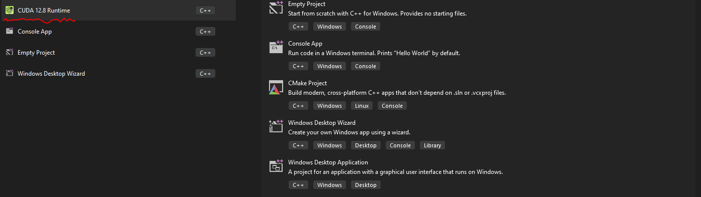

## Prerequiste for CUDA

* CUDA 를 설치하기 위해서 해야하는것을 간단히 소개 하겠다. CUDA 를, 즉 개발 환경을 설정하려면 아래의 목록 대로 설치 할 필요가 있다.
  * Visual Studio 2019/2022
  * Nvida Graphic App
  * CUDA Toolkit (*******)
  * Nsight Visual Studio Editon Extension in Visual Studio
  * Nsight System
  * Nsight Compute 
  * vcpkg (C++ Library, like pip)

* vcpkg 에 필요한 라이브러리는 설명하지는 않겠다. 단 몇가지를 설치할 필요가 있다.

```
./vcpkg install vulkan:x64-windows, stb:x64-windows, glfw3:x64-windows, glm:x64-windows
./vcpkg install vulkan:x64-windows stb:x64-windows glfw3:x64-windows glm:x64-windows
./vcpkg install vulkan:x64-windows
./vcpkg install stb:x64-windows
./vcpkg install glfw3:x64-windows
./vcpkg install glm:x64-windows
```

## CUDA: Hello World

위의 내용을 설치하지 않아도, `cuda tool kit` 이 설치가 완료 되었다고 한다고 하면, 굳이 할 필요 없다. Visual Studio 만으로도 충분히 사용할 수 있다. 일단 C 에 Program Files 안에 CUDA Toolkit 안에 있는 예제 `.exe` 파일을 돌려보거나, 설치가 되어있다고 하면, Project 를  생성할때 아래와 같이 사용할수 있다.



그리고, 코드를 보면 `cu` 라는 확장자를 가지고 있다.  또 아래의 코드처럼 생성 이후에, 실행을 시켜보면. `hello, CUDA` 가 출력이 된다. 자 여기서, 분명 `__global__ void hello(void)` 쪽이 바로 CUDA 에서 실행되는 부분이다. 그리고 `__global__` 이라는 것은 이 함수가 GPU 에서 실행될 것이라는 것을 의미한다. 그리고 이 함수는 모든 GPU 에서 실행될 것이다. 즉 하나의 설정자이다. `CUDA` 라는게 C++ 위에 올라가는거기때문에, editor 에서 에러 처럼 보일수 있다.. 이건 c/c++ 이 CUDA Kernel 을 포함시킨다를 의미한다.

그리고 `<<>>` 이 부분이 1 x 1 즉 1 개 Core 만 사용한다는 뜻이다. (Liunux 에서는 안들어갈수 있다.) 저걸 만약에 <<1 , 8>> 이라고 하면, 1 x 8 개의 Core 를 동시에 사용한다는 의미이다. 그리고 만약 <<8, 2>> 라고 한다면, 16 개의 Core 를 동시에 사용한다는 의미이다. 그리고 8 개의 세트를 두번씩 돌린다는 말이다.

```c++
#include <cstdio>

__global__ void hello(void)
{
    printf("hello, CUDA\n");
}

#include <vector>
int main()
{
    hello << <1, 1 >> > (); // parallel execution (call cuda) 
    return 0;
}
```

OS 에 상관 없이 돌려 보아야하기 때문에, Linux 에서 사용을 해보도록 하자. Linux 에서 사용하려면, `cudaDeviceSynchronize()` 를 사용해야한다. 이 함수는 모든 thread 가 끝날때까지 기다리는 함수이다. 그래서 이 함수를 사용하면, 모든 thread 가 끝날때까지 기다리기 때문에, 모든 thread 가 끝나고 나서야 다음 코드를 실행할수 있다. 

```c++
#include <cstdio>

__global__ void hello(void)
{
    printf("hello, CUDA %d\n", threadIdx.x);
}

#include <vector>
int main()
{
    hello << <1, 8>> > ();
    #if defined(__linux__)
        cudaDeviceSynchronize();
    #endif
    fflush(stdout);
    return 0;
}
```

### Resource
[Courses](https://developer.nvidia.com/educators/existing-courses#1)
