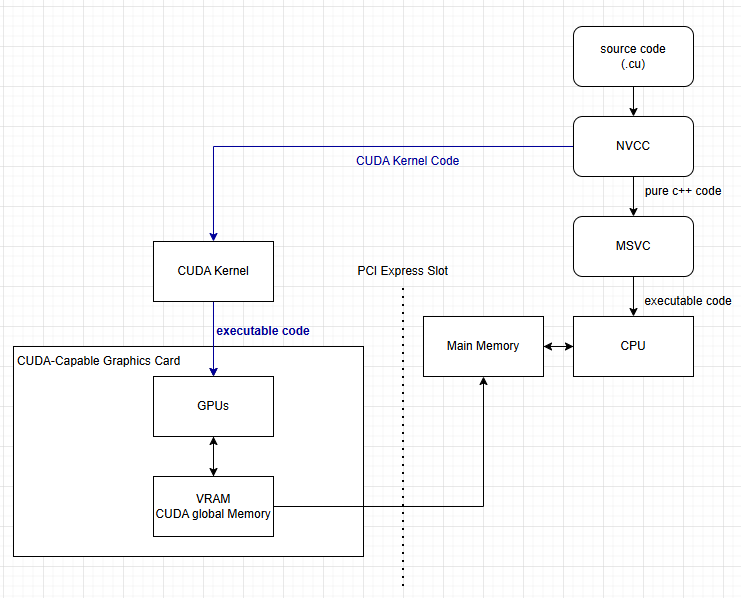

## CUDA Architecture & Memory Handling

바로 아래의 Diagram 을 살펴보자.



위의 그림을 보자면, Source Code 에서 nvcc (nvidia) CUDA Compiler 가 CUDA 관련된 코드만 쏙 빼가서, 그부분만 컴파일을 하게 된다. Compile 을 한 이후에, executable code 만 GPU 에게 넘겨준다. 즉 전에 Post 에서 사용했던 `__global__` 코드만 nvcc 가 가로채서 GPU 에서 실행을 했다고 생각을 하면된다. 그리고 남은거는, MSVC 또는 GNU 가 pure C++ Code 만 가져가서, CPU 에 실행한다고 볼수 있다.

여기에서 용어를 한번 정리를 한다면, 
* CUDA Kernel: GPU 가 실행하는 작은(병렬) 프로그램이고
* VRAM: CUDA 가 사용하는 메모리

직접적인 I/O 는 오로지 South PCI Slot 이므로 North PCI 에서는 안됨, 그래서 간접적으로 해야한다. 즉 이 말은 I/O 에서 받아오는것들을 Main Memory 로 들고 온이후에, CUDA Memory (VRAM) 으로 Copy 를 해주면 된다. 그래서 이것저것 GPU 에서 한 이후에, Main Memory 로 다시 넘겨주면 되는 형식이다. 즉 다시 정리를 하자면

1. 외부 데이터로부터 메인메모리, 메인메모리부터 비디오 메모리 (Host CPU)
2. CUDA Kernel 실행, 비디오 메모리 데이터 사용, GPU 로 병렬처리, 처리 결과는 비디오 메모리 (Device=Kernel Program)
3. 비디오 메모리 -> 메인메모리, 외부로 보내거나, I/O 출력 (Host CPU)

이런식으로 3 단계로 일반적인 Step 이라고 볼수 있다.

### Memory Handling
* CPU 와 GPU 메모리는 공간이 분리되어있다 
* **메인메모리 할당/복사 C++ 함수 사용**
>> void* malloc(size_t nBytes);
void free(void* ptr);
void* memset(void*ptr, int value, size_t count);
void* memcpy(void* dst, const void*src, size_t num);
```c++
int nbytes = 1024 * sizeof(int);
int *ptr = nullptr;
ptr = malloc(nbytes);
memset(ptr, 0, nbytes);
free(ptr);
```
* **비디오 메모리 할당/복사: 별도의 CUDA 함수 이용**
>> cudaError_t cudaMalloc(void** dev_ptr, size_t nbytes);
cudaError_t cudaMemset(void* dev_ptr, int value, size_t count);
cudaError_t cudaFree(void* dev_ptr);
cudaError_t cudaMemcpy(void* dst, void* src, size_t nbytes, enum cudaMemcpyKind direction);
```c++
int nbytes = 1024 * sizeof(int);
int* dev_ptr = nullptr;
cudaMalloc((void**)&dev_ptr, nbytes);
cudaMemset(dev_ptr, 0, nbytes);
cudaFree(dev_ptr);
```

여기에서 `cudaMemcpy` 를 한번보자.
* 이전 CUDA 함수들이 모두 종료되어야 복사가 시작된다.
* copy 중에는 CPU Thread Pause, 작업이 완료되어야 리던한다.
* host = CPU, main memory, RAM
* device = CUDA, video memory, vram
* enum cudaMemcpyKind
  * cudaMemcpyHostToDevice
  * cudaMemcpyDeviceToHost
  * cudaMemcpyDeviceToDevice
  * cudaMemcpyHostToHost

특별 이슈라고 말을 할수 있는건 아래와 같다.
* Memory address 문제
* 어느쪽 주소인지 ㅣ프로그래머가 구별
* 반대쪽 Address 를 넣으면 System Crash 발생가능
* 해결책: device 에서는 `dev_` 사용

예제를 한번 보자. 자세하게 보면, 메모리를 할당할때, 간접적으로, dev_a 와 dev_b 를 받아주는걸 볼수 있다. 그리고, Host 에서 GPU 로 a 라는 걸 `SIZE * sizeof(float)` 만큼 할당해서, device 에 있는 dev_a 를 가르키게끔 되어있다. 그다음 dev_b 에서 dev_a 를 copy 한 이후에, dev_b 에 있는걸 b 로 Copy 하는 걸 볼 수 있다.
```c++

#include <stdio.h>
#include <cuda.h>
#include <cuda_runtime_api.h>
#include <cuda_runtime.h>

int main()
{
    const int SIZE = 8;
    const float a[SIZE] = { 1., 2., 3., 4., 5., 6., 7., 8. }; //src
    float b[SIZE] = { 0., 0., 0., 0., 0., 0., 0., 0. }; //dst

    printf("a = {%f,%f,%f,%f,%f,%f,%f,%f}\n", a[0], a[1], a[2], a[3], a[4], a[5], a[6], a[7]);
    fflush(stdout);

    float* dev_a = nullptr;
    float* dev_b = nullptr;
    cudaMalloc((void**)&dev_a, SIZE * sizeof(float));
    cudaMalloc((void**)&dev_b, SIZE * sizeof(float));

    cudaMemcpy(dev_a, a, SIZE * sizeof(float), cudaMemcpyHostToDevice);
    cudaMemcpy(dev_b, dev_a, SIZE * sizeof(float), cudaMemcpyDeviceToDevice);
    cudaMemcpy(b, dev_b, SIZE * sizeof(float), cudaMemcpyDeviceToHost);

    cudaFree(dev_a);
    cudaFree(dev_b);

    printf("b = {%f,%f,%f,%f,%f,%f,%f,%f}\n", b[0], b[1], b[2], b[3], b[4], b[5], b[6], b[7]);
    fflush(stdout);
    return 0;
}
```