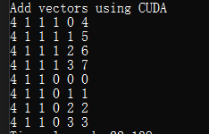
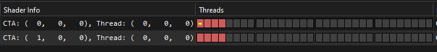
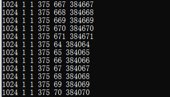

# CUDA Kernel - Example 

[Previous Post](https://sjang1594.github.io/study/CUDA-Kenel.html) 글에서 봤듯이, Addition 을 Block 하나를 여러개의 Threads 들을 사용해서, Vector Addition 을 할수있다. 만약에 그럼 여러개의 Block 을 쪼개서 총 8 개의 사이즈를 가지고 있는 Array 를 더하려면 어떻게 하냐? 라고 물어볼수 있다 생각보다 간단하다. Block 두개를 사용해서, Thread 4 개씩 할당할수 있다.
아래의 코드 Segments 를 봐보자. 아래처럼 Block 2 개, thread 개수 4 개 이런 방식으로 구현을 하면 된다. **우리가 궁금한거는 결국 이 덧셈이 어떻게 되는지가 궁금한 포인트이다**. 그러기 때문에 아래처럼 속도가 느려지더라도, `printf` 를 통해서, 볼수 있다. `int i = blockDim.x * blockIdx.x + threadIdx.x` 라고 써져있다. blockIdx.x 하고 threadIdx 는 대충 이해가 갈것이다. 하지만 BlockDim 은 뭔가라고 한번쯤 고민이 필요하다.  

```c++
__global__ void addKernel(const int* a, const int* b, int* c, int size)
{
	int i = blockDim.x * blockIdx.x + threadIdx.x;

	if (i < size)
		c[i] = a[i] + b[i];

	printf("%u %u %u %u %u %d\n", blockDim.x, blockDim.y, blockDim.z, blockIdx.x, threadIdx.x, i);
}

addKernel <<<2, 4 >>> (dev_a, dev_b, dev_c, size);
```

일단 위의 코드를 Printf 한 결과값을 한번 봐보자. 아래의 결과값을 보자면, Thread Block 은 4 x 1 x 1 이다. 그말은 Thread 의 개수 하나의 Block 당 4 개의 Thread 를 의미한다. 그리고, Block Index 는 총 2 개의 Block 을 사용하니 0, 1 로 나오며, 이제 ThreadIdx 는 그대로 나온다. 하지만 여기서 중요한건 바로 1 부터 돌아갔다는 소리이다. Multithreading 을 하다 보면 순서에 상관없이 돌기 때문에 그 환경 때문에 먼저 실행되는건 일이 끝난 순서대로 되서 순서와 상관없이 Operation 만 끝내면 된다는 방식에서 온거이다. 그리고 i 의 계산의 결과 값들을 봐도 우리가 예상하지 못한 결과를 볼수 있다. 



결국에는 그럼 우리가 어떻게 Debugging 하지? 라는 질문이 있다.. 어찌저찌 됬든간에, CUDA 안에 있는 Thread Block Index, Thread Index, Block Dimension 같은 경우를 봐야하지 않을까? 라는게 포인트이다. Nsight 를 쓰면 굉장히 잘나와있다. 아래의 그림을 보면, 굉장히 Visualization 이 생각보다 잘되어있다. 안에 있는 내부 구성요소는 거의 위와 구현한 부분을 매칭하면서 보면 좋을것 같다.



아래의 코드 같은 경우 대용량의 Data 처리를 위한 예제 코드라고 볼수 있다. 64 같은 경우는 내 컴퓨터 스펙중에 Maximum Threads Per Dimension 안에 있는 내용을 인용했다. 물론 이때는 Printf 를 쓰면 과부하가 걸릴수도 있으니 결과값만 확인하자. 물론 아래의 그림같이 Printf 를 한경우도 볼수 있다.
```c++
const int size = 1024 * 1024 * 64
const int threadsPerBlock = 1024; 
int numBlocks = (size + threadsPerBlock - 1) / threadsPerBlock; 
addKernel << < blocks, threadsPerBlock >> > (dev_a, dev_b, dev_c, size);
```



### Resource
* [CUDA-thread](https://www.cs.emory.edu/~cheung/Courses/355/Syllabus/94-CUDA/CUDA-thread.html)
* [Courses](https://developer.nvidia.com/educators/existing-courses#1)