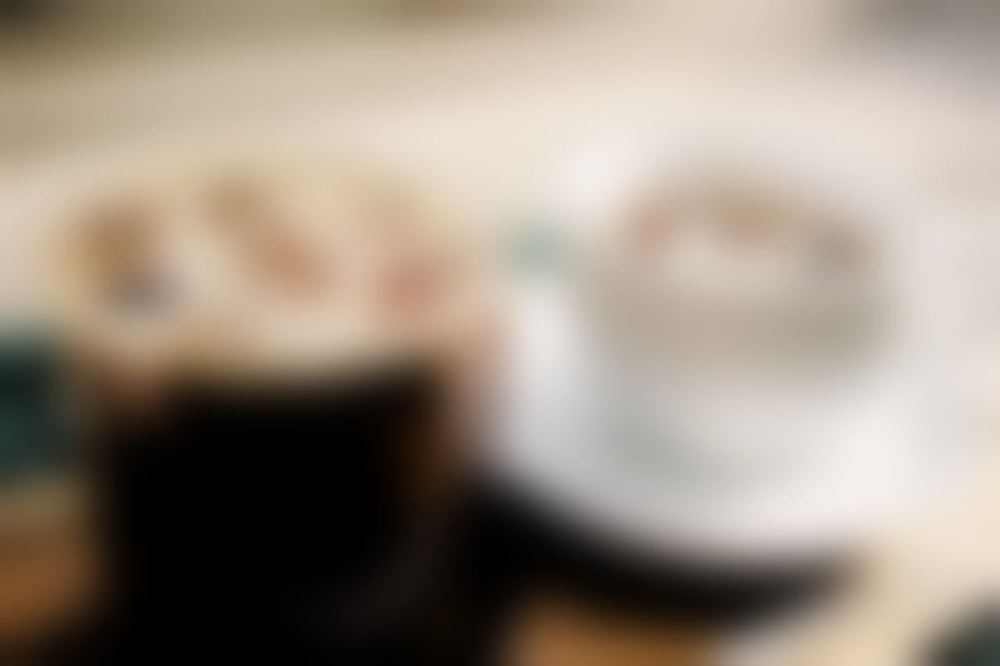

## Handling Images (2D Array)

Image 를 처음으로 Screen 으로 봤을때, 2D 로 보일거다. OpenCV 를 사용했었더라면, `Image Watch` 로 봤을때, 각 pixel 값이 2D image 에 잘 저장이되어 보인다고 볼수 있다.

사실은 내부적으로 어떻게 되는지? 를 궁금해할수있다. C++ 에서의 운영체제에서는 데이터를 받을때 1차원형태로 받는다. 만약에 image 의 pixel 값이 [0, 255] 을 값을 Normalize 를 0 과 1 사이로 한다면, 한 element 에 들어가는것은 바로 float 값일거다. 그래서 `float* myImg = new [width * height]` 이런식으로 해서 Image를 1D 로 보관한다. 즉 어떻게 Indexing 하느냐에 따라서 2D 로 배열을 바꿀수 있다.

주로 기초적인 질문일수 있지만, API 를 사용하다보면 놓칠수도 있다.
왼쪽 가로축으로 시작해서 오른쪽으로 한칸 한칸 움직이고(Column), 그 다음 row 에 가서 위와 같은 방법으로 indexing 을 할 수 있다. 예를들어서 (0, 0), (1, 0), (2, 0) .. 이런식으로 가다가 두번째 row 에서는 (0, 1) (1, 1), (2, 1) .. 이런식으로 가서 맨 아래의 element 에서는 (#column, #row) 가 되는식으로 될것이다.

그렇다면 다시 거꾸로 해서, 2D image 에서 (2, 3) 이라는 데이터가 있다고 가정하자. 그리고 (2,3) 에 가서 data 를 변경 한다고 가정하면, 우리에게 주어진건 1D data 이기 때문에, 17 번째의 Index 를 찾아야한다. 어떤 인덱스 (i, j) 에서 1차원 index 를 가지고 올수 있는 방법은 `i + width * j` 이다.

## Handling Screen(Image)

일단 Graphics 관점에서 뭔가 screen 에다가 표현을 하고 싶다고 한다면, DirectX11 을 사용해서 Pixel 값들을 움직일 수 있다. 여기서 Vec4 라는 구조체를 넣어서, screen 좌표에 있는 모든 pixel 값들을 하얀색으로 지정해준다. 그런 다음에 Update 에서 while 문에서 호출 했었을때, screen 좌표에있는 Pixel 을 빨간색을 칠해주고 그다음 pixel 을 가서 또 칠해준다. 즉 빨간색 pixel 이 움직이는것 처럼 보이게 할수 있다.

아래 부분의 주석으로 되어있는 코드는 CPU 에서 Memory 를 Map 을 만들어주고, memory copy 를 해서 GPU 에 넘겨주는 코드 부분이다. 이게 사실 Bottle Neck 이 될수 있다. 더 자세한건 Grpahics Pipeline 을 한번 참고 하기를 바란다.

```c++
struct Vec4
{
    float v[4];
}

void Update()
{
    Sleep(300);
    static int = 0;
    std::vector<Vec4> pixels(canvasWidth * canvasHeight, Vec4{1.0f, 1.0f, 1.0f, 1.0f});
    pixels[i] = Vec4{ 1.0f, 0.0f, 0.0f, 1.0f };
    if (i >= pixels.size() - 1)
    {
        i = 0;
    }
    else
    {
        i++;
    }

    // Update Texture Buffer
    D3D11_MAPPED_SUBRESOURCE ms;
	deviceContext->Map(canvasTexture, NULL, D3D11_MAP_WRITE_DISCARD, NULL, &ms);
	memcpy(ms.pData, pixels.data(), pixels.size() * sizeof(Vec4));
	deviceContext->Unmap(canvasTexture, NULL);
}
```

제일 Image 를 해석하려면, 제일 좋은게 뭐일까라고 물어본다면 바로 이미지를 읽고 저장하는게 제일 중요하다. OpenCV 를 사용해서 Image 를 읽는것도 있지만, 제일 쉬운건 Python 에서 pip 관리 하는것처럼 [vcpkg](https://vcpkg.io/en/packages.html) 를 사용해서 [stb](https://github.com/nothings/stb) 를 사용하는게 제일 좋다. (*단 image 가 너무 커질때는 조심해야한다.*)

```c++
#define STB_IMAGE_IMPLEMENTATION
#include <stb_image.h>
#define STB_IMAGE_WRITE_IMPLEMENTATION
#include <stb_image_write.h>
#include <algorithm> // std::clmap(c++ 17)
class Image
{
public:
    int width = 0, height = 0, channels = 0;
    std::vector<Vec4> pixels; 

    void ReadFromFile(const char* fileName);
    void WritePNG(const char* filename);
    Vec4& GetPixel(int i, int j);
}

void Image::ReadFromFile(const char* fileName)
{
    // 대부분의 img 는 0 ~ 255 값을 가지고 있기때문에 unsigned char 로 저장
    unsigned char* img = stbi_load(fileName, &width, &height, &channels, 0);

    if (width) {
		std::cout << width << " " << height << " " << channels << std::endl;
	}
	else {
		std::cout << "Error: reading " << filename << " failed." << std::endl;
	}

    // channel 이 3 이나 4 일걸 가정
    pixels.resize(width * height);
    for(int i = 0; i < width * height; i++)
    {
        pixels[i].v[0] = img[i * channels] / 255.0f;
		pixels[i].v[1] = img[i * channels +1] / 255.0f;
		pixels[i].v[2] = img[i * channels +2] / 255.0f;
		pixels[i].v[3] = 1.0f;
    }

    delete [] img;
}

void Image::WritePNG(const char* filename)
{
	// 32bit -> 8bits
	std::vector<unsigned char> img(width * height * channels, 0);
	for (int i = 0; i < width * height; i++)
	{
		img[i * channels] = uint8_t(pixels[i].v[0] * 255.0f); 
		img[i * channels + 1] = uint8_t(pixels[i].v[1] * 255.0f);
		img[i * channels + 2] = uint8_t(pixels[i].v[2] * 255.0f);
	}

	stbi_write_png(filename, width, height, channels, img.data(), width * channels);
}

Vec4& Image::GetPixel(int i, int j)
{
	i = std::clamp(i, 0, this->width - 1);
	j = std::clamp(j, 0, this->height - 1);

	return this->pixels[i + this->width * j];
}
```

위의 함수를 적절히 이용해서, 아래와 같은 Image Data 를 읽고 저장할수 있다. 사진의 해상도가 높다면 깨질수도 있으니 확인이 필요하다.

<figure>
  
</figure>

## Convolution

Deep Learning 에서 Image Object Detection 을 해봤더라면 `Convolution Layer` 라는 걸 사용해 본적이 있을것이다. 그리고 OpenCV 에서 Kernel size 아니면 Masking 을 사용하거나 적용해서 Edge 를 더 나타내거나, 여러 Blur 종류 들을 볼수 있을것이다. Convolution 의 내용은 아래 `6 Basic Things to Know about Convolution` 과 `A Basic Introduction to Convolutions` 를 참고하기 바른다.

<figure>
  
</figure>

Computer Graphics 측면에서 Convolution Filter 를 사용하게되면 연산량이 많아진다. 그래서 `Separable Convolution` 을 사용한다. Separable Convolution 같은 5 x 5 의 Kernel 이 있다고 하면 Middle point 에서 row 값을 평균을 내고, column 값에서 평균을 낸다. 즉 중앙을 기준으로 row 를 평균, column 을 평균을 내는 방식이다.

그렇다면 Box Blur 를 구현을 해보자. 구현 내용은 아래와같다. GetPixel 함수에서 clamping 을 했기 때문에 만약에 Padding 이 없을 경우, -2, -1 값들은 0, 1 로 push 하게 된다.

```c++
for (int j = 0; j < this->height; j++)
{
	for (int i = 0; i < this->width; i++)
	{
		Vec4 neighborColorSum{ 0.0f, 0.0f, 0.0f, 1.0f };
		for (int si = 0; si < 5; si++)
		{
			Vec4 neighborColor = this->GetPixel(i + si - 2, j);
			neighborColorSum.v[0] += neighborColor.v[0];
			neighborColorSum.v[1] += neighborColor.v[1];
			neighborColorSum.v[2] += neighborColor.v[2];
		}
		pixelsBuffer[i + this->width * j].v[0] = neighborColorSum.v[0] * 0.2f;
		pixelsBuffer[i + this->width * j].v[1] = neighborColorSum.v[1] * 0.2f;
		pixelsBuffer[i + this->width * j].v[2] = neighborColorSum.v[2] * 0.2f;
	}
}

for (int j = 0; j < this->height; j++)
{
	for (int i = 0; i < this->width; i++)
	{
		Vec4 neighborColorSum{ 0.0f, 0.0f, 0.0f, 1.0f };
		for (int si = 0; si < 5; si++)
		{
			Vec4 neighborColor = this->GetPixel(i, j + si - 2);
			neighborColorSum.v[0] += neighborColor.v[0];
			neighborColorSum.v[1] += neighborColor.v[1];
			neighborColorSum.v[2] += neighborColor.v[2];
		}
		pixelsBuffer[i + this->width * j].v[0] = neighborColorSum.v[0] * 0.2f;
		pixelsBuffer[i + this->width * j].v[1] = neighborColorSum.v[1] * 0.2f;
		pixelsBuffer[i + this->width * j].v[2] = neighborColorSum.v[2] * 0.2f;
	}
}
```

사용을 하면, 아래와 같은 그림이 결과로 저장이되어 나온다.

<figure>
  
</figure>

## Gaussian Blur
가우시안 Blur 를 사용하려면, weight 값을 줘야 된다. `const float weights[5] = { 0.0545f, 0.2442f, 0.4026f, 0.2442f, 0.0545f };`

위에서 Box Blur 와 마찬가지로 해결해보면, 아래와 같은 코드가 나온다.

```c++
for (int i = 0; i < this->width; i++)
{
	Vec4 neighborColorSum{ 0.0f, 0.0f, 0.0f, 1.0f };
	for (int si = 0; si < 5; si++)
	{
		Vec4 neighborColor = this->GetPixel(i + si - 2 , j);
		neighborColorSum.v[0] += neighborColor.v[0] * weights[si];
		neighborColorSum.v[1] += neighborColor.v[1] * weights[si];
		neighborColorSum.v[2] += neighborColor.v[2] * weights[si];
    }
	pixelsBuffer[i + this->width * j].v[0] = neighborColorSum.v[0];
	pixelsBuffer[i + this->width * j].v[1] = neighborColorSum.v[1];
	pixelsBuffer[i + this->width * j].v[2] = neighborColorSum.v[2];
}

for (int j = 0; j < this->height; j++)
{
	for (int i = 0; i < this->width; i++)
	{
		// 주변 픽셀들의 색을 평균내어서 (i, j)에 있는 픽셀의 색을 변경
		// this->pixels로부터 읽어온 값들을 평균내어서 pixelsBuffer의 값들을 바꾸기
		Vec4 neighborColorSum{ 0.0f, 0.0f, 0.0f, 1.0f };
		for (int si = 0; si < 5; si++)
		{
			Vec4 neighborColor = this->GetPixel(i, j + si - 2);
			neighborColorSum.v[0] += neighborColor.v[0] * weights[si];
			neighborColorSum.v[1] += neighborColor.v[1] * weights[si];
			neighborColorSum.v[2] += neighborColor.v[2] * weights[si];
		}
		pixelsBuffer[i + this->width * j].v[0] = neighborColorSum.v[0];
		pixelsBuffer[i + this->width * j].v[1] = neighborColorSum.v[1];
		pixelsBuffer[i + this->width * j].v[2] = neighborColorSum.v[2];
	}
}

```

## Bloom Effect
Bloom 효과 같은경우는 밝은 Pixel 은 가만히두고, 어두운 Pixel 을 전부다 검은색으로 둔다음에 Gaussian Blur 를 사용한다. 그런다음에 원본이미지와 Blur 된 이미지를 더하면, Bloom Effect 가 일어난다. 일단 어두운 Pixel 을 전부다 검은색으로 바꾸는게 중요하다. 아래의 Resource 에서 `Relative Luminance` 를 참고하길 바란다. 그래서 이 식으로 하면 된다. `Relative Luminance Y = 0.2126*R + 0.7152*G + 0.0722*B`.

구현 방법은 아래와 같다. 즉 Pixel 을 가지고 와서 Relaitve Luminance 를 곱한 이후에, 어떤 threshold 에 넘는다고 하면 0 으로 바꿔치기하는 기술이다.

```c++
for (int j = 0; j < height; j ++)
	for (int i = 0; i < width; i++)
	{
		auto& c = this->GetPixel(i, j);
		const float relativeLuminance = c.v[0] * 0.2126 + c.v[1] * 0.7152 + c.v[2] * 0.0722;
		if (relativeLuminance < th)
		{
			c.v[0] = 0.0f;
			c.v[1] = 0.0f;
			c.v[2] = 0.0f;
		}
	}
```
그런다음 Gaussian Blur 함수를 call 한다음에 원본이미지에 더하는 코드는 아래와 같다. pixelBackup 같은경우 원본이미지의 복사본을 들고 있는거다.

```c++
for (int i = 0; i < pixelsBackup.size(); i++)
{
	this->pixels[i].v[0] = std::clamp(pixels[i].v[0] * weight + pixelsBackup[i].v[0], 0.0f, 1.0f);
	this->pixels[i].v[1] = std::clamp(pixels[i].v[1] * weight + pixelsBackup[i].v[1], 0.0f, 1.0f);
	this->pixels[i].v[2] = std::clamp(pixels[i].v[2] * weight + pixelsBackup[i].v[2], 0.0f, 1.0f);
}
```

결과의 이미지를 참고 하면,

relative luminance 를 통한 어두운 pixels 를 검은 pixel 로 바꿨을때
<figure>
  
</figure>

그 이후 Gaussian Blur 했을때
<figure>
  
</figure>

마지막으로 원본 데이터를 aggregate 했을때
<figure>
  
</figure>

## Resource
- [Convolution](https://en.wikipedia.org/wiki/Convolution)
- [Separable Filter](https://en.wikipedia.org/wiki/Separable_filter)
- [A Basic Introduction to Convolutions](https://towardsdatascience.com/a-basic-introduction-to-separable-convolutions-b99ec3102728)
- [6 basic things to know about Convolution](https://medium.com/@bdhuma/6-basic-things-to-know-about-convolution-daef5e1bc411)
- [Relative Luminance](https://en.wikipedia.org/wiki/Relative_luminance)