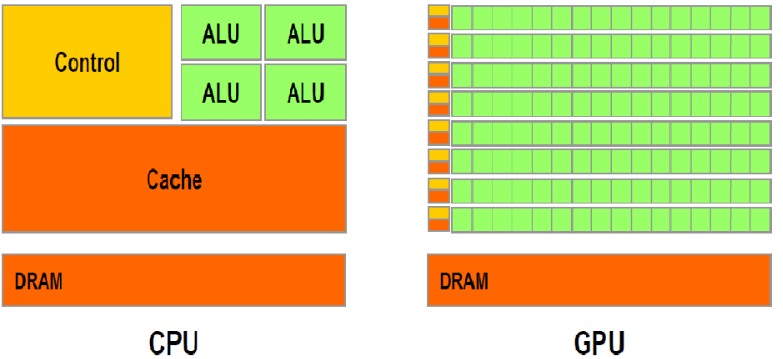
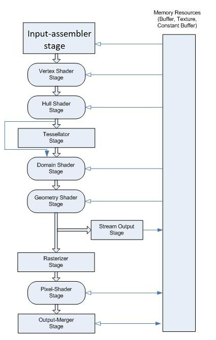
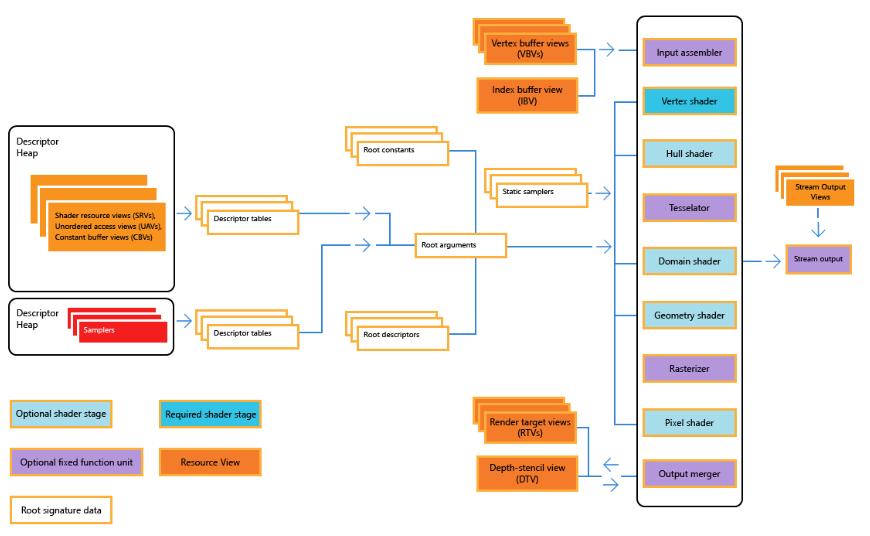

## DirectX12 Background

일단 장치 초기화 하기 이전에, Hardware 를 알아보자. 컴퓨터를 뜯어봤으면 알수 있는건 바로 CPU 와 GPU 를 한번쯤은 봤을것이다. 아래의 구조를 한번 보자.

<figure>
  
</figure>

CPU 는 마치 고급인력 처럼 보인다. CPU 는 뭔가 큰작업을 빠르게 처리할수 있는 ALU 4 개가 있고, 반대로 GPU 같은 경우는 수많은 ALU 가 존재하는데 약간 인력집단처럼 정말 많다. 바로 여기서 힌트를 얻을수 있는게, 단순 또는 값싼 인력을이 많아서, 독립적인 일을 병렬로 처리할수 있게 보인다. 만약 독립적인일을 CPU 로 하기엔 뭔가 고급 인력들을 잡일로 시키는것 같다. 그래서 주로 CPU 같은 경우, 뭔가 데이터나 연산들이 서로가 서로 연관관계일때 주로 사용되는게 좋다. 다시 정리해서 말하면 CPU 는 고급인력이고, GPU 는 약간 외주(outsourcing) 을 하는 느낌이다. GPU 에게 외주를 맡길거면, 어떤 일을 해야 하는지, 사인을 어느 부분에서 해야하는지, 등 알려주는게 좋아서, 바로 `Rendering Pipeline` 이라는게 정의가 되었다.

## Rendering Pipeline in DirectX

아래의 그림이 DirectX3D 11 의 Rendering Pipeline 이다. 각각이 뭐를 하는지 briefly 하게 넘어가보자.

<figure>
  
</figure>

``Input Assembler`` 에서는 정점(Vertex) 의 정보들을 전달해주는거라고 생각을 하면 된다. 예를들어서 삼각형의 정점들이 어떻게 이루어졌는지. ``Vertex Shader`` 같은 경우, 아까의 정점들을 가지고 연산을 하는 단계이다. 예를들어서, Morphing, Translation, 등 정점의 이동등을 연산한다. ``Tessellation Stage`` 나 ``Geometry Shader Stage`` 같은경우 정점을 추가시켜주는 작업을 맡는다. 정점을 추가하는 이유는 예를 들어서 선명도를 좀더 표현하기 위해서 정점을 더 더해줘서 quality 를 올리는 등이 있다.

``Rasterization Stage`` 는 정말 중요하다. 이 stage 가 오기전에는 정점을 가지고 놀았다면, 이제 각 정점에 Pixel 들을 입혀줘서, 삼각형이라고 한다면 어느정도 색깔과 모양을 그럴싸하게 표현해주는 stage 라고 생각하면 된다. 그런다음에 ``Pixel Shader`` 같은 경우 색상을 변경또는 조절을 담당한다. 그 다음에 최종 결과물을 이제 Output 으로 넘겨주는 형식이다.

이런 PipeLine 을 더 이해하고, 더 나아가서, GPU 에 다가 어떻게 일감을 던져주는지를 알려면 `Device Initialization` 이 필요하다. 이 아래에 설명이 있으니 한번 정리 해볼려고 한다.

## Device Initialization (Component Descriptions)

일단 설계구조는 이렇다. Engine 안에 `CommandQueue`, `DescriptorHeap`, `Device`, `SwapChain`, `RootSignautre` 등이 들어간다. 그리고 Engine 내부에서는 초기화(Init) 이 들어가고, Rendering 을 할수 있는 Render 가 들어갈것이다.

일단 `Device` 를 한번 보자.
`Device` 같은 경우, 인력 사무소라고 생각하면된다. 즉 GPU 와 소통할 공간이라고 생각하면 된다. 일단 Device 에서는 DirectX 를 지원하기위해서 `ComPtr` 타입을 사용한다. `COM(Component Object Model)` 인데, 이건 DX 의 programming 의 독립성과 하위 호환성을 위해서 만들어진 객체이며, COM 객체를 통해서, GPU 에 접근을 할수 있다. 즉 COM 을 사용하려면, ComPtr 을 접근을 통해서 COM 을 관리할수 있다.

Window 에서 device 를 사용하려면, Window API 를 사용해야하는데, 이때 `CreateDXGIFactory` 들지, `D3D12CreateDevice` 등 사용된다. 이때 사용되는 함수들은 Direct3D 와 같이 사용될수 있게끔 잘만들어줘야한다. 그래서 Device 객체안에서는 Init 이 존재한다.

그 다음 `ComandQueue` 를 알아보자.
DX12 에 나온 친구인데, 뭔가 외주를 요청했을떄 따로 따로 일을 보내주면, 되게 비효율적이다. 그래서 한꺼번에 Command Queue 를 일들을 넣어줘서 실행시키는게 더 효율적이다. 그리고 Fence 라는 개념도 등장하는데, CPU 와 GPU 의 동기화를 맞춰줄떄 사용된다. 그냥 봐서는 일감만 던져주면 된다고 생각하지만, 만약에 그 일감이 돌아오기까지를 기다려서, 그다음 업무를 실행시킬떄는 Synchronize 를 해줘야하는데 그게 Fence 의 역활이다. 여기에서는 Init 과 sync 를 맞추기 위한 `WaitSync` 가 필요하다. 그리고 실질적으로 Rendering 이 시작되는 부분과 끝부분이 여기에서 필요하다. Rendering 을 한 결과물을 여기에서 RenderEnd 와 RenderBeging 을 통해서 RenderTarget 을 swapchain 에서 불러 들어와, 지금 현재 뿌려져있는걸 뿌리는걸 Handle 하고, RenderEnd 에서는 Backbuffer 와 현재 screen 에 뿌려진걸 바꿔주면서 다시 일감을 준다. 그리고 RenderEnd 에서 실제 수행한다. 

그 다음 `SwapChain` 대해 알아보자.
일단은 직역을 하자면, 교환사슬이다. 이게 어떻게 사용되는지 생각을 해보면 일단 외주과정을 한번 살펴보면, 게임 세상에 어떤 상황을 묘사해서, 어떤 공식으로 계산을 할것인지를 외주 목록으로 던져줘서, GPU 가 열심히 계산을 한다음에 결과물을 받는다. 이 외주과정을 살펴보면, 한번만 한다고 하면 GPU 에서 처리한다음에 그대로 일을 보여주기만 하면 끝난다. 하지만 실제 게임은 그렇지 않다. 매 Frame 마다 게임은 실행되어야되며, 게임이 실행된다는건, 매 frame 마다 화면이 다르기때문에 GPU 의 계산한값과 CPU 로 부터 보여지는 화면등이 계속 바뀌어야한다는것이다. 그럴려면 SwapChain 이라는게 필요하다. 그리고 외주 결과물은 어떻게 받느냐라고 하면, 어떤 종이(컴퓨터에 관점에서는 buffer) 에 그려달라고 건내주면, 뭔가 특수 종이를 만들어서, GPU 에게 건내준다음에 그려줘서 결과물을 받아서 화면에 출력한다. 즉 이떄 하나의 종이로만 받지말고 CPU 와 GPU 가 사용하는 종이를 두개를 만들어서 바꿔주면 된다. 즉 하나는 현재 화면을 그리고, 나머지 하나는 외주의 결과물을 담으면 된다. 즉 이러한 개념이 `Double Buffering` 이라고 한다. 결론적으로 BackBuffer 에서는 GPU 의 결과값을 담고, 현재화면에서는 현재의 buffer 를 담고있으면 된다.

SwapChain 에는 backBuffer 의 index 를 가지고 있고, renderTarget 이 array 로 존재하기 때문에 buffer 의 Count 에 따라서 renderTarget 이 변경이된다. 그리고 SwapChain 에서 구현해야되는 함수는 어떤 Index 에 renderingTarget 이 있는지와, 현재 어떤것을 뿌려야해는지 등 있다.

그 다음 `descriptorHeap` 이다.
일단 외주를 하는건 좋다. 하지만 기안서 즉, 어떤 어떤것을 실행해주고, 어떤 형태의 양식을 넘겨줘서 일을 맡겨야 속이 시원하다. 아무형태나 같다주면, 이게 뭐야 쓰레기인가 하면서 처리하지 못한다. 즉 `descriptorHeap` 에서는 각종 리소스를 어떤 용도로 사용하는지 꼼꼼하게 적어서 넘겨주는 역활이다.

DescriptorHeap 같은 경우 DX12 에서 생겨난건데, 이 descriptor Heap 을 통해서 RenderTargetView(RTV) 를 설정한다. 즉 기안서를 실행을 하면, 어떠한곳에서 Handle 을 하라고 넘겨줄거고, SwapChaing 에서 descriptor 를 실행해 그리고, RenderTargetView 를 생성해서, 만들어지면 SwapChain 에서 바꿔준다. 그리고 Resource 를 넘겨줄때, 그냥 넘겨주는게 아니라, 기안서(View) 를 통해 넘겨줘야하는데 backbufferview 로 넘겨주는 형식이다. 결론적으로 말해서 DescriptorHeap 은 어떤 Array 의 형식으로 이뤄져있는데, array 의 element 가 여러개의 View 를 가지고 있고, 그게 원본 resource 를 가르키고 있다.

즉 Engine main code 에서는 Render 를 할떄 CommandQueue 의 RenderBegin 과 RenderEnd() 가 계속 돌아간다.

그 다음 `Root Signature` 이다.
이건 약간 결재 또는 계약서이다. 즉 무엇을 대상으로 데이터를 가공하는지를 GPU 가 알고 있어야한다. 즉 CPU 에서 GPU 로 일감을 넘길때 어떤 data 나 resource 를 주는데 가공방법이나 이런걸주는데 서명을 해야 된다. 이것이 `root signature` 이다. 더나아가서 어떤 버퍼에서는 이런걸을 하기로 계약을하고 다른 버퍼에서는 이걸 계약하겠다라는 승인이 필요하다.

Root Signatuer 을 이해하려면 CPU 와 GPU 의 메모리구조의 이해가 필요하다. Cache 나 Register 안은 메모리의 양도 적지만 빠르다. 하지만 물리적인 관점에서 봤을때 우리가 사용하는 하드메모리는 평민같아서 되게 멀기도하고 딱히 외주를 넘겨줄때 승인이 필요하지 않다. 하지만 Register 나 Cache 같은 친구들은 비싼친구들이기 때문에 조금 승인받는것도 빡세다. 그래서 `root signature` 같은 경우 option 이 필요하다. 즉 성명 Type 이 필요하다. 처음에는 API 의 칸을 설정을 해주고, 중간에는 어떠한 용도로 사용 될지가 들어가고, 마지막은 shader programming 에서 register 의 bind 할 slot 이라고 생각하면 된다. 여기에서 중요한게 data 를 실제로 넣으려고 하는게 아니라, 계약서에 이러한 이러한 정보를 담겠다가 맞다. 즉 Resource 를 어떻게 어디서 붙힌다라는걸 설명해주는 문서 라고 생각하면 된다. 그리고 Register 를 선택한 이후에, `Option 이 들어가는게 Pipeline 안에 stage 들을 보여줄수있는 옵션도 있다.` 

Root signautre 를 사용할때, constant buffer 를 사용하는데 CPU 와 연결되어있는 메모리를 GPU 에 있는 메모리에 옮겨준다음에, register 에 buffer 의 주소값만 던져주고, 나중에 CommandQueue 에서 처리할때, GPU가 일을 할수 있게 된다.

 더 자세한 정보는 여기서 보면 된다 [Constant Buffer View](https://learn.microsoft.com/en-us/windows/win32/direct3d12/example-root-signatures).

그 다음 `Mesh` 와 `shader` 이다.
`Mesh` 같은 경우 즉 정점의 정보들을 가지고 있어야한다. resource 를 바로 보내는게 아니라 descriptorHeap 처럼 bufferview 라는걸 보여줘야한다. 여기에서 중요한건 뭐냐, 일단 vertex 의 정보를 buffer 에 넣어서 CPU 에서 만들어준 다음, 그 buffer 를 GPU 메모리에 할당을 해준다. 그렇다면 Mesh 가 Render 되는 부분은 CommmandQueue 안에 RenderBegin 과 RenderEnd 에 나머지부분을 그려주는 형태이다. 그리고 그리는 방식 또는 Topology 형태를 Parameter 로 지정이 가능하고, vertex buffer view 를 slot 에 끼워넣어서 vertex 를 그릴수 있다.

`Shader` 는 무엇이냐? 라고 묻는다면, 바로 외주인력들이 무엇을 해야하는지 말해주는거다. 뭔가 거대한 거물들이 계약서도 받고 도장도 찍었으면, 이제 그 거물급들이 각각의 인력들에게 오케이 이제 오늘부터 이거 해야되라고 말하는것이다. 즉 일감 기술서 이다. shader 프로그램을 읽고 로딩해서 실행한다. shader 에는 pixel shader (part of fragment shader) 와 vertex shader 가 존재한다.
잠깐 shader program? shader program 이 다행히 c++ 와 비슷한 syntax 를 가지고 있어서, 짜기도 쉬운데 문제는 Main 에서 Parameter 를 한정적으로 받을수 있다는게 문제이다.
아래의 Graphic Pipeline 을 한번 봐보자. 아래의 그림을 보면 Input Assember Stages 에서는 멋대로 data 값을 넘겨줄수 없다.(다른 stage 와 달리)

<figure>
  
</figure>

## Resource
 