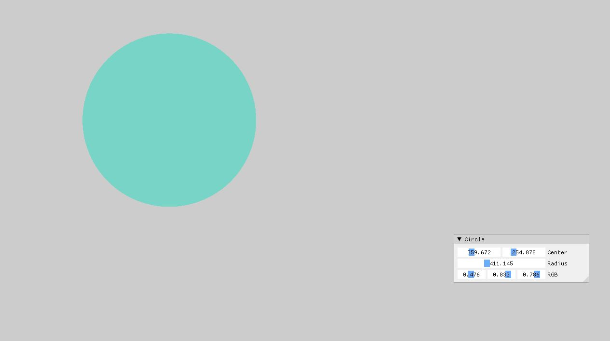
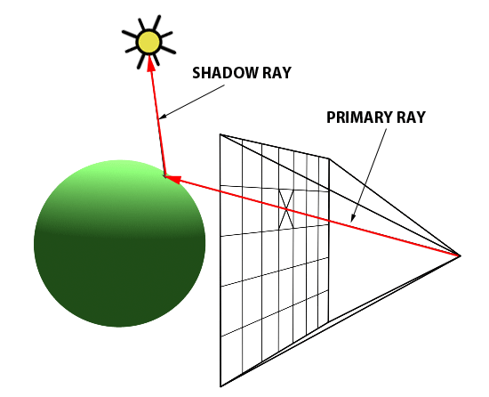
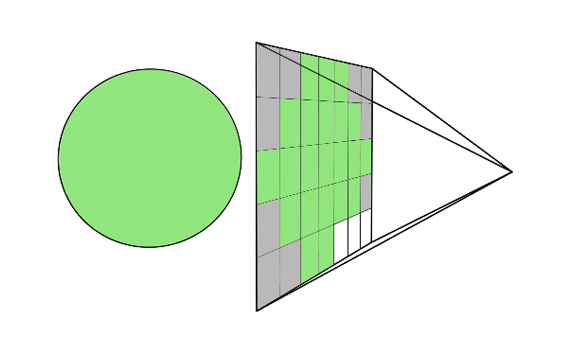

## Prep
Graphics 를 다루기 앞서서, glm 과 imgui 가 필요하다는걸 말씀드리고 싶다. vcpkg 로 설치가 편하니, [vcpkg](https://vcpkg.io/en/packages.html) 찾아보기 바란다.

### How to draw the Circle in Image Coordinates (2D)

일단 Image Coordinates 에서는 쉽게 far left corner 이 (0, 0) 을가지고 있고, far right corner in bottom 은 (width - 1, height -1) 로 되어있다. 어떠한 Point 가 원안에 있는지 확인을 하려면, 어떠한 Point 와 `x_center` 값의 절대값이 r 보다 크기 비교를 하면 된다.

일단 Circle 이라는 class 를 만들어보자. 일단 편의성을 위해 접근지정자를 public 으로 해놓고 보면 된다. 그리고 생성자(Constructor)는 원에 필요한 인자로 받는다.

첫번째 방법 같은 경우는 약간 Brute-Force 처럼 곱셈을 할수 있다. 다른 방법같은경우 glm 을 사용해서 point - center 를 뺀값의 distance 를 구하는 방법이 있고, 더 최적화 하는 방법은 `radius squared` 한값을 가지고 `distance squared` 를 비교하는 방법이 있다.

```c++
#include <glm/glm.hpp>
#include <glm/gtx/string_cast.hpp>
#include <glm/gtx/norm.hpp>

class Circle
{
public:
    glm::vec2 center;
    float radius;
    glm::vec4 color; 

    Circle(const glm::vec2& center, const float radius, const glm::vec4& color)
        : center(center), color(color), radius(radius)
    {}

    bool IsInside(const glm::vec2& point)
    {
        const float distance = (point.x - center.x) * (point.x - center.x) + (point.y - center.y) * (point.y - center.y);
        
        // 최적화 방법은 여러가지
        // const float distance = glm::length(point - center) or 
        
        // const float distanceSquared = glm::dot(point - center, point - center);
        

        if(distance <= radius){
            return true;
        }
        else{
            return false;
        }
    }
}
```

아래 처럼 결과를 볼수 있다.

<figure>
  
</figure>

### How to draw the Circle for Transformation (2D)

가끔씩은 In Game 내부 안에서는 좌표계 변환을 할 필요가 있다. 예를 들어서 Unity 나 Unreal 같은 경우, 내부 안에 따른 카메라 모듈이 있다고 가정하면, Player 가 보는 관점과 그 카메라가 담고 있는 시점이 다르다. 즉 상대적으로 보고 있는게 다르기 때문에 좌표계 변환이 필요하다. 일단 좌표계 변환에 앞서서 `aspect ratio` 라는 개념이 필요하다. Screen 에서 aspect ratio 를 구할려면, 뿌려질 화면(Screen) 에 width 와 height 로 나눠줘야 한다.

그렇다면 이런식으로 나타낼수 있을거다.

```c++
const float aspectRatio = (float)width / height;
```

그리고 가정이 또 필요한데 Screen 좌표계에서 직접 World Coordinate System 으로 지정해야한다. Custom 하게 제작을 한다면 Screen 좌표계는 `[0 x with - 1] x [0 x height -1]` 이고, 정의하고자 하는 좌표계를 `[-aspectRatio, +aspectRatio] x [1 + -1]` 이라고 지정을 하자. 다시말하면 far left corner on the top 의 위치는 [0, 0] 이였던게 [-aspectRatio, 1] 이되고, [width - 1, height - 1] 이 였던게 [+aspectRatio, -1] 이 되는거다.

그렇다면 변환을 하는식을 코드로 표현 해보자. 설명을 해보자면 일단 도형을 그린다고 했을때 좌표계변환은 원하는 도형이 안나올수 있기때문에 여기서 Scaling 을 구하려면 aspectRatio 에 곱해주어야만 원하는 도형이 나올 수 있다(예: 원이라고 하면 타원이 나올수도 있다.) 그리고 positionScreen 값에 scale 을 곱해서 해당의 한칸당 움직임을 알수 있고 이 좌표계를 -aspectRatio 가 제일 맨윗점이 되어야하므로 -aspectRatio 를 하고, y 같은 경우도 마찬가지로 위의 방향이 -1 부터 시작해야하므로 -1 을 빼준다. 하지만 이게 다가 아니다. 이때 y 의 부호값도 뒤집어줘야 위로 갈땐 양수 아래로 갈땐 음수 이렇게 표현하기위해선 전체 부호를 뒤집어 줘야한다.

```c++
glm::vec2 TransformScreenToWorld(glm::vec2 positionScreen)
{
    const float aspectRatio = float(width) / height;
    const float xScale = 2 * aspectRatio / (width - 1);
    const float yScale = 2 / (height - 1)

    return glm::vec2(positionScreen.x * xScale - aspectRatio, -(positionScreen.y * yScale -1));
}
```

### How to draw the Sphere
Rendering 기술이나 Brute force 를 사용한 Ray-tracing 을 보면 주로 Sphere 을 찾아 보기가 쉽다. 그 이유는 Sphere 을 그리기가 쉽기 때문이다. 그렇다면 RayTracing 을 한번 봐보자.

1. 일단 사람의 눈을 기준으로 잡고 Screen, 즉 한 Pixel 에서 광선을 여러개 쏜다.
2. 그 다음 각 Pixel 에 있는 Ray 중에, 하나가 구에 부딫친다.
3. 구에 부딫힌 Ray 는, 구의 색깔의 Pixel 을 가져와서 Screen 에 보여진다 (다음 그림)
4. 
<figure>
  
</figure>
<figure>
  
</figure>

이런식으로 Simple 한 Ray Tracing 구조를 가져 올수 있다. 그러면 바로 코드로 표현 해보자. 일단, 구체적인 DirectX 에 관련된 부분은 주제와 조금 알맞지 않으므로 작성하지 않았다. 아래에서 중요한 부분은 Ray, Hit, Sphere 안에 있는 `IntersectRayCollision` 함수 이부분이다. 일단 Ray 같은 경우는 어떤 시작점에서 어떤방향으로 출발한다는 벡타와 그 Point 를 가지고 있어야하고, Hit 같은 경우 distance 정보와 Hit 을 했을때의 point 좌표와 그거에 해당되는 Normal vector 등 필요할것이다. 그리고 현재 위에서 했던것과 달리 World Coordinate 이 [-1, 1] x [1, -1] 로 바뀌었다는 점을 찾을수 있다. 그래서 여기서 중요한 알고리즘은 Rendering 이 Update 이 될때, RayTracing 에서 Render 라는 함수를 호출하고, Render 에서, 각각의 screen 좌표계에 있는걸 좌표계 변환으로 통해서, 바꾼 다음에 Ray 를 쏠 준비를 하는 것이다. 

그런다음에 Ray 를 trace 하면서 물체의 거리를 비교하면서, Sphere 에 Hit 이 됬으면, 그 color 값을 가지고 오는것이다.

```c++
struct Vertex
{
    glm::vec4 pos;
    glm::vec2 uv;
};

class Ray
{
public:
    glm::vec3 start;    // start position of the ray
    glm::vec3 dir;      // direction
}

class Hit
{
public:
    float d;            // distance from the start to hit point
    glm::vec3 point;    // point where ray hits
    glm::vec3 normal;   // normal vector that are perpendicular to the surface of sphere 
}

class Sphere
{
public:
    // Property
    glm::vec3 center;
    float radius;
    glm::vec3 color;

    // Constructor
    Sphere(const glm::vec3 &center, const float radius, const glm::vec3 &color) 
        : center(center), color(color), radius(radius)
    {}

    Hit IntersectRayCollision(Ray &ray)
    {
        Hit hit = Hit(-1.0f, vec3(0.0f), vec3(0.0f));
        return hit;
    } 
};

class RayTracer
{
public:
    int width, height;
    shared_ptr<Sphere> sphere;

    RayTracer(const int &width, const int &height)
        : width(width), height(height)
    {
        sphere = make_shared<Sphere>(vec3(0.0f, 0.0f, 0.0f), 0.4f, vec3(1.0f, 1.0f, 1.0f));
    }

    glm::vec3 TransformScreenToWorld(glm::vec2 posScreen)
    {
        const float xScale = 2.0f / (this->width - 1);
        const float yScale = 2.0f / (this->height - 1);
        const float aspect = float(this->width) / this->height;

        return glm::vec3((posScreen.x * xScale -1.0f) * aspect, -posScreen.y * yScale + 1.0f, 0.0f);
    }

    vec3 traceRay(Ray &ray)
    {
        const Hit hit = sphere->IntersectRayCollision(ray);

        if(hit.d < 0.0f)
        {
            return vec3(0.0f);
        }
        else
        {
            return sphere->color * hit.d;
        }
    }

    void Render(std::vector<glm::vec4> &pixels)
		{
            // init all black as background color
			std::fill(pixels.begin(), pixels.end(), vec4{0.0f, 0.0f, 0.0f, 1.0f});

// multi-threading
#pragma omp parallel for
			for (int j = 0; j < height; j++)
				for (int i = 0; i < width; i++)
				{
					const vec3 pixelPosWorld = TransformScreenToWorld(vec2(i, j));

					const auto rayDir = vec3(0.0f, 0.0f, 1.0f);

					Ray pixelRay{pixelPosWorld, rayDir};

					pixels[size_t(i + width * j)] = vec4(traceRay(pixelRay), 1.0f);
				}
		}
};

class RayTracingModule
{
public:
    int width, height;
    Raytracer rayteracer;

    // DirectX11 setups..
    ID3D11Device *device;
	ID3D11DeviceContext *deviceContext;
	IDXGISwapChain *swapChain;
	D3D11_VIEWPORT viewport;
	ID3D11RenderTargetView *renderTargetView;
	ID3D11VertexShader *vertexShader;
	ID3D11PixelShader *pixelShader;
	ID3D11InputLayout *layout;

	ID3D11Buffer *vertexBuffer = nullptr;
	ID3D11Buffer *indexBuffer = nullptr;
	ID3D11Texture2D *canvasTexture = nullptr;
	ID3D11ShaderResourceView *canvasTextureView = nullptr;
	ID3D11RenderTargetView *canvasRenderTargetView = nullptr;
	ID3D11SamplerState *colorSampler;
	UINT indexCount;

public:
    RayTracingModule(HWND window, int width, int height)
        : raytracer(width, height)
    {
        Initialize(window, width, height);
    }

    void Update()
    {
        // set pixels as 1D array with color info
        std::vector<glm::vec4> pixels(width * height, glm::vec4(0.8f, 0.8f, 0.8f, 1.0f));

        // Raytracer Render
        raytracer.Render(pixels);

        // Copy CPU Mem -> GPU mem
        // 렌더링 결과를 GPU 메모리로 복사
		D3D11_MAPPED_SUBRESOURCE ms;
		deviceContext->Map(canvasTexture, NULL, D3D11_MAP_WRITE_DISCARD, NULL, &ms);
		memcpy(ms.pData, pixels.data(), pixels.size() * sizeof(glm::vec4));
		deviceContext->Unmap(canvasTexture, NULL); 
    }

    void Initialize(HWND window, int width, int height)
    {
        this->width = width;
        this->height = height;

        // Swapchain... Set

        // Create Render Target

        // Set the view port

        // Create texture and rendertarget

        // Create the sample state

        // vertex buffer
    }

    void Render()
    {
        // ...
    }

    void Clean()
    {
        // ....
    }
};

int main()
{
    const int width = 1280, height = 720;
    // Imgui setup & winAPI setup

    // HWND hwnd...
     
    auto rayTracingModule = std::make_unique<RayTracingModule>(hmwd, width, height);
    
    MSG msg = {};
    while(WM_QUIT != msg.message)
    {
        if(PeekMessage(&msg, NULL, 0, 0, PM_REMOVE))
        {
            // ... do Something
        }
        else
        {
            // ... Imgui start setup
            rayTracingModule->Update();
            rayTracingModule->Render()

            // swap the back buffer and the front buffer
            rayTracingModule->swapChain->Present(1, 0)
        }

    }

    // clean up
}
```

## Resource
[Introduction to Raytracing](https://www.scratchapixel.com/lessons/3d-basic-rendering/introduction-to-ray-tracing/implementing-the-raytracing-algorithm.html)
[Line-sphere Intersection](https://en.wikipedia.org/wiki/Line%E2%80%93sphere_intersection )