## Lighting Effect

일반적으로 물체에 빛을 받아서 반사되어서 나온 색깔을 우리가 보고 "아 저건 빨간색이다, 오 저건 초록색이다" 라고 말을 할수 있을거다. 그래서 Computer Graphics 에서는 물체에 조명에따라서 어떻게 `Shaindg` 을 하는지 알아보자.

일단 단순한 백색광 Light 를 c++ 로 단순하게 만들어보자면 아래와 같다.

```c++
class Light
{
public:
    glm::vec3 pos;
}
```

이후에 초기화를 할때는
```c++
Light light;

light = Light{ {0.0f, 0.0f, -1.0f}} // 화면 뒷쪽
```

일단 여기에 앞서서 어떤 물체가 어떤 색상을 띄고 있는지, 물체의 표면에 따라 달라질수 있다. 이게 바로 물체의 `Material` 에 따라 달라진다.

## Phong Models & Phong Shading

물체가 조명을 받았을때, Ambient + Diffuse + Specular 이렇게 나누어진다. 왜? 라고 물어본다면, 사실 나도 잘모르겠지만, 어찌됬든 이런 식으로 나눠서 aggregate 하면 뭔가 그럴듯하게 Reflection 이 나온다는 Model 이 Phong Model 이라고 Wiki 에는 나와있다.

그러면 Ambient, Diffuse, Specular 의 어떻게 구하는지, 속성이 뭔지를 알아보자.

Ambient 같은 경우는, 어떤 물체가 색깔을 빛내고 있다고 생각을 하면된다. 즉 이말은 빛이 도달했을때 물체 그대로의 색깔을 return 한다고 생각을 하면된다.

Diffuse 의 원리는 아래의 그림을 참고하면 된다. 만약에 어떤 Light 가 중앙에 물체를 90 degree 로 내려짼다고 했을때, 빛의 세기는 강하다. 하지만 Light Source 가 가 기울어지게 쎄면, 확실히 빛의 세기는 각각 다를것이다. 이럴때 생각을 해보면, 어떤 물체의 Normal 값과 Light Source 의 Opposite direction 의 Vector 의 각도에 따라 빛의 영향이 달라질것이다. 그래서 이 각도를 사용을 하려면 `cos(theta)` 를 사용하면 된다. **[기본적으로 Diffuse 같은 경우는 표면이 거친 상태에서 가정한다. 그래서 난반사 느낌으로 재질을 설정한다.]**

Cos Graph 같은 경우 pi / 2 일때 0 이고, 0 일때 1 이다 그걸 생각을 해보면 `max(cos(theta), 0.0f)` 로 clipping 처리가 가능하다. 물론 여기서 cos(theta) 를 구지 구할필요가 없다. 어떤 경우에 `normal vector 와 Light source 의 반대방향의 Vector 가 Unit Vector` 일때 `glm::dot(n, l) = cos(theta)` 를 사용한다면 `max(glm::dot(n,l), 0.0f)` 의 식으로 변경이 가능하다.

<figure>
  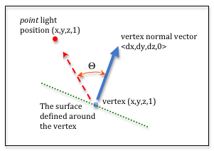
</figure>

<figure>
  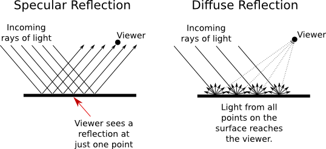
</figure>

Diffuse 의 구현방식은 생각보다 쉽다.

```c++
const vec3 dirToLight = glm::normalize(light.pos - hit.d) // 이미 물체에서 Light 를 바라보는 Vector
const float diff = glm::max(glm::dot(hit.normal, dirToLight), 0.0f);
```

그래서 diffuse 값의 제곱을 하는게 보이는데, 이거는 Light Power 를 보여주기 위해서 return 을 하게 되면 아래의 사진처럼 나온다.

<figure>
  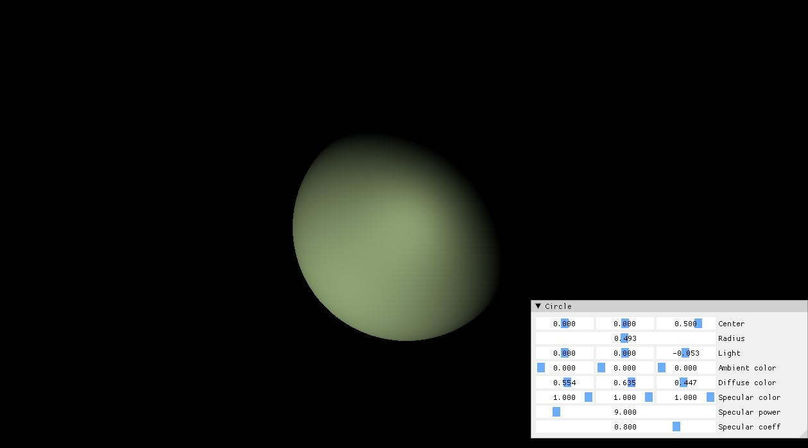
</figure>

그 다음 마지막으로 Specular 를 한번 봐보자. 위에서 그림과 같이 Specular 같은 경우, 재질자체가 매끈할때, 금속이나 거울이 완전 반사를 하는 걸 정의한다. 금속이나 거울이 빛을 많이 받았을때, 완전반사가 되어서 우리눈에 부시게 하는 성질을 표현할때 사용된다.

Specular 는 특히나 보는 관점에 따라서 다르다. 즉 눈의 시점에 따라서 아무리 강력한 빛이 오더라도, Light 에 관련된 Power 가 다를 수도 있다.

구현을 해보자면, 아래와 같다

```c++
const vec3 reflectDir = 2 * glm::dot(hit.normal, dirToLight) * hit.normal - dirToLight;
const float specular = glm::pow(glm::max(glm::dot(- ray.dir, reflectDir), 0.0f), sphere->alpha);
```

그래서 전부다 종합하면 아래와 같이 return 을 하면 result 를 볼수 있을거다.

```c++
return sphere->amb + sphere->diff * diff + sphere->spec * specular * sphere->ks;
```

<figure>
  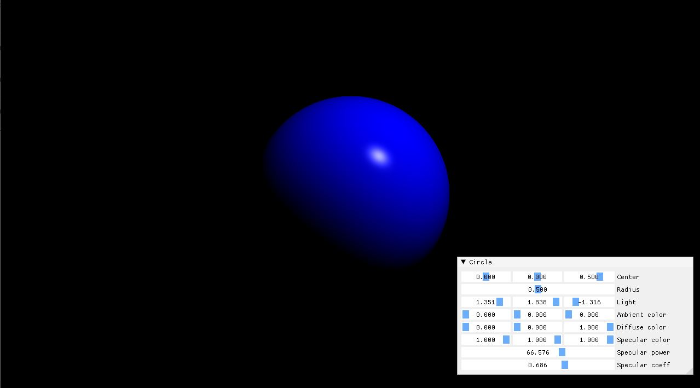
</figure>

## Light Reflection

이제 Light 의 Reflection 을 추가하려면 어떻게 해야될까? 지금까지는 Phong Model 을 사용했더라면, 이제는 Material 에 reflection 을 넣어줘어야한다. 그리고 어떤 물체를 사용할지 모르니 일단 Object Manager 처럼 Object class 에다가 넣어주자.

```c++
class Object
{
public:
  vec3 amb = vec3(0.0f);  // Ambient
  vec3 dif = vec3(0.0f);  // Diffuse
  vec3 spec = vec3(0.0f); // Specular

  float alpha = 10.0f;
  float reflection = 0.0f;
  float transparency = 0.0f;

  std::shared_ptr<Texture> ambTexture;
  std::shared_ptr<Texture> difTexture;

  Object(const vec3 &color = {1.0f, 1.0f, 1.0f})
    : amb(color), dif(color), spec(color)
  {}

  virtual Hit CheckRayCollision(Ray &ray) = 0; 
};
```

이제 어떤 물체를 Spawn 이나 Create 할때, 이 `Object` class 를 상속받아서 만들면 된다. 그리고 Reflection 과 transparency 가 추가 되어있는 걸 확인 할수 있다.
일단 구현원리는 아래의 노트를 한번 참고 하면서 생각을 해보자.

<figure>
  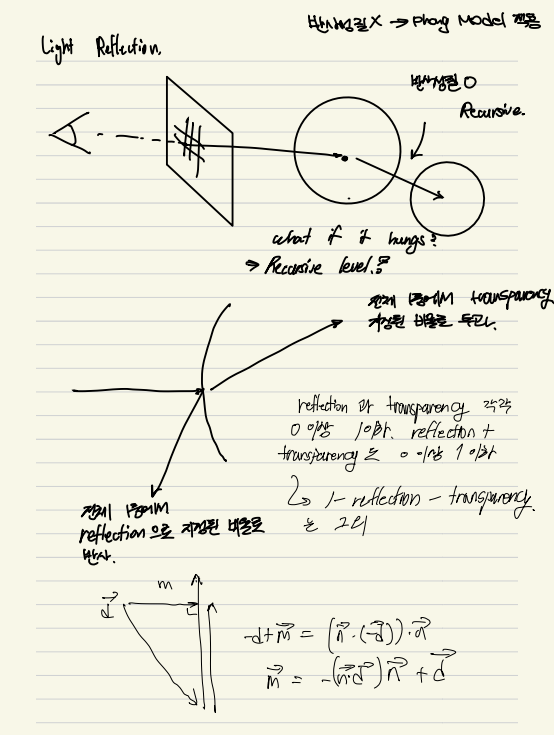
</figure>

일단 눈에서부터 나오는 Ray 들을 Screen 좌표에서 각 Pixel 에다가 쏴주고, 그게 어떤 물체에 부딫친다. 만약 그 물체의 Material 특성상 reflected 한 성질을 가지고 있다면, 다시 Reflection Ray 를 다시 쏴준다. 그렇지 않으면, ambient/diffuse/specular 값만 return 을 해준다. 근데 만약 계속 쏘다가 물체와 물체끼리만 reflected ray 를 핑퐁한다고 하면 어떡할까? 이건 어쩔수 없지만 implemenation 에서 recursive level 을 지정해줘서, ray 를 못쓰게 하면 된다. 일단 사용한 모형은 아래와 같다.

<figure>
  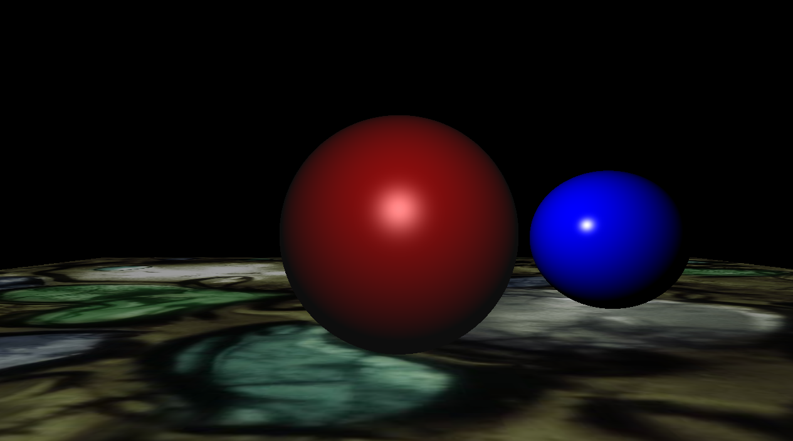
</figure>

아래와 같은 Implementation 을 사용해서, 위의 두물체에 대해서 Reflection 을 적용할수있다. reflection 할 percentage 는 50% 이다.

```c++
if (hit.obj->reflection)
{
  const vec3 reflectedDirection = glm::normalize(hit.normal * 2.0f * dot(-ray.dir, hit.normal) + ray.dir);
	Ray ReflectionRay{ hit.point + reflectedDirection * 1e-4f, reflectedDirection };
	color += traceRay(ReflectionRay, recurseLevel - 1) * hit.obj->reflection;
}
```

이 Core 부분을 적절히 사용을 하면 아래와 같은 결과가 나온다.

<figure>
  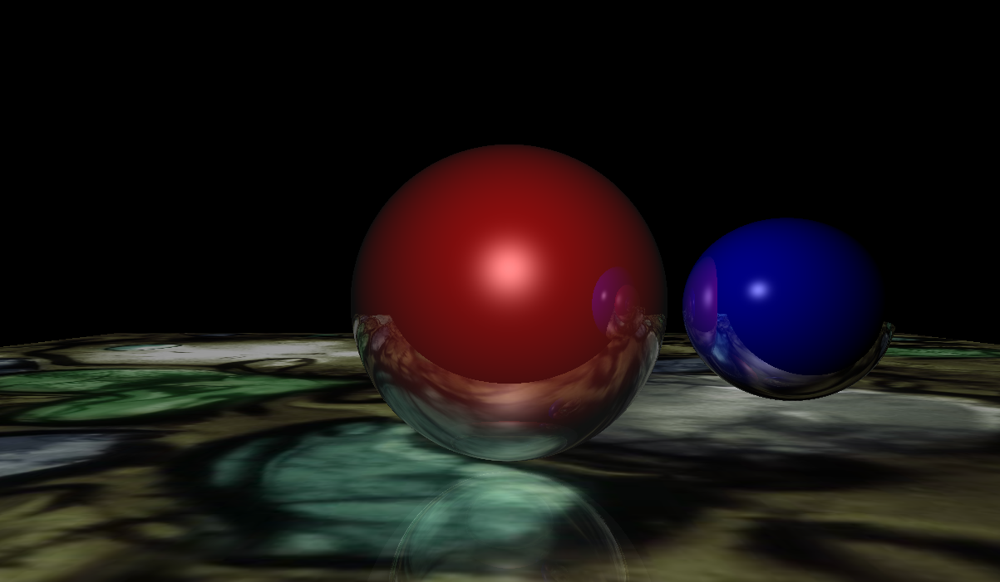
</figure>

## Light Refraction

Light Reflection 과 달리 Light Refraction(굴절)은 Material 에 Transparency 를 가지고 있는 물체가 존재 한다는 가정하에 조명이 투과하는 현상이다. 물론 물체가 둘다 존재한다면 일부는 Reflected 하고 어떤부분은 굴절을 할거다. 그게 더 Realistic 한 Object 일거다. 일단 굴절과 관련된 Note 를 참고해보자.

<figure>
  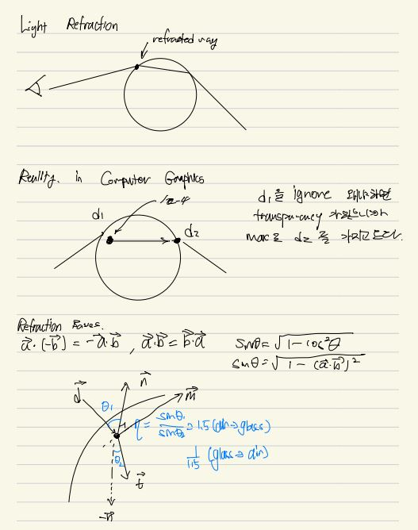
</figure>

<figure>
  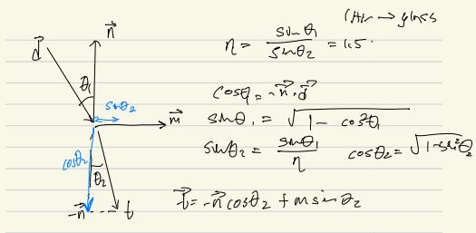
</figure>

처음에 Ray 가 물체에 부딫힌다고 한다면 그리고 material 에 transparency 가 있다고 가정하면, Ray 가 부딫히는 지점은 두군데이다. 일반적인 Ray Tracing 기법을 사용해서 Ray 를 쏘아줬을때, 제일 먼저 부딫히는 지점을 retrun 을 하지만 굴절을한다고 가정하면, 두번째에 부딫히는 point 가 중요하다. 그리고 Refraction 이 됬을때의 Ray 의 물체의 normal 한 각도와, incoming Ray 의 각도는 과학적으로 증명된 `(eta = sin(theta1) / sin(theta2))` 이식이 constant 값을 반환한다. 그렇다고 한다면 우리가 구해야할 vector 는 바로 t 이다. t 위의 노트와 마찬가지로 구할수 있다.

처음에 Implementation 하기전의 모형을 보여주려고 한다. 일단 이 도형의 Material 의 transparency 는 1.0 으로 주어져있다. 그말은 굴절값이 없다는걸 표현 하려고 했었다.

<figure>
  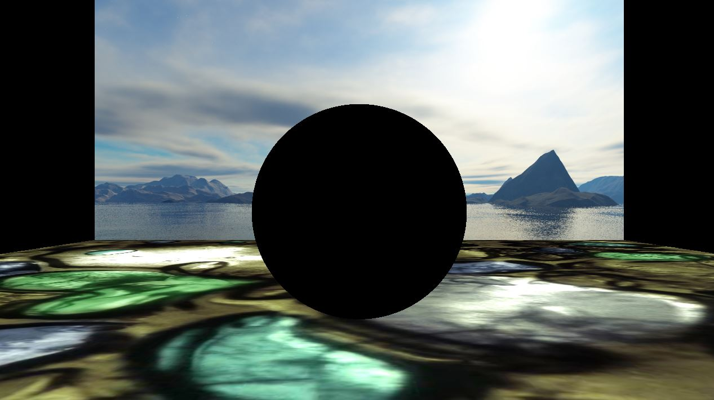
</figure>

그렇다면 위의 개념으로 코드를 짜보았다.

```c++
const float ior = 1.5f; // Index of refraction (유리: 1.5, 물: 1.3)

float eta; // sinTheta1 / sinTheta2
vec3 normal;

if (glm::dot(ray.dir, hit.normal) < 0.0f)// (ex: 공기->유리)
{
	eta = ior;
	normal = hit.normal;
}
else // (ex 유리->공기)
{
	eta = 1.0f / ior;
	normal = -hit.normal;
}
const float cosTheta1 = glm::dot(hit.normal, -ray.dir);
const float sinTheta1 = glm::sqrt(1 - cosTheta1 * cosTheta1);
const float sinTheta2 = sinTheta1 / eta;
const float cosTheta2 = glm::sqrt(1 - sinTheta2 * sinTheta2)
const vec3 m = glm::normalize(dot(hit.normal, -ray.dir) + ray.dir);
const vec3 a = -normal * cosTheta2;
const vec3 b = m * sinTheta2;

const vec3 refractionDir = glm::normalize(a + b);
Ray refractionRay{ hit.point + refractionDir + 0.0001f, refractionDir };
color += traceRay(refractionRay, recurseLevel - 1) * hit.obj->transparency;

return color;
```

결과는 아래와 같다.

<figure>
  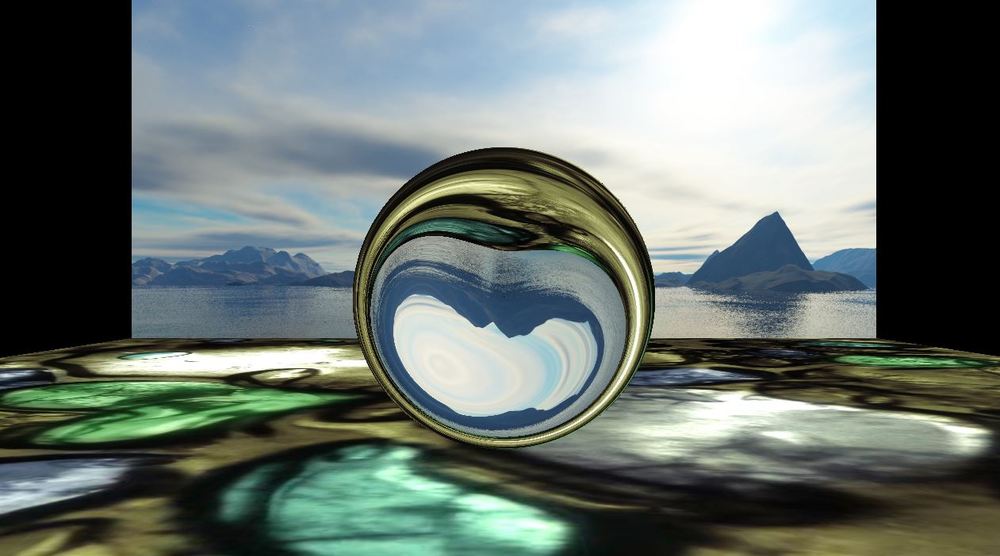
</figure>

### Resource
- [Phong Reflection Model](https://en.wikipedia.org/wiki/Phong_reflection_model)
- [The Phong Model, Introduction to the Concepts of Shader, Reflection Models and BRDF](https://www.scratchapixel.com/lessons/3d-basic-rendering/phong-shader-BRDF/phong-illumination-models-brdf.html)
- [Refraction in Sphere](https://samdriver.xyz/article/refraction-sphere)
- [Introduction to Shading](https://www.scratchapixel.com/lessons/3d-basic-rendering/introduction-to-shading/reflection-refraction-fresnel.html)
- [Reflection & Refraction](https://web.cse.ohio-state.edu/~shen.94/681/Site/Slides_files/reflection_refraction.pdf)