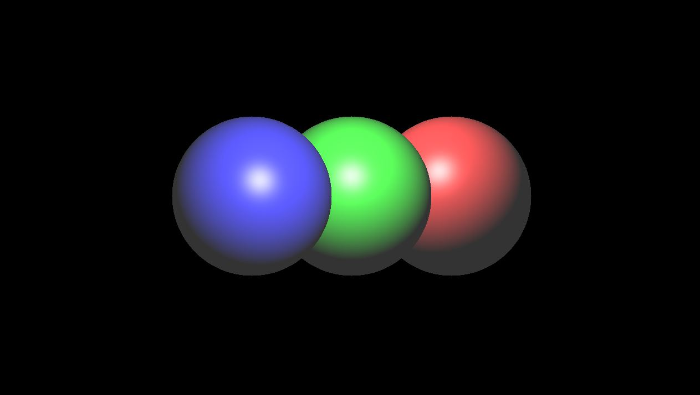
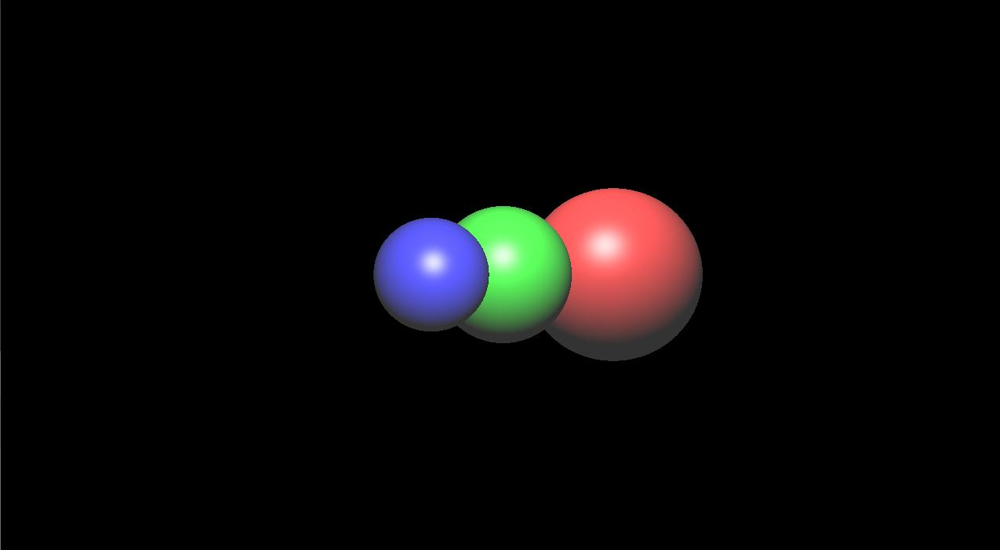
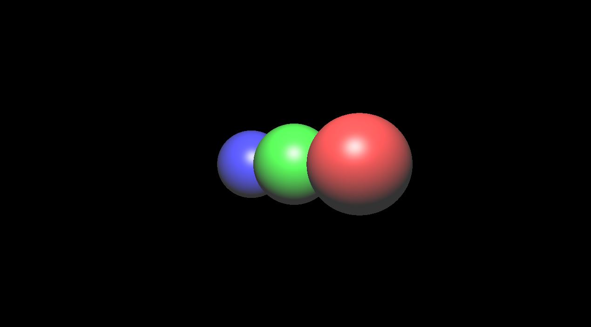

### Orthographic Projection

Orthographics Projection 은 정투영, 즉 물체를 원근감없이 그리는거다. 어렸을때 집을 그릴때 원근감을 표현하기 위해서 노력했지만 그럴싸하게 안나오는 이유는 바로 원근감을 생각하지 않고 그리기때문이다. 이럴 경우 집의 표면만 그대로 그리는 건데 이게 바로 정투영이다.

그래서 Computer Grpahics 에서 RayTracing 을 구현할때도 마찬가지이다. 어떤 세도형이 있고 물체가 앞에 있는데도 불구하고 그리는 순서 대로 그렸을때가 바로 정투영 현상이다.

예를 들어서, 일단 코드에서는 빨간색을 먼저 그리고, 초록색 그리고, 파란색을 그렸고, 각 구의 Vertex 들의 Z 는 빨간색, 초록색, 파란색순으로 앞순서로 만들었다. [그림을 참고]

<figure>
  
</figure>

### Perspective Projection

어찌됬든 정투영 보다는 더 realistic 한 거는 Perspective Projection (원근 투영) 이다. 앞에 정투영 같은 경우, 각 Screen 에 있는 pixel 들이 똑같은 위치에 시작해서 Ray 를 쏘는 반면, Perspective Projection 같은 경우 각 Pixel 들의 Ray 들이 방향이 다다르게 설정된다, 바로 눈의 시점의 Pointer 를 이용해서. **이럴때 주의점은 그 Ray 들을 전부다 Normalize 를 해줘야한다.** 그렇다면 쉽게 코드를 작성해보자. 테스트는 위의 사진을 가지고 첫번째로 그릴거다. 여기서 보면, 일단 Render 만 하기때문에 아직은 어떤 물체가 Ray 에 부딫히는 걸 무시하고, 결과를 써봤다.

일단 제일 중요한거 eye position 을 우리 스크린 뒷방향 즉 1.5 f 에서 바라본다고 하고 작성을 했다. Screen 의 각 Ray 들은 screen 에서 우리 눈의 방향 Vector 를 뺀값들이다.

```c++
void Render(std::vector<glm::vec4>& pixels)
{
	std::fill(pixels.begin(), pixels.end(), vec4{ 0.0f, 0.0f, 0.0f, 1.0f })
	const vec3 eyePos(0.0f, 0.0f, -1.5f);

#pragma omp parallel for
	for (int j = 0; j < height; j++)
	    for (int i = 0; i < width; i++)
		{
			const vec3 pixelPosWorld = TransformScreenToWorld(vec2(i, j));

			Ray pixelRay{ pixelPosWorld, glm::normalize(pixelPosWorld - eyePos)};

			pixels[i + width * j] = vec4(glm::clamp(traceRay(pixelRay), 0.0f, 1.0f), 1.0f);
		}
}
```

<figure>
  
</figure>

근데 여기에서 문제가 제대로 그려지는건 맞지만, Red Sphere 가 green sphere 를 감추게 해야한다. 그러면 제대로 동작하지 않았다는걸 볼수 있다. 그리고 모든 물체의 Radius 는 동일하다.

그래서 고쳐야 할부분은 바로 Closest Hit 이 누구인지 확인만 하면 된다.

```c++
Hit FindClosestCollision(Ray& ray)
{
	float closestD = 10000.0;
	Hit closestHit = Hit{ -1.0, dvec3(0.0), dvec3(0.0) }
	for (int l = 0; l < objects.size(); l++)
	{
		auto hit = objects[l]->CheckRayCollision(ray)
		if (hit.d >= 0.0f)
		{
			if (hit.d < closestD)
			{
				closestD = hit.d;
				closestHit = hit;
				closestHit.obj = objects[l];
			}
		}
	
	return closestHit;
}
`
<figure>
  
</figure>
