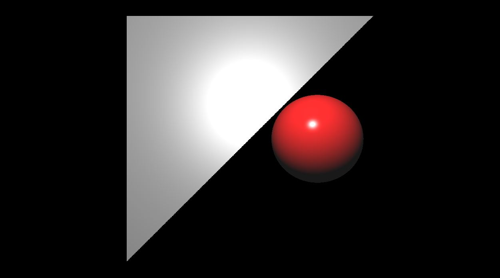

* this unordered seed list will be replaced by the toc
{:toc}

## How to draw a Triangle

앞에 Post 에서는 원의 방정식을 이용해서 물체를 그렸었다. 하지만, 더 Computer Graphics 를 접한다면 삼각형을 먼저 그려보아야한다. 왜냐하면 바로 모든 물체는 삼각형으로 그려지고 기본이기 때문이다. 그래서 도형에서는 Mesh 가 많으면 많을수록 그 도형이나 물체가 더 정밀하게 보인다.

일단 왜 삼각형이 기본의 도형이냐면 첫째는 점을 이용해서 접혀지지 않는다. 사각형같은 경우 Vertex 가 4 개 이기때문에 양쪽 대각선을 이용해서 삼각형을 만들수 있다.

삼각형을 구조를 한번 짜보자. 일단 아래와 같이 필요한 생성자들이 있고, Ray 의 충돌 여부를 확인 하는 함수가 있다. 물론 모든 물체를 Object 부모 클래스를 만들어서, `Hit CheckRayCollision` 을 순수 가상함수로 만들어서 관리를 해도된다.

```c++
class Traiangle
{

public:
    vec3 v0, v1, v2;

    Triangle()
        : v0(vec3(0.0f)), v1(vec3(0.0f)), vec3(vec3(0.0f))
    {}
    
    Triangle(vec3 v0, vec3 v1, vec3 v2)
        : v0(v0), v1(v1), v2(v2)
    {}

    Hit CheckRayCollision(Ray &ray)
    {}
};
```

원같은 경우 원의 반지름안에 임의의 Point 가 들어오느냐 안들어오느냐는 생각보다 easy, but Triangle 은 살짝 다르다. 일단 나중에 공부할 Barycentric Coordinate 을 생각하면 편할텐데. 일단 삼각형 안에 들어 왔는지 안들어왔는지는 수식으로 보면 편하다. 

예를 들어서 ray 의 식을 `P = O + tD` 라는 식이있다. 그리고 어떤 Point 가 삼각형의 임의의 Point 에 맞는다고 생각하고, 그 평면 안에 있다고 생각을 하고 세운것이다. 그렇다고 하면 그 Point 같은경우 어떠한 Vertex (v0) 이 존재한다고 했을때, Point 에서 v0 까지 가는 Vector 는 삼각형 평면의 Normal 값과 90 이어야한다. 즉 `glm::dot((P - V0), Normal) = 0` 이 나와야한다, 그 P 는 Ray 가 쏘는 방향이므로 Ray 의 식을 대입을 해보면 t 의 값을 찾을수 있다. 여기에서 t 는 거리인 scalar 값이다. 그렇다고 한다면, 우리는 식을 고쳐서 t 를 기준으로 세울수 있다.

`t = (glm::dot(v0, Normal) - glm::dot(orig, Normal)) / glm::dot(dir, Normal)` 여기에서 dir 은 Ray 의 방향 벡터이고, Orig 는 Ray 의 시작 점이다.
이러한 방법으로 t 에 따라서 충돌점 Point 를 찾을수 있다.

바로 코드로 한번 봐보자.

```c++
bool IntersectRayTriangle(const vec3 &orig, const vec3 &dir,
const vec3 &v0, const vec3 &v1, const vec3 &v2, vec3 &point, vec3 &faceNormal, float &t, float &u, float &v)
{
    faceNormal = glm::normalize(glm::cross(v1 - v0, v2-v0));
	
    // Backface culling
	if (glm::dot(-dir, faceNormal) < 0.0f) return false;
	
    // 광선과 평면의 Normal 과 수평일경우
    if (glm::abs(glm::dot(dir, faceNormal)) < 1e-2f) return false;

	t = (glm::dot(v0, faceNormal) - glm::dot(orig, faceNormal)) / glm::dot(dir, faceNormal);
	
    // 광선이 뒤에서 충돌했을때? retrun false
    if (t < 0.0f) return false;
	
    point = orig + t * dir; // 충돌점

	// 작은 삼각형들 3개의 normal 계산
	const vec3 normal0 = glm::normalize(glm::cross(point - v2, v1 - v2));
	const vec3 normal1 = glm::normalize(glm::cross(point - v0, v2 - v0));
	const vec3 normal2 = glm::normalize(glm::cross(v1 - v0, point - v0));

	// 아래에서 cross product의 절대값으로 작은 삼각형들의 넓이 계산
	 if (dot(normal0, faceNormal) < 0.0f) return false;
	 if (dot(normal1, faceNormal) < 0.0f) return false;
	 if (dot(normal2, faceNormal) < 0.0f) return false;

	return true;
}
```

Cross Product 의 성질로 인해서 Normal 값을 계산 할때에 주의할점은 주로 왼손좌표계로 시계방향으로 웬만하면 맞춰줘야하므로, Cross Product 할때 주의하기 바란다. 하지만 어떻게 계산을 하든 시계방향으로 맞춰줘야한다는것만 조심하자.

<figure>
  
</figure>

## Resource
- [Ray-Tracing: Rendering a Triangle](https://www.scratchapixel.com/lessons/3d-basic-rendering/ray-tracing-rendering-a-triangle/ray-triangle-intersection-geometric-solution.html)
- [Face Culling](https://www.khronos.org/opengl/wiki/Face_Culling#:~:text=Given%20an%20ordering%20of%20the,clockwise%20around%20the%20triangle's%20center.)