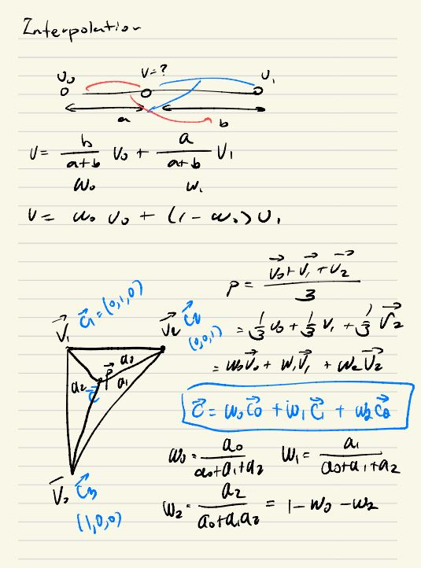
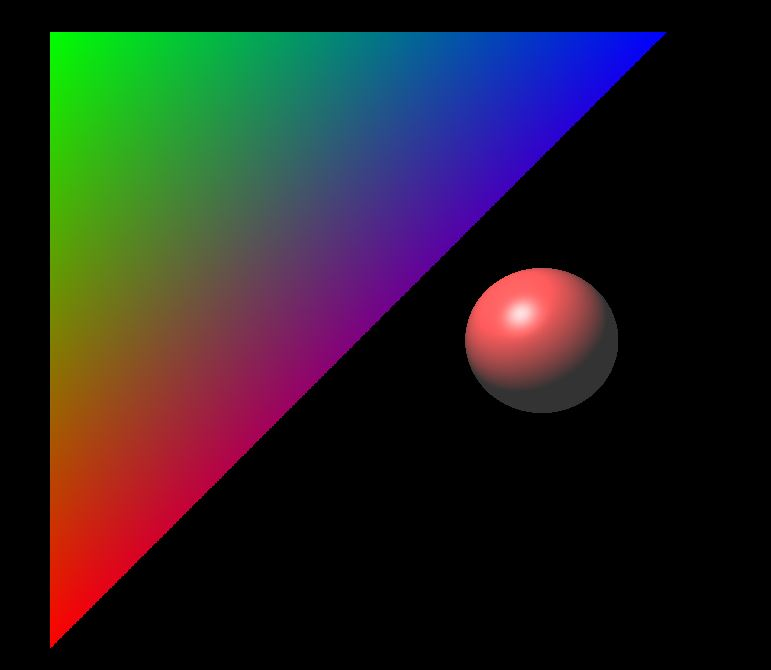

* this unordered seed list will be replaced by the toc
{:toc}

## Introduction to Barycentric Coordinates

이제는 도형을 그려봤으니, 도형에 색깔을 입혀보는것도 중요하다. 도형에 어떻게 색상을 정해줄지는 유저의 자유지만, 내부 알고리즘이 어떻게 돌아가는지는 알아야한다.

근데 만약에 각 Vertex 당 색이 정해졌다고 하면, 편하게 알아서 그라데이션을 해줄수 있는 방법이 있을까하면, 바로 `Barycentric Coordinates` 이 있다. 즉 가중치를 줘서 Pixel 값에 영향을 끼치는거다.

여기서 `Barycentric Coordinates` 바로 넘어가기전에 Interpolation 을 한번 생각해보자.

## Interpolation or Linear Interpolation

아래의 그림을 살펴보자.

<figure>
  
</figure>

일단 v1 과 v0 이 존재한다고 했을때, 임의의 V 의 점을 찾으려고 할때 Linear Interpolation 을 사용해서 그 Pointer 를 구할수 있다. 예를 들어서 V 의 값이 v0 에 가까워진다고 했을때 b 에 가중치가 더들어가서, `b / a + b` 는 커질것이다. 마찬가지로 반대 일 경우이는 `a / a + b` 의 가중치가 거질것이다.
또 이 가중치의 합은 1 이므로, 이미지에 표현된것과 같이 표현이 가능하다.

## Barycentric Coordinates

위의 내용과 같이 생각을 해보자면 삼각형에도 적용이 가능할것이다. 어떠한 점 `P` 를 잡고, Vertex 를 표현했을때 `P = v0 + v1 + v2 / 3` 이라고 표현될것이다. 더 쉽게 표현한다고 하면 W 를 사용해서 `p = w0v0 + w1v1 + w2v2` 이런식으로 표현이 될것이다. 그리고 각 W 는 Point (P) 를 사용해서 작은 삼각형의 생각한다면 넓이의 비율로 구할수 있을것이다. 넓이 뿐만아니라 각 Vertex 의 색상이 주어졌다면, 똑같이 구할수 있다.

Point (P) 의 색깔 Color(c) 가 있다고 가정을 한다면, 위에 표시한것처럼 Color 도 `c = w0c0 + w1c1 + w2c2` 로 표현이 가능할거다.

설명은 이쯤하고 구현하는 코드를 공유하려고 한다.

```c++
const vec3 cross0 = glm::cross(point - v2, v1 - v2);
const vec3 cross1 = glm::cross(point - v0, v2 - v0);
const vec3 cross2 = glm::cross(v1 - v0, point - v0
if (dot(cross0, faceNormal) < 0.0f)
    return false;
if (dot(cross1, faceNormal) < 0.0f)
    return false;
if (dot(cross2, faceNormal) < 0.0f)
    return fals

const float area0 = glm::length(cross0) * 0.5;
const float area1 = glm::length(cross1) * 0.5;
const float area2 = glm::length(cross2) * 0.
const float areaSum = area0 + area1 + area

float w0 = area0 / areaSum;
float w1 = area1 / areaSum;
float w2 = 1 - w0 - w1;
```

이 코드를 사용한다고 하면, 아래와 같이 삼각형에 부드럽게 Pixel 이 적용되어있는걸 확인할수 있다.

<figure>
  
</figure>