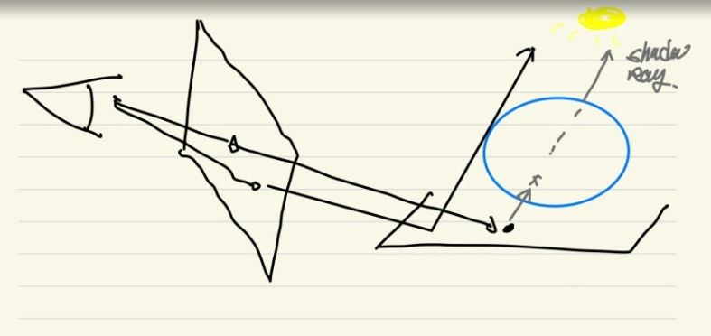
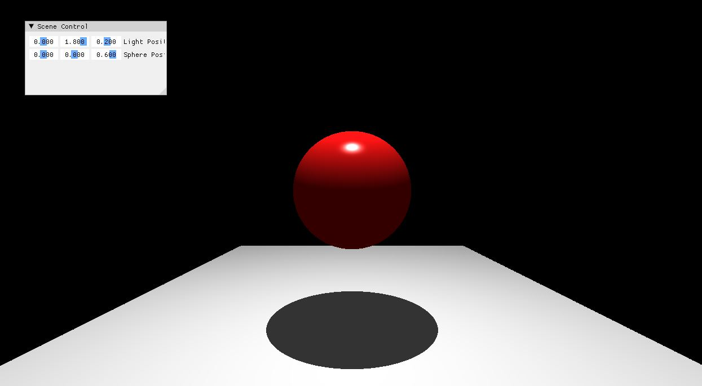

* this unordered seed list will be replaced by the toc
{:toc}

## Shadowing

빛이 있는곳에 우리가 걷거나 어떤 행동을 하게 된다면, 우리의 모습과 똑같게 그림자가 있는걸 확인 할수 있다. 그림자는 결국 물체에 빛이 부딛혔을때, 그 뒷부분에다가 광원과 비슷한 방향으로 그림자를 그려주면 된다. 즉 조명의 위치나 물체의 위치에따라서 그림자가 결정된다.

그리고 참고로 Real-time graphics 에서는 광원에서 물체가 있다고 하면은 뒤에는 그림자를 붙여주는 형식으로 한다.

조금 원리를 짚고 넘어가자.
1. 눈에서 나오는 Ray 가 Screen 을 지나서 어떤 바닥에 부딫힌다. 
2. 그 바닥에 부딫힌 Ray 에서, 다시 Shadow Ray 를 쏴준다.
3. 그때 물체가 있다면 충돌할거고, 없으면 바로 광원쪽으로 갈거다.

여기서 두번째 스텝 같은경우 Shadow Ray 를 쏜다는 의미가 바닥에서 쏜다는 의미보다는 Shadow Ray 가 광원까지 도달할수 있는지 없는지를 체크하는것이다. 그러면 Diffuse 와 Specular 은 없애버리고, ambient color 만 검은색으로 칠해주면된다.
참고로 Shadow Ray 에서 쏠때, 작은 수치의값을 움직인다. 위의 내용은 아래의 그림과 같다.

<figure>
  
</figure>

코드는 아래와 같다.

```c++
glm::vec3 color(hit.obj->amb);

const vec3 dirToLight = glm::normalize(light.pos - hit.poin)
Ray ShadowRay = { hit.point + dirToLight * 1e-4f, dirToLight }
if (FindClosestCollision(ShadowRay).d < 0.0f)
{
	const float diff = glm::max(dot(hit.normal, dirToLight), 0.0)
	const vec3 reflectDir = 2.0f * dot(hit.normal, dirToLight) * hit.normal - dirToLight;
	const float specular = glm::pow(glm::max(glm::dot(-ray.dir, reflectDir), 0.0f), hit.obj->alph)
	color += hit.obj->dif * diff + hit.obj->spec * specular;
}
return color;
```

결과는 아래와 같다.

<figure>
  
</figure>

## Resource
