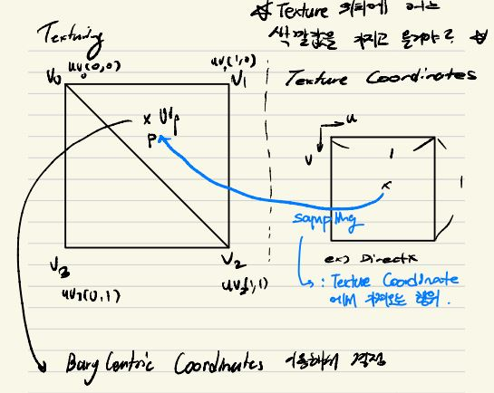
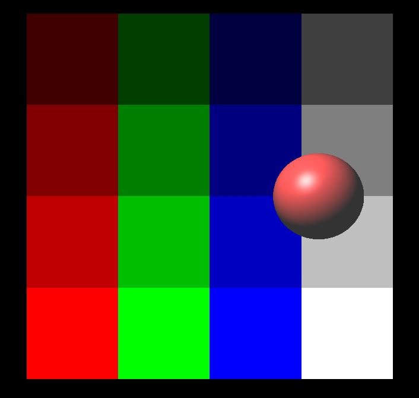
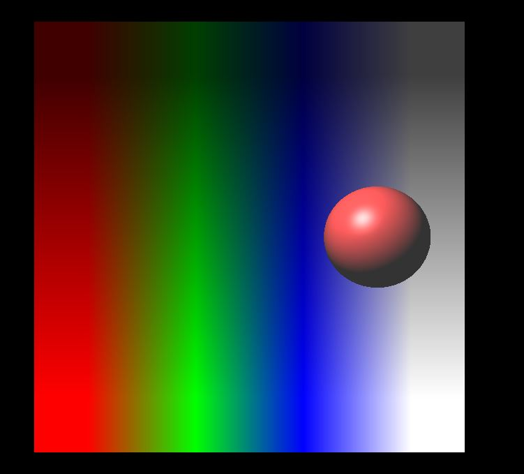
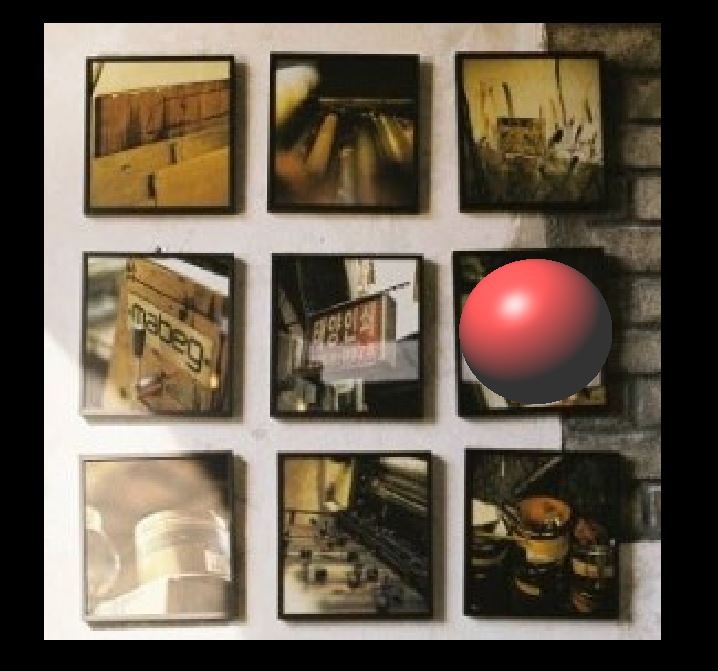

### Texturing

쉽게 말해서, 우리가 일일히 도형의 Pixel 에다가 색깔을 넣어서 그림을 넣어주기는 너무 번거롭다. 그렇다면 2D 이미지를 가지고 와서 그 도형에다가 덮어버리는 기술을 `Texture Mapping` 이라고 한다. 관련된건 Resource 를 참고 하자. 일단 브레인 스토밍을 해보자, 어떤 Texture 이미지를 Screen 안에 있는 또는 가상 공간안에 있는 도형에 맞춰서 그릴려고 한다. 다시 말해서, Texture 위치에 어느 색깔값을 가지고 와서, 도형에 그릴까? 라는것이 되어야한다. 그럴려면 좌표계 변환이 필요하다. 아래의 그림을 한번 참고 해보자.

<figure>
  
</figure>

위의 그림과 같이 Texture Coordinates 를 uv 좌표계라고 한다. 왼손좌표계를 DirectX 에서 사용하므로(OpenGL 은 반대), 맨윗 오른쪽이 (0, 0) 을가지고 width 가 1 이고, height 가 1 좌표계를 만들수 있다. 그래서 본론으로 돌아와서, 이 Texture 을 어떻게 도형에다가 매칭 시켜줄지, 즉 임의의 UV 좌표에 있는 색깔값을 도형에 넣는 방법을 `Sampling` 이라고 한다. 여기서 Sampling 방법은 두가지가 있다. 하나는 Mapping 을 할때, 임의의 UV 좌표를 이미지 좌표에 매핑이 되었을때 가장 가까운 Pixel 값만 가져오는게, Point Sampling 이라고 하고, Interpolation 을 해서 Linear 하게 부드럽게 표현하기위해서 Sampling 하는 기법을 Linear Sampling 이라고 한다.

일단 uv 좌표계에서, 이미지의 좌표계로 변환하는과정을 살펴보자. 텍스춰링의 좌표 범위는 앞서 말한것 처럼 [0.0, 1.0] x [0.0, 1.0] 여기에서 이미지 좌표를 변경하려면, [-0.5, width - 1 + 0.5] x [-0.5, height - 1 + 0.5] 의 좌표에 Mapping 을 해야한다. 여기에서 0.5 가 Padding 처럼 붙여있는이유는, 일단 UV 좌표계에서 한 pixel 이 pixel block 정중앙에 위치해있다고 생각했을때, 실제 UV 좌표의 array 또는 메모리가 저장되는 측면에서는 [0, width-1] x [0, height - 1] 인덱싱을 할수 있지만, 어떤 임의점을 표현을 하려면 0.5 씩 벌어져야 그 중앙에 가까운 값들을 가지고 올수 있어서 표현되어있다.

```c++
vec2 xy = uv * vec2(float(width), float(height)) - vec2(0.5f);
```

### Sampling (Point & Linear)

여기에서 Sampling 을 하는 것을 설명을 하려고한다.

Point Sampling Code 는 아래와 같다. GetClamp 함수는 이미지가 좌표가 넘어가는걸 Clamping 하기위해서, 그리고 Point 같은 경우는 Pixel 이 Pixel block 정중앙에 있기 때문에 제일 가까운걸 가져다 쓰고 싶어서 `glm::round` 를 사용했다.

```c++
class Texture
{
public:
    int width, height, channels;
    std::vector<uint8_t> image;
    Texture(const std::string &fileName);
    Texture(const int& width, const int &height, const std::vector<vec3> &pixels);

    vec3 GetClamped(int i, int j)
	{
		i = glm::clamp(i, 0, width - 1);
		j = glm::clamp(j, 0, height - 1);
		const float r = image[(i + width * j) * channels + 0] / 255.0f;
		const float g = image[(i + width * j) * channels + 1] / 255.0f;
		const float b = image[(i + width * j) * channels + 2] / 255.0f;
		return vec3(r, g, b);
	}

    vec3 SamplePoint(const vec2 &uv) // Nearest sampling이라고 부르기도 함
	{
		vec2 xy = uv * vec2(float(width), float(height)) - vec2(0.5f);
		int i = glm::round(xy.x);
		int j = glm::round(xy.y);
		// return GetClamped(i, j);
		return GetClamped(i, j);
	}
}
```

결과는 아래와같다.

<figure>
  
</figure>

또 다른건 바로 Linear Sampling 이다. Linear Sampling 같은 경우 Pixel 을 가지고 오지만, 그 Point 와 Point 사이의 Pixel 값을 자연스럽게 추가해줘야되기 때문에 Linear Interpolation 을 사용해야 한다. 또한 가로축 Sampling 을 할뿐만아니라, 세로축도 Sampling 을 해야 한다. 즉 Linear Interpolation 을 두번하는걸 Bilinear Interpolation 이라고 한다.

구현은 비슷하지만, GetWrapped 와 GetClamp 에 따라서 결과값이 달라진다. 그리고 Bilinear Interpolation 가로축에 해당되는 부분을 a 라고 지정했으며, 세로축에 해당되는 부분을 b 로 저장해서 사용되었다.

```c++

```

결과는 아래와같다.

<figure>
  
</figure>

### Texturing

위와같이 사용을했을때 GetWrapped 와 GetClamped 를 사용해서 원하는 Domain 에 따라 사용되는게 다를수도있고, 그리고 현재 Texture 에 빛의 효과를 따로 줄수도 있다.

<figure>
  
</figure>

### Resource
- [Texture Mapping WiKi](https://en.wikipedia.org/wiki/Texture_mapping)
- [Image Textures](https://math.hws.edu/graphicsbook/c4/s3.html)
- [2D Graphics Algorithms](https://www.youtube.com/watch?v=IDFB5CDpLDE&ab_channel=BrianWill)