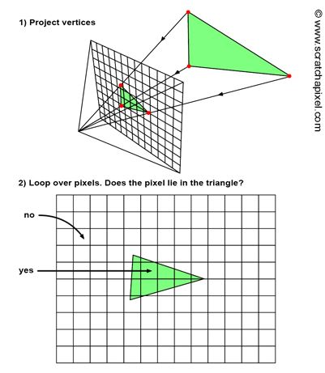
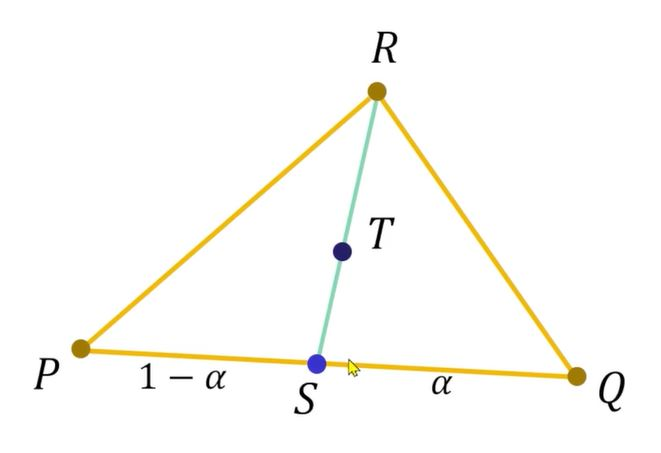
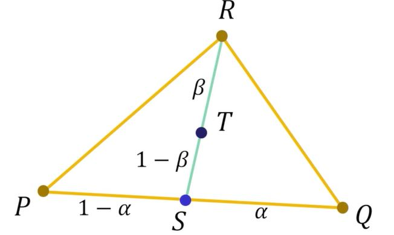

### Introduction (Bottleneck of Ray Tracing Method)

Ray Tracing 으로 Rendering 을 하게 되면, 여러 Bottleneck 이 존재한다. 일단 모든 물체에 대해서 물체가 부딫혀서 색깔을 가져와야하며, 물체의 Material 이 Transparncy 나 Reflection 이 있다면 반사 또는 굴절(reflection ray & refracted ray) 를 만들어서 다시 쏴주는것도 한계가 있으며, 또 물체의 그림자를 표현하려면, shadow ray 를 만들어서 `물체의 충돌`을 계산해야한다. 그래서 실시간으로 Rendering 을 하기에는 Computation Expensive 하다. 물론, 다른 Data Structure 를 사용한다면, 분명 최적화가 가능하지만, 일단 이러한 점을 CPU 에서 해결하는게 효율적이지 못하다.

이걸 해결하기위한 방법이 Rasterization Algorithm 이다. 일단 Approach 자체가 다르다.

### Rasterization Algorithm

일단 앞서서, Ray Tracing 을 사용할때, 역방향으로 Ray 를 쏴줬다. 더 자세하게 설명을 하면, 우리가 보는 위치(눈) 에서 Ray 를 Screen 으로 100 개를쏴서, 그 100 개가 물체에 충돌하는지 충돌 안하는지를 계산을 했었다. 하지만, `Rasterization` 에서는 물체의 형상을 Screen 좌표계로 투영을 시킨다는 점이다. 즉 정점들을 Screen 좌표로 투영을 시켜서, 삼각형이라고 한다면, 그 3 개의 Vertex 를 정점을 투영시켜, 정점들을 연결시켜서 Render 또는 그리면 된다. 그래서 Screen 좌표 Block 에 삼각형이 들어있는지 없는지만 체크하면된다. 마치 충돌처럼 보일수는 있어도, Pixel 이 있는지 없는지만 확인을 하면 되기때문에, 더 빠르다. 아래의 그림을 보면 조금더 이해가 잘될거다.

<figure>
  
</figure>

Rasterization 의 알고리즘의 Step 은 Ray Tracing 과 비슷하면서도 다르다. 예를 들어서 Ray Tracing 같은 경우, 모든 Pixel 에 대해서 Loop 을 돌면서 모든 물체에 Hit 을 하는지 안하는지를 체크 한이후에, 물체에 부딫히면 물체의 색을 결정했었다. `Rasterization` 같은 경우, 기준이 scene 에있는 모든 물체에서 Loop 을 돌고, 그 이후에 모든 물체의 Vertex 들을 투영을 시킨다음에, 그다음에 Pixel 을 돌면서, 그 Pixel 이 물체안에 들어가있는지 없는지를 체크를 한이후에 들어가 있다면, color 값을 가지고 오면 된다. 여기서 중요한건 Rasterization Algorithm 은 `object-centric` 이라는 점이다. 즉 도형의 Geometry 를 image 좌표계로 바꿔서, 그 Image 를 Loop 을 돌기 때문이다. 

실제 Implementation 같은 경우 그 정점들을 이어주려면 그 공간에 위치해있다 라는걸 알기 위해서 Bounding Box 를 그린다.

### Rasterization Prep
- **Baycentric Coordinates**
여기에서 알아볼 점은, 삼각형 정점 `PQR` 이 존재한다고 했을때 그 안에 T 를 Affine Sum 으로 표현하는게 중요하다.

<figure>
  
</figure>

위의 그림과 같이 R 의 좌표와 T 의 좌표를 이미 알기때문에, R 과 T 를 포함하는 직선을 그려서, PQ 직선의 점 S 에 그리게 되면 P 와 S 의 거리, S 와 Q 의 거리의 비를 찾을수 있다. 그러면 S 의 위치를 `S = P + (1 - alpha)(Q - P)` 라는 식을 구할수있다. 

그 이후에, 아래와 같이 T 의 위치를 PQ 에서 S 의 위치를 구하듯이, Beta 를 이용해서 구할수 있다. 그래서 T = beta * S + (1 - beta)*R 이런식으로 구한다음에 S 의 값을 위의 식에 대입을 하면 T 의 좌표를 Affine Combination 을 구할수 있다. `T = alpha * beta * P + beta(1 - alpha)*Q + (1 - beta)*R` 이런식으로 표현이 된다.

<figure>
  
</figure>

### Rasterization Implementation (How to draw Triangle)

### Resource
- [Rasterization: a Practical Implementation
](https://www.scratchapixel.com/lessons/3d-basic-rendering/rasterization-practical-implementation/overview-rasterization-algorithm.html)