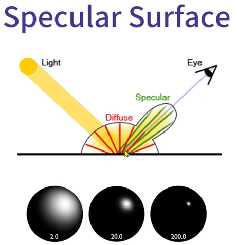
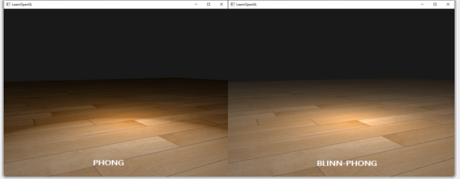

* this unordered seed list will be replaced by the toc
{:toc}

## Shading

Vertex shader 에서 주로 shading 파트를 한다, 요즘엔 그래픽 카드가 좋아서, pixel shader 에서 종종한다고 한다. 일단 shading 이란 조명과 재질을 고려해서 색을 결정하는 작업을 말한다. 주로 방법론은 두가지 방법이 있는데 Vertex shader 에서 vertex 의 색을 결정한 이후에 pixel shader 로 보내줘서 pixel shader 에서 interpolation 을 하는 방법이 있고, ㅏ나머지 방법은 shading algorithm 을 pixel shader 계산하는 방법이 있다. 두가지 방법을 구지 고려했을때 정점의 개수가 확실히 적기 때문에 shading 을 Vertex shader 에서 하는 편이다. Ray Tracing 에서 구현한 Phong shading model 의 개선된 Blinn-Phong Shading 을 알아보자.

## Material

일단 Shading 을 하기 앞서, 조명에 관련된걸 잠깐 언급하려고 한다. 조명에도 2 가지가 있는데, Local Illuimination (직접 조명) 이 있고, Global Illumination (간접조명)이 있다. 이 두가지의 차이는 직접 조명 같은 경우는 직접적으로 조명을 주기때문에 빛춘곳만 shading 이 생기는거고, Global illumination 은 그 빛에만 조명효과가 일어나는게 아니라 빛이 분배되는것처럼 구현이 된다.

예를 들어서 빛이 물체를 비췄을때, 조명과 물체가 비스듬하게 비췄을때의 그 suface 를 `Lambertian Surface` 라고 하는데, 이것도 마찬가지로 조명과 물체가 수직일때 물체에 받는 intensity 가 강할껀데 이공식이 I(diffuse) = Kd * I(light) * cos(theta) 라 정리가 된다. Lambertian Surface 에서 정의하는게 어떤 조명이 표면이 울퉁불퉁하는 곳에 부딫쳤을때, 난반사가 일어나는데 이때 난반사의 모양이 반쪽의 구의 모형으로 균일하게 반사하는걸 표현한다. 여기에서 더 extend 를 하자면 반구의 크기가 결국에는 입사각에 따라서 달라진다 라는 말이 된다.

결국엔 물체의 색깔을 결정하기 위해선, `Reflection` 이 중요하고, Reflection 을 정의하려면 물체의 표면을 고려해야한다. 그래서 Specular 과 Diffuse 는 물체의 표면을 생각했을때, 떼어낼수 없는 존재이다. 그 예는 아래와 같이 Image 를 참고하자

<figure>
  
</figure>

## Blinn-Phong Shading
일단 Phong 보다 개선된점은 바로 계산의 속도 문제이다. Phong 모델에서는 R dot V 를 했었다. 하지만 Blinn Phong 에서는 N dot H 를 한다는 점이 포인트이다. 이때 H 는 Halfway Vector 라고 하는데 왜 Half 냐면 N 과 L 사이의 중간지점인 Vector 이기 때문이다. H 같은 경우는 L + V / ||L + V|| 로 구할수 있다.

역시 Phong 과 Blinn-Phong 을 비교 해봐야 어떤게 좋은지 알수 있다.

<figure>
  
</figure>

[OpenGL](https://learnopengl.com/Advanced-Lighting/Advanced-Lighting#:~:text=The%20only%20difference%20between%20Blinn,the%20view%20and%20reflection%20vector.) 일단 Phong Model 은 Reflection vector 와 View Vector 의 각도가 크기 때문에 제곱을 했을때 더 날카롭게 표현되기때문에 Phong model 을 봤을때 directional light 가 더 강하게 보인다. 하지만 Blinn-phong 같은 경우 halfway vector 와 Normal vector 의 각도가 작기때문에 제곱을 해도 부드럽게 나오는걸 확인할수 있다.

계산에서 중요한점은 Point 같은 경우는 이동이 가능하지만, Vector 는 이동이 불가능하다. 이 점이 물체가 이동을 할때 Point 도 옮겨줘야하지만, Normal Vector 도 같이 움직여줘야한다는 부분이다.

그렇다면 C++ 코드로 GPU 에서 해야될 shader 를 잠깐 구현한다고 하면.

```c++
#include <glm/glm.hpp>
#include <vector>

// Helper function for rotating about certain axis 
vec3 RotateAboutZ(const vec3 &v, const float &theta) {
    return vec3(v.x * cos(theta) - v.y * sin(theta),
                v.x * sin(theta) + v.y * cos(theta), v.z);
}

vec3 RotateAboutY(const vec3 &v, const float &theta) {
    return vec3(v.x * cos(theta) + v.z * sin(theta), v.y,
                -v.x * sin(theta) + v.z * cos(theta));
}

vec3 RotateAboutX(const vec3 &v, const float &theta) {
    return vec3(v.x, v.y * cos(theta) - v.z * sin(theta),
                v.y * sin(theta) + v.z * cos(theta));
}

struct Transformation {
  vec3 scale = vec3(1.0f);
  vec3 translation = vec3(0.0f);
  float rotationX = 0.0f;
  float rotationY = 0.0f;
  float rotationZ = 0.0f;
};

struct Material{
  vec3 ambient = vec3(0.1f);
  vec3 diffuse = vec3(1.0f);
  vec3 specular = vec3(1.0f);
  float shininess;
};

sturct Light{
  vec3 strength = vec3(1.0f);
  vec3 direction = vec3(0.0f, -1.0f, 0.0f);
};

struct Constants {
  Transformation transformation;
  Light light;
  Material material;
} constants;

struct VSInput{
  vec3 position;
  vec3 normal;
  vec3 color;
};

struct VSOutput{
  vec3 position;
  vec3 normal;
};

vec3 BlinnPhong(vec3 lightStrength, vec3 lightVec, vec3 normal, vec3 toEye,
              Material mat){
  
}

vec3 ComputeDirectionalLight(Light L, Material mat, vec3 normal, vec3 toEye){
  vec3 lightVec = -L.direction;

  vec3 lightStrength = vec3(1.0f);

  return BlinnPhong(lightStrength, lightVec, normal, toEye, mat);
}

// Vertex Shader
VSOutput MyVertexShader(const VSInput vsInput){
  VSOutput vsOutput;

  vsOutput.position = RotateAboutX(
    RotateAboutY(vsInput.position * constants.transformation.scale,
      constants.transformation.rotationY),
      constants.transformation.rotationX) + constants.transformation.translation;

  vsOutput.normal = RotateAboutX(
    RotateAboutY(vsInput.normal, constants.transformation.rotationY),
      constants.transformation.rotationX);

  return vsOutput;
}

```

## Resource
- [Blinn-Phong Model Paper](https://www.microsoft.com/en-us/research/publication/models-of-light-reflection-for-computer-synthesized-pictures/)
- [Computing Diffuse Reflection](http://groups.csail.mit.edu/graphics/classes/6.837/F00/Lecture16/Slide10.html)
- [Diffuse Lighting](http://learnwebgl.brown37.net/09_lights/lights_diffuse.html)

