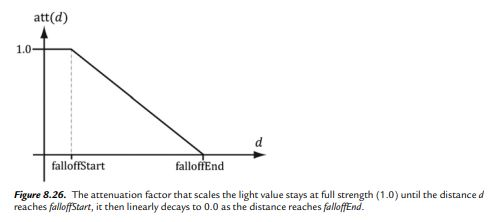

## Lighting in Rasterization

Ray Tracing 과 마찬가지로, Rasterozation Pipeline 에서도 Lighting 의 종류는 Directional Light / Point Light / Spotlight 이 있다. 역시 이것도 [Unreal Light Type](https://docs.unrealengine.com/4.27/en-US/BuildingWorlds/LightingAndShadows/LightTypes/) 의 일부분이다. (참고: Unreal Light Type 은 SkyLight 과 Rect Light 이 존재한다.)

일단 Shading 부분에서 구현했듯이, Directional Light 은 구하긴 쉽다. 여기에서는 Point Light 과  Spotlight 을 구현해보려고 한다.

## Point Light

Point Light 의 Physical 한 부분은, 전구로 묘사 하는게 제일 알맞다. 어떤 한 빛의 지점에서 구의 형태로 부터 여러 방면으로 빛이 나간다.

아래의 그림을 참고하자. 어떠한 Arbitary point P 로 부터, Point Light 의 Origin Q 로 부터 빛이 퍼져나간다. 그래서 Light 을 구하는 방법은, 우리가 보는 시점 P 로부터 Q 의 Vector 즉 Q - P 의 Vector 로 표현이 가능하다. 그래서 Direction 을 찾자면 아래의 그림 처럼 공식이 성립이된다.

<figure>
  
</figure>

그리고 Light 의 방향 벡터는 위와 같이 구했지만, 실제 Light 의 세기인 Intensity 를 Physical Level 에서 그럴싸하게 보이려면 Attenuation Function 을 사용해야한다. Light 의 세기 가 거리에 따라서 약해지기 대문에 I(intensity) = I(initial) / d^2 이렇게 정의 할수 있고, 이건 HDR(High dynamic range) 에서 사용되고 tonemapping 에 사용된다. 근데 쉽게 구현 가능하는거는 아래와 같은 함수이다. saturate 함수인데 아래와 같이 표현이 가능하다. 일단 fallofStart 까지는 1 이라는 constant value 가 적용되고, 그리고 fallOfStart 와 fallOfEnd 의 사이는 0 까지의 직선이고, falloffEnd 부터는 0 이된다.

<figure>
  
</figure>

구현하는 방법은 아래와 같다.

## Spot Light

Spotlight 을 받는다라고 하는 장면을 생각해보면, 어떤 무대에서 배경은 다 까맣고, 그 Spot Light 를 받는 인물만 빛이 들여오는걸 상상할수 있다. SpotLight 은 Point Light 과 비슷하다. 하지만 square 이 붙는다. 아래의 Figure 를 보면 P 는 빛을 받는 지점이고 Q 는 spotlight source 이다. P 를 봤을때 SpotLight 의 Cone 안에 있다는걸 확인 할수 있는데 이걸 결정할수 있는게 phi max 보다 D 와 -L 의 dot product 를 했을때 각도가 적다는걸 확인 할수 있다. 그리고 이 Cone 에서의 특징점은 Cone 의 Q 지점에서 직선으로 being lit 했을때의 지점이 제일 밝고, 그 지점으로 부터 멀어질수록, 즉 Phi max 일때는 빛의 intensity 가 0 이 된다. 그래서 max(cos(phi), 0 )^5 라고 말할수 있고, 결국 이거는 `max(-L dot d, 0)^5` 라고 볼수 있다.

<figure>
  
</figure>


## C++ 구현

```c++
struct Light {
    vec3 strength = vec3(1.0f);
    vec3 direction = vec3(0.0f, -1.0f, 0.0f);   // directional/spot light only
    vec3 position = vec3(0.0f, 1.0f, 0.5f);     // point/spot light only
    float fallOffStart = 0.0f;                  // point/spot light only
    float fallOffEnd = 1.8f;                    // point/spot light only
    float spotPower = 0.0f;                     // spot light only
};

struct VSInput {
    vec3 position;
    vec3 normal;
    vec3 color;
    vec2 uv;
};

struct VSOutput {
    vec3 position;
    vec3 normal;
    vec3 color;
    vec2 uv;
};

vec3 BlinnPhong(vec3 lightStrength, vec3 lightVec, vec3 normal, vec3 toEye,
                Material mat) {

    vec3 halfway = normalize(toEye + lightVec);
    vec3 specular =
        mat.specular * pow(glm::max(dot(halfway, normal), 0.0f), mat.shininess);

    return mat.ambient + (mat.diffuse + specular) * lightStrength;
}

vec3 ComputeDirectionalLight(Light L, Material mat, vec3 normal, vec3 toEye) {
    vec3 lightVec = -L.direction;

    float ndotl = glm::max(dot(lightVec, normal), 0.0f);
    vec3 lightStrength = L.strength * ndotl;
    return BlinnPhong(lightStrength, lightVec, normal, toEye, mat);
}

float Saturate(float x) { return glm::max(0.0f, glm::min(1.0f, x)); }

float CalcAttenuation(float d, float falloffStart, float falloffEnd) {
    // Linear falloff
    return Saturate((falloffEnd - d) / (falloffEnd - falloffStart));
}

vec3 ComputePointLight(Light L, Material mat, vec3 pos, vec3 normal,
                       vec3 toEye) {
    vec3 lightVec = L.position - pos;
    float d = length(lightVec);
    if (d > L.fallOffEnd)
        return vec3(0.0f);

    lightVec /= d;

    float ndotl = glm::max(dot(lightVec, normal), 0.0f);
    vec3 lightStrength = L.strength * ndotl;

    float att = CalcAttenuation(d, L.fallOffStart, L.fallOffEnd);
    lightStrength *= att;

    return BlinnPhong(lightStrength, lightVec, normal, toEye, mat);
}

vec3 ComputeSpotLight(Light L, Material mat, vec3 pos, vec3 normal,
                      vec3 toEye) {
    vec3 lightVec = L.position - pos;
    float d = length(lightVec);
    if (d > L.fallOffEnd)
        return vec3(0.0f);

    lightVec /= d;

    float ndotl = glm::max(dot(lightVec, normal), 0.0f);
    vec3 lightStrength = L.strength * ndotl;

    float att = CalcAttenuation(d, L.fallOffStart, L.fallOffEnd);
    lightStrength *= att;

    float spotFactor = glm::pow(glm::max(dot(-lightVec, L.direction), 0.0f), L.spotPower);
    lightStrength *= spotFactor;

    return BlinnPhong(lightStrength, lightVec, normal, toEye, mat);
}

// Vertex Shader
VSOutput VertexShader(const VSInput vsInput) {
    VSOutput vsOutput;

    vsOutput.position =
        RotateAboutX(
            RotateAboutY(vsInput.position * constants.transformation.scale,
                         constants.transformation.rotationY),
            constants.transformation.rotationX) +
        constants.transformation.translation;
    
    vsOutput.normal = RotateAboutX(
        RotateAboutY(vsInput.normal, constants.transformation.rotationY),
        constants.transformation.rotationX);

    return vsOutput;
}

// Pixel Shader
struct PSInput {
    vec3 position;
    vec3 normal;
    vec3 color;
    vec2 uv;
};

vec4 PixelShader(const PSInput psInput) {

    vec3 eye = vec3(0.0f, 0.0f, -1.0f); // -distEyeToScreen
    vec3 toEye = glm::normalize(eye - psInput.position);

    vec3 color;

    if (constants.lightType == 0) {
        color = ComputeDirectionalLight(constants.light, constants.material,
                                        psInput.normal, toEye);
    } else if (constants.lightType == 1) {
        color = ComputePointLight(constants.light, constants.material,
                                  psInput.position, psInput.normal, toEye);
    } else {
        color = ComputeSpotLight(constants.light, constants.material,
                                 psInput.position, psInput.normal, toEye);
    }

    return vec4(color, 1.0f);
}
```

## Reference 
[DirectX12](https://terrorgum.com/tfox/books/introductionto3dgameprogrammingwithdirectx12.pdf)