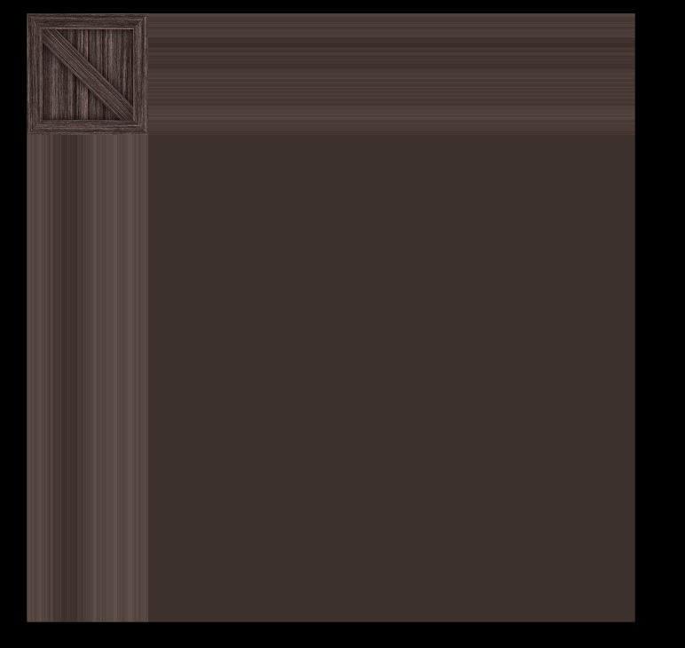
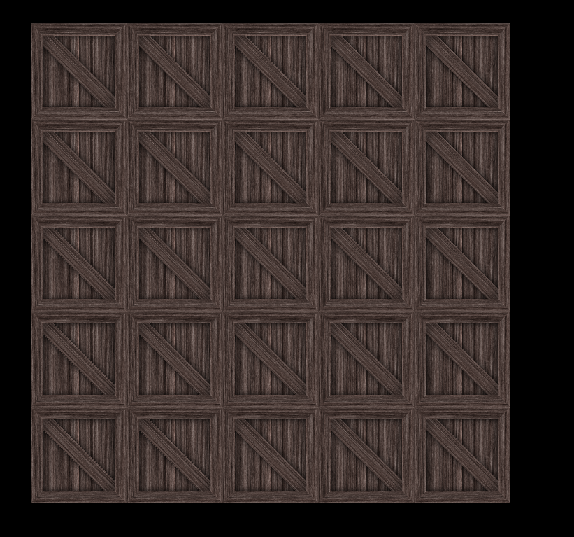
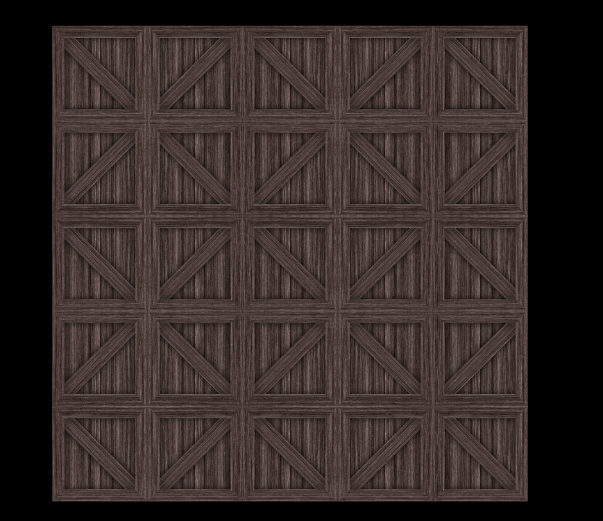
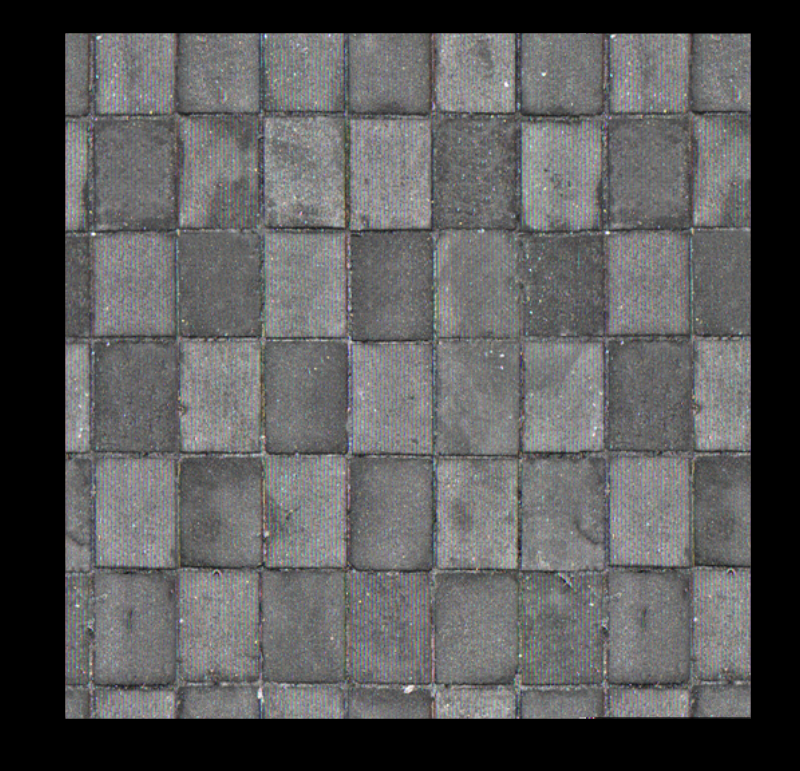

### DirectX11 - Texture in GPU

일단, Texturing 을 하기 위해서, Shader Programming 해야된다. 일단 Texturing 을 하려면 Vertex Shader 에서 해야되는지, Pixel Shader 에서 해야되는지가 고민이 되는데, 일단 Microsoft 공식문서에서는 Pixel Shader 에서 하라고 명시가 되어있다. 어떤 특유의 Texture 를 결국에는 Vertex 의 Point 에 맞게끔, Image 를 Texture Coordinate 으로 Mapping 을 해줘야한다.

CPU 에서의 Texture 를 사용하기위한 Resource 를 먼저 만들어보자. 아래처럼 Texture2D 를 만들어주고, 그리고 `ID3D11ShaderResourceView` 는 Texture 를 Shader 에서 사용할수 있게끔, ResourceView 를 Mapping 해줬다고 볼수 있다. 그리고 Texture 를 Sampling 하는 SamplerState 도 정해놓을걸 볼수 있다. 

```c++
ComPtr<ID3D11Texture2D> m_texture;
ComPtr<ID3D11ShaderResourceView> m_textureResourceView;
ComPtr<ID3D11SamplerState> m_samplerState;
```

정리하자면 Shader 를 Resource 로 사용하는 View 로 보겠다가 되겠고, Texture 를 RenderTarget 으로도 사용할수 있다. (RenderTargetView 참고), 또 이렇게 저렇게 Texture 로 나온 결과값을 다른 Shader 에서도 집어 넣는게 가능하다.

그리고 이러한 Texture 을 Rendering Stage 에서, Setter 를 맞춰줘야한다. 여러개의 Texture Resource 를 사용할수 있으니, 아래처럼 처리할수 있다.

```c++
// Render()
ID3D11ShaderResourceView* resources[1] = {m_textureResourceView.Get()};
_context->PSSetShaderResources(0, 1, resources);
_context->PSSetSamplerState(0, 1, m_samplerState.GetAddresssOf());
```

그리고 만약 Texture 를 초기화 할떄 한다고 한다면, Sample Description 을 Init 을 해야한다. 옵션은 여러개 있지만,
예를 들어서 D3D11_TEXTURE_ADDRESS_WRAP / D3D11_TEXTURE_ADDRESS_MIRROR / D3D11_TEXTURE_ADDRESS_CLAMP 등이 있다. 

```c++
D3D11_SAMPLER_DESC sampDesc;
ZeroMemory(&sampDesc, sizeof(sampDesc));
sampDesc.Filter = D3D11_FILTER_MIN_MAG_MIP_LINEAR;
sampDesc.AddressU = D3D11_TEXTURE_ADDRESS_WRAP;
sampDesc.AddressV = D3D11_TEXTURE_ADDRESS_WRAP;
sampDesc.AddressW = D3D11_TEXTURE_ADDRESS_WRAP;
sampDesc.ComparisonFunc = D3D11_COMPARISON_NEVER;
sampDesc.MinLOD = 0;
sampDesc.MaxLOD = D3D11_FLOAT32_MAX;
```

그러면 PixelShader 의 Program 을 잠깐 봐보자. 일단 GPU 에서 Texture Image 를 `Texture2D` 로 받아 올수 있다. 그리고 앞에서 잠깐 언급했듯이, Texture Image 안에서 색깔 값을 가져오는 걸 Sampling 이라고 했었다. 그래서 `SamplerState` 도 사용해야한다. 여기서 register 일때의 `t0` 과 `s0` 이 있다. `t0` 같은 경우, Texture 일때, 그리고 index 는 0, 그리고 sampler 일때는 s 그리고 index 는 0. 자세한건, 이 [Resource](https://learn.microsoft.com/en-us/windows/win32/direct3dhlsl/dx-graphics-hlsl-variable-register) 를 활용하자.


```hlsl
Texture2D g_texture0 : register(t0);
SamplerState g_sampler : register(s0);

cbuffer PixelShaderConstantBuffer : register(b0) {}

struct PixelShaderInput
{
    float4 pos : SV_POSITION;
    float3 color : COLOR;
    float2 texcoord : TEXCOORD;
}

float4 main(PixelShaderInput input) : SV_TARGET
{
    return g_texture0.Sample(g_sampler, input.textcoord);
}
```


위와 같은 방법으로 했을시에 아래와 같은 결과 값이 나온다.


만약 다른 옵션으로 정의 한다고 했을때, Clamp, Wrap, Mirror 를 한번씩 보자. 일단 더 정확하게 보려면, Shader 코드의 변경점이 필요하다.

`return g_texture0.Sample(g_sampler, input.textcoord * 5);` 이런식으로 Clamp 부터 확인 해보자.



Clamp 같은 경우는 약간 가장자리를 쭈욱 댕기는 느낌이라고 볼수있다. 작은 Texture 를 잡아당기기때문에 ZoomIn/ZoomOut 느낌은 아니다.

그 다음에 Wrap 같은 경우는 5 x 5 의 작은 Texture 이 Mapping 이된걸 볼수 있다.


그 다음에 Mirror 같은 경우는 5 x 5 인데 마치 데칼코마니 처럼 보여질수 있는걸 볼수 있다.



다른 Image (png, jpeg) 의 변환작업이 필요하지만, 이건 ResourceView 로 Mapping 만 잘해주면 될것 같다.



주의해야될점은 한 Texture 를 한 Shader 안에서 동시에 Resource 와 RenderTarget 으로 사용할수 없다. 그래서 Texture 가 두개가 있다고, 가정하면, Res1 -> Shader -> RT2 = Res2 -> Shader -> RT1 이렇게 사용이 가능하다.

## Resource
- [Create Textures](https://opengameart.org/content/3-crate-textures-w-bump-normal)
- [Texutre in OpenGL](https://learnopengl.com/Getting-started/Textures)