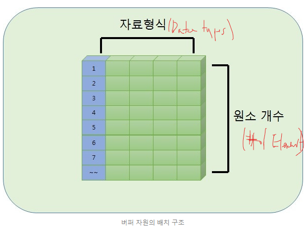

## Goal & Motivation

DirectX11 또는 DirectX12 를 사용함으로써, 어떤 Resource 를 Assign 을 할 수 있는지와, Software 관점에서 어떻게 GPU 의 Hardware 과 어떻게 연관관계가 있는지를 파악 하는 목적으로 이 글을 써보려고 한다.

## GPU Architecture
GPU Archtiecture 를 보기 앞서서, 위의 그림을 확인 해보자.

## DirectX Resource 

HighLevel 에서 봤을때에는, Resource 들은 C / C++ 에서 코드로 연결해서 생성해주고, Pipeline 에 연결하고, 해제하는 어떠한 대상이라고 생각하면된다. 하지만 Porgram 가능 Shader 단계의 HLSL Shader 안에서는 자원을 훨씬 더 디테일하게 다룰 에정이다.

### Buffer Resource

Buffer Resource 에 속하는 자원들은 Direct3D 11 이 사용할 1 차원 선형 메모리 블록을 제공한다. 다양한 옵션들을 설정함으로써 행동 방식이 다른 다양한 버퍼들을 만들어 낼 수 있으나 아래의 그림에 나온것 처럼 기본적인 직선형 배치 구조만큼은 동일하다.

Buffer 의 크기는 Byte(1 Byte = 8bit) 단위이다. 버퍼를 구성하는 원소의 크기는 버퍼의 종류에 따라 다를수 있으며, 같은 종류의 Buffer 더라도, 특정 설정에 따라 원소의 크기는 다를수 있다. Buffer 들 중에는 응용 프로그램의 C++ 쪽에서 주로 쓰이는것도 있고, 파이프라인에 부착된 후 HLSL Shader Programming 안에서 주로 쓰이는것도 있다.

## Resource
