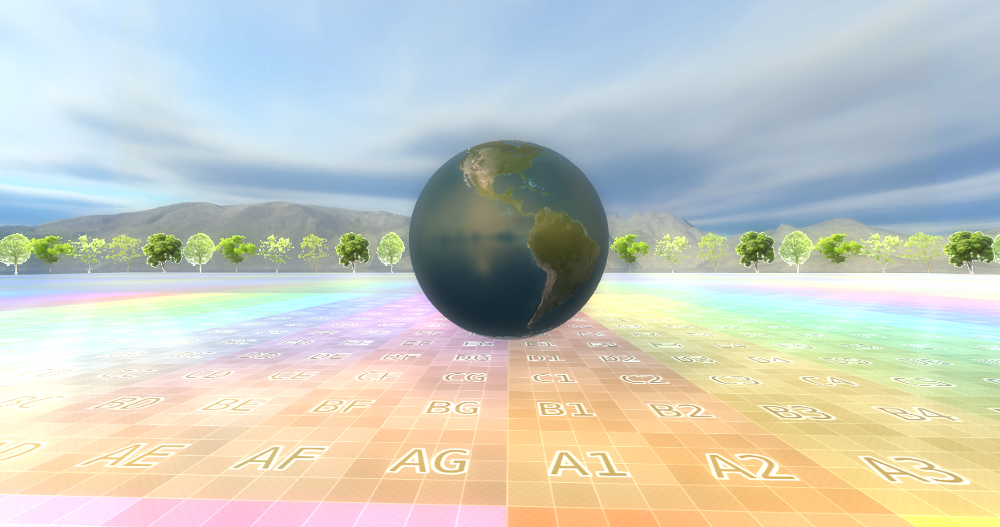

## MipMap Introduction

Mipmap 이라는건 Main Texture Image 를 downsized 를 시킨 여러개의 사진이라고 생각하면 된다. 즉 여러개의 해상도를 조정하며 만든 여러개의 Image 라고 생각 하면 된다. Computer Vision 에서는 Image Pyramid 라고도 하는데, 여러개의 서로 다른 Resolution 의 Image 를 올려 놓았다고 볼수 있다. 아래의 이미지를 봐보자. 아래의 Image 를 보면 512, 512/2, 256/2... 절반씩 Resolution 이 줄어들고 있다. 


그러면 어디서 이게 사용되까? 라고 한다면 바로 MIPMAP 이다. MIPMAP vs Regular Texture 라고 하면, 바로 문제가 Aliasing 이 문제이다. 아래의 Image 를 보면 이해할수 있을것 같다.

Unreal 에도 똑같은 기능이 있는데, 바로 RenderTargetTexture 를 생성시에 여러가지의 옵션이 보인다.


옵션을 보면, Texture RenderTarget 2D 라고 해서, DirectX 에서 사용하는 description 을 생성할때와 동일한 옵션이 된다. 여기에서 Mips Filter(Point Sampler / Linear Interpolation Sampler) 도 보인다. 결국에는 Texture 를 Mapping 한다는 관점에서, 우리는 Texture Coordinate 을 어떠한 사각형 박스 안에 Mapping 을 해서 사용했고, 그걸 사용할때, Texture Coordinate 도 명시를 했었다. 자 결국에는 Texture 를 Mapping 한다는 관점에서 봤을때, 확대도 가능하고, 축소도 가능하다. 그게 바로 Maginification 과 Minification 이다. 


즉 Magnification 을 하기 위해서, Mag Filter (To interpolate a value from neihboring texel) 이말은 결국엔 Linear Filter / Pointer Filter 로 Interpolation 과 그리고 내가 그리려는 Texture (64, 64) 를 어떠한 박스 (512, 512) 에 붙인다고 상상했을때, 그림은 작고, 보여줘야하는 화면이 클경우, GPU 가 이 Texture 를 늘려서 보간을 해야하는 경우가 (그말은 화면 하나의 픽셀이 원래 텍스쳐의 중간쯤 위치에 거릴수 있다. texel / pixel < 1) Magnification 이라고 한다. 그리고 이 반대의 상황을 Minification 이라고 한다. 그리고 MipLevels = 0 으로 둔다는게 Max MipMap 즉 MipMap 을 Resolution 대로 만들고 이게 결국에는 LOD 와 똑같게된다.

Subresoruce Term 인데, Texture 의 배열로 각각 다른 Texture 에 대해서, 각각의 Mipmap 들을 생성한는것이 바로 Array Slice 이고, 여러개의 Texture 에서. 같은 Resolution 끼리, mipmap level 이 같은걸 MIP Slice 라고 한다. A Single Subresoruce(Texture) 즉 하나의 Resource 안에서, Subresource 를 선택해서 골라갈수 있다. (이걸 Selecting a single resource) 라고 한다. 자세한건, [Subresource](https://learn.microsoft.com/en-us/windows/win32/direct3d11/overviews-direct3d-11-resources-subresources) 를 확인하면 좋다.

아래의 코드를 보자면 추가된건 별로 없지만, Staging Texture 임시로 데이터를 놓는다. 그 이유는 MipMap 을 생성할때, 우리가 내부의 메모리가 어떻게 되어있는지 모르므로, 최대한 안전하게 Input Image 를 StagingTexture 를 만들어 놓고, 그리고 실제로 사용할 Texture 를 설정을 해준다. 이때 Staging 한거에대해서 복사를 진행하기에, `D3D11_USAGE_DEFAULT` 로 설정을 하고, 그리고 GPU 에게 결국에는 RESOURCE 로 사용할것이다 라는걸 Description 에 넣어주고, Mip Map 을 설정한다. (즉 GPU 에서 GPU 에서 복사가 이루어진다.) 즉 Staging Texture는 GPU 리소스에 직접 데이터를 쓸 수 없기 때문에, CPU 쓰기 전용 텍스처에 데이터를 쓴 후 GPU용 리소스로 복사하는 중간 단계라고 말을 할수 있겠다. 그리고 메모리만 잡아놓고, CopySubresourceRegion 을 통해서, StagingTexture 를 복사를 한다. 그리고 마지막에 그 해당 ResourceView 에, 이제 GenerateMips 를 하면 될것 같다.

CPU
---
```c++
ComPtr<ID3D11Texture2D> texture;
ComPtr<ID3D11ShaderResourceView> textureResourceView;

ComPtr<ID3D11Texture2D> CreateStagingTexture(ComPtr<ID3D11Device> &device,
                     ComPtr<ID3D11DeviceContext> &context, const int width,
                     const int height, const std::vector<uint8_t> &image,
                     const int mipLevels = 1, const int arraySize = 1) 
{
    D3D11_TEXTURE2D_DESC txtDesc;
    ZeroMemory(&txtDesc, sizeof(txtDesc));
    txtDesc.Width = width;
    txtDesc.Height = height;
    txtDesc.MipLevels = mipLevels;
    txtDesc.ArraySize = arraySize;
    txtDesc.Format = DXGI_FORMAT_R8G8B8A8_UNORM;
    txtDesc.SampleDesc.Count = 1;
    txtDesc.Usage = D3D11_USAGE_STAGING;
    txtDesc.CPUAccessFlags = D3D11_CPU_ACCESS_WRITE | D3D11_CPU_ACCESS_READ;

    ComPtr<ID3D11Texture2D> stagingTexture;
    HRESULT hr = device->CreateTexture2D(&txtDesc, nullptr, stagingTexture.GetAddressOf())
    if (FAILED(hr)) {
        cout << "Failed to Create Texture " << endl;
    }

    D3D11_MAPPED_SUBRESOURCE ms;
    context->Map(stagingTexture.Get(), NULL, D3D11_MAP_WRITE, NULL, &ms);
    uint8_t *pData = (uint8_t *)ms.pData;
    for (UINT h = 0; h < UINT(height); h++) {
        memcpy(&pData[h * ms.RowPitch], &image[h * width * 4],
               width * sizeof(uint8_t) * 4);
    }
    context->Unmap(stagingTexture.Get(), NULL);

    return stagingTexture;
}

ComPtr<ID3D11Texture2D> stagingTexture =
    CreateStagingTexture(device, context, width, height, image);

D3D11_TEXTURE2D_DESC txtDesc;
ZeroMemory(&txtDesc, sizeof(txtDesc));
txtDesc.Width = width;
txtDesc.Height = height;
txtDesc.MipLevels = 0; // Highest LOD Level
txtDesc.ArraySize = 1;
txtDesc.Format = DXGI_FORMAT_R8G8B8A8_UNORM;
txtDesc.SampleDesc.Count = 1;
txtDesc.Usage = D3D11_USAGE_DEFAULT; 
txtDesc.BindFlags = D3D11_BIND_SHADER_RESOURCE | D3D11_BIND_RENDER_TARGET;
txtDesc.MiscFlags = D3D11_RESOURCE_MISC_GENERATE_MIPS; 
txtDesc.CPUAccessFlags = 0;

// Copy the highest resolution from the staging texture
context->CopySubresourceRegion(texture.Get(), 0, 0, 0, 0, stagingTexture.Get(), 0, nullptr);

// Creating Resource View
device->CreateShaderResourceView(texture.Get(), 0, textureResourceView.GetAddressOf());

// Generate Mipmap reducing the resolution
context->GenerateMips(textureResourceView.Get()); 
```

GPU(Shader) 
---
```c++
float dist = length(eyeWorld - input.posWorld);
float distMin = 1.0;
float distMax = 10.0f;
float lod = MAX_LOD * saturate((dist - distMin) / (distMax - distMin));
diffuse *= g_texture0.SampleLevel(g_sampler, input.texcoord, lod);
PixelShaderOutput output;
output.pixelColor = diffuse + specular;
return output;
```
GPU 에서는 결국에는 Mipmap 을 사용해줘야하므로, HLSL 에서는 그냥 `Sample()` 아니라 `SampleLevel()` 을 해줘야한다. 참고로 Sample() 과 SampleLevel 의 차이는 Sample 을 이용하면, lod Level 을 내부적으로 계산해서 샘플링을 한다고 한다. 그리고 LOD 가 0 이면 Quality 가 좋은 Texture 라고 정할수 있다. (Vertex 개수가 많음).

또, 이렇게 끝내면 좋지 않지 않느냐? 바로 RenderDoc 으로 부터 언제 MipMap 이 생성되는지 한번 봐야하지 않겠냐 싶어서 RenderDoc 을 돌려봤다. PostPorcessing 이 끄면 이 MipMap 들이 보이진 않을거다. 즉 한 Pass 와 다른 Pass 사이에 MipMap 을 내부적으로? 생성하는것 같아보인다. 제일 앞에 있는게 제일 높은 LOD 를 가지고 있다. 그리고 RenderDoc 에서 왜 클릭이 안되어있는지는 모르겠지만 Subresource 를 보면 Mip Level 들이 보이고, 내부적으로 해상도(Size) 를 계속 줄이는것 같이 보인다.


## Result



## Resources
* [What is mipmapping](https://blog.imaginationtech.com/why-you-really-should-be-using-mipmapping-in-your-graphics-applications/)
* [Texture Magnification](https://www.youtube.com/watch?v=ZlzXX8cLAds&ab_channel=Udacity)
* [Texture - Slide](https://www.slideserve.com/lang/texture-mapping)