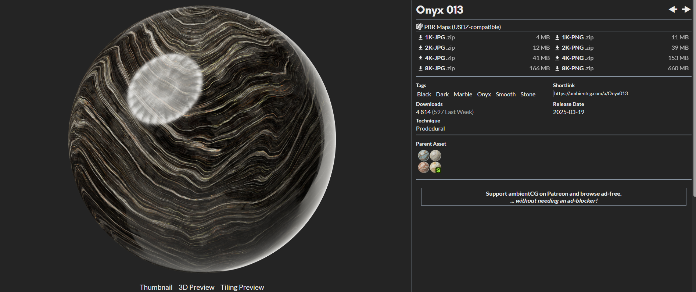

### DirectX - Normal Mapping 

PBR 을 이용한, 필요한 Texture 기술 중에 하나가 물체의 질감을 표시하는것이다. Cube Mapping 이나 Environment Mapping 같은데에 필요한것이 High Resolution 을가지고 있던 Texture 였다. 여기에서도 마찬가지이다.

아래에 그림처럼 이러한 Texture 를 사용해서 "Normal Mapping" 이라는걸 하면 된다.

* Albedo: The albeo map is the base color input that difines the diffuse color or reflectivity of the surface. (Similar to diffuse map, but has the pure color of an object)

* Vertex Shader 에서도 Texture 를 Sample 할수 있는데, SampleLevel 을 사용해야한다.

* 만약에 여러개의 Texture 를 가지고 와야한다면, Texture2DArray 를 사용하는게 더 좋다.

* Normal Map Texture 부터 가지고오면, Normal Vector 들을 가지고 있는 Texture 이다. 실제 Samping 하기 위해서는, World 좌표계로 변환해줘야한다.

* DX 와 OpenGL 의 Texture 좌표계는 다른다. 

* 그리고 Tangent 방향은 U Bi-Tangent 의 방향은 V 그리고 Normal 의 방향은 U X V (왼손좌표) 그리고 Texture 좌표계와 World 좌표계를 대비하면, Texture 좌표계의 X 는 월드좌표계 의 X 이고, Texture 좌표의 Y 는 World 좌표계의 -Y 이고, Texture 의 Z 의 좌표계는 Z 라고 하면, World 좌표계는 -Z 가 될것 같다.

### Resource 
* [Bricks](https://ambientcg.com/view?id=Bricks075A)
* [Grey Porous Rock PBR Texture (cgaxis.com)](https://cgaxis.com/product/grey-porous-rock-pbr-texture-3/)
* [Others-1](https://ambientcg.com/)
* [Others-2](https://freepbr.com/)