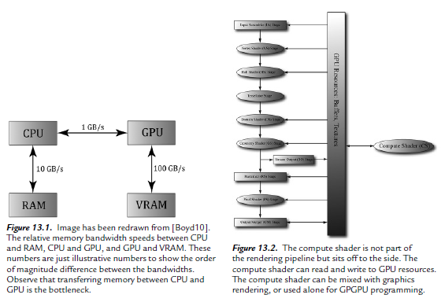
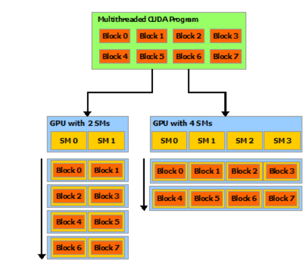

## Motivation

Unreal 또는 Unity 를 다루다 보면, 어떤거는 Vertex Shader / Pixel Shader / Geometry Shader 를 Pipeline Stage 를 태워서 사용해야하는지, 어떤거는 Graphics Pipeline 에 속하지 않은 GPGPU 를 아이디어를 사용한 Compute Shader 를 사용해야할지 모를수가 있다. 한참 Radar Simulation 을 구현하다가.. 한참 Pixel Shader 로 Unity 로 작성되어있길래 Unreal 에서도 Pixel Shader 로 하면 되겠구나...? 이러다가 1 개월이 지난 지금 엄청나게 후회하고 있고, 정확하게 Usage 도 모르게 사용했다 라는것에 현타가 오고, Compute Shader 에 대해서 정확하게 정리 된 글이 없어서 작성을 하기로 하였다. (개인적으로 Unity 는 뭔가 다 알아서 해주는 느낌인데, Unreal 은 뭔가 이거 아니면 안된다 라는 느낌이 강하다.)

## Prerequisites
* HLSL Code
* Multithread in C++

## Vertex, Pixel Shader, Hull Shader ... Compute Shader in Graphics Pipeline

아래의 그림처럼 Vertex/Pixel Shader, 다른 Shader 같은 경우는 GPU Resource 에 각 Pipeline Stage 를 거치면서 이루어진다. 하지만 Compute Shader 만 동떨어져서, 따로 붙어 있는걸 확인할수 있다. 뭔가 독립적인 분위기를 혼자만 풍기고 있다. (Very Suspecious)

Pixel Shader 안에서, 어떤 Pixel 을 접근 하기가 어렵다. 왜냐하면 Rasterization Stage 단계에서, 이미 Culling 을 통해서 어떤 물체가 있는지 없는지를 판단하고, NDC 를 통해서, Screen 공간으로 변환하고, 그 이후에 삼각형 (최소단위) Pixel 의 색깔을 결정을 한다. 그리고 Pixel Shader 에서는 결국에는 색깔을 딱 칠하게 해주기 때문이다. 이러한것들이 Pixel Shader 에 Input 으로 돌아온다고 생각하면 된다. 즉 Pixel Shader 에서는 각 픽셀 위치당 색깔을 칠하니까, 접근 하는 것 처럼 보이지만, 그 위치에 그림을 그린다고 해서 그 Pixel 을 건드릴수 있는건 아니다. 즉 픽셀별로 독릭적으로 실행되고, 다른 Pixel Data 에 접근이 불가능하다. 

그렇다면, 이러한걸 가능케 하는것들은 뭘까? 바로 Compute Shader 이다. Compute Shader 자체 단어만 봐도 뭔가를 비쥬얼하게 만들어주는게 아니라, 진짜 "계산"에 집중을 하는것이다. GPU 의 구조상으로, 수백개의 Core 들이 있고, 그만큼 Process 도 붙어있을거고, 그 Core 아래에 Thread 가 있을것이다. 즉 병렬로 처리하기 위한 Programming GPGPU 의 Premise 에 놓여있다. 그래서 이미지 처리, 물리 시뮬레이션, 병렬 계산 작업(Matrix Multiplication) 등이 될것 같다.



여기서 특이한점 딱 하나가 있다. 저 모든 Stage 에서 할것들을 Compute Shader 에서 할수 있느냐? 를 물어본다면 가능할수도 있고, 불가능할수도 있다. 그 말은 즉슨, Texture2D 의 정보를 만약 받았을때, 읽고 쓸수 있다는거고, 읽고 쓸수 있다는건, 뭔가 Input / Output 으로 쓸수 있다는 것이다.

그러면 대체적으로 개념을 알아봤으면, 실제 코드로 확인을 해보자. 기본적으로 Resource 의 Description 을 BackBuffer 와 같게 한다. 그리고 `CreateUnorderedAccessView()` 를 통해서 RenderTargetView 처럼 내가 그릴 대상을 정한다. 그리고 Shader 를 만드는건 Vertex/PixelShader 를 만드는것과 동일하고, Compile 해서, ComPtr 에다가 넣어주는것 동일하다. 병렬로 처리를 해야하니, WaitSync() 처럼 어떤 Task 가 먼저 끝날지 모르니 CPU 에서는 기다리게끔 해야한다.

```c++
// CPU Resource Creation
ComPtr<ID3D11Texture2D> backBuffer;
m_swapChain->GetBuffer(0, IID_PPV_ARGS(backBuffer.GetAddressOf()));

D3D11_TEXTURE2D_DESC desc;
backBuffer->GetDesc(&desc);

D3D11_UNORDERED_ACCESS_VIEW_DESC uavDesc;
uavDesc.Format = desc.Format;
uavDesc.ViewDimension = D3D11_UAV_DIMENSION_TEXTURE2D;
uavDesc.Texture2D.MipSlice = 0;
HRESULT hr = m_device->CreateUnorderdAccessView(backBuffer.Get(), &uavDesc, m_backUAV.GetAddressOf());

// Create Compute Shader
ComPtr<ID3DBlob> shaderBlob;
ComPtr<ID3DBlob> errorBlob;

UINT compileFlags = 0;
#if defined(DEBUG) || defined(_DEBUG)
compileFlags = D3DCOMPILE_DEBUG | D3DCOMPILE_SKIP_OPTIMIZATION;
#endif

HRESULT hr = D3DCompileFromFile(
    filename.c_str(), 0, D3D_COMPILE_STANDARD_FILE_INCLUDE, "main",
    "cs_5_0", compileFlags, 0, &shaderBlob, &errorBlob);

device->CreateComputeShader(shaderBlob->GetBufferPointer(),
                            shaderBlob->GetBufferSize(), NULL,
                            &m_computeShader);
                            
// Member Variable
ComPtr<ID3D11ComputeShader> m_computeShader;

// Render()
// SetPipelineStage
m_context->VSSetShader(NULL, 0, 0);
m_context->PSSetShader(NULL, 0, 0);
m_context->HSSetShader(NULL, 0, 0);
m_context->DSSetShader(NULL, 0, 0);
m_context->GSSetShader(NULL, 0, 0);
m_context->CSSetShader(m_computeShader.Get(), 0, 0);
m_context->CSSetUnorderedAccessViews(0, 1, m_backUAV.GetAddressOf(), NULL);
m_context->Dispatch(UINT(ceil(m_screenWidth / 256.0f)), m_screenHeight, 1);

ComputeShaderBarrier();
```

자 위에서 `UnorderedAccessView` 는 Input / Output 도 된다.. 이건 Shader 의 코드를 봐야한다. 그리고 Dispatch 라는것이 있다. 결국 이게 Pixel Shader 에 호출이되는 DrawIndexed 이다. 위에서 Dispatch 할때, Parameters 는 ThreadGroupX, Y, Z 이다. screenWidth = 1280 / 256 라고 하면, 5 의 Thread Group 이 X width 로 생긴다는 것이다. 아래의 코드를 보면, RWTexture2D 를 보면 이게 아까 보았던 UnorderedAccessView 와 Binding 된다고 보면된다. Semantics 은 u 에 slot 0 번에 등록이 되었다고 볼수 있다. 

```c++
RWTexture2D<float4> gOutput : register(u0)

[numthreads(256, 1, 1)] // Thread group 안에서 1 개의 Thread Group 안에서, thread 의 개수 
void main(int3 gID: SV_GroupID, uint3 : SV_DispatchThreadID)
```

SV_GroupID 는 ThreadGroup, 즉 Dispatch 했을때의 인자값이다. 그리고 SV_DispatchThreadID 같은 경우에는 실제 ThreadID 이다. 결국 Group 하나에 256, 1, 1 의 Thread 가 있다고 생각을 하면. 전체 Thread 의 개수는 256 * 5 * 1 * m_screenHeight * 1 * 1 이렇게 되어있고, 두번째 Group 에 있는 (2,1,0), 그리고 numthread가 (256, 1, 1) 이라고, 전체에서, 해당 Index sms (2,1,0) * (256*1*1) + offset 이라고 생각할수 있다. (즉 Pixel 의 위치이다.) Dispatch Group 이 즉 index 를 했을시에 DispatchThreadID 로 저 많은 양의 Thread 를 Indexing 을 한다고 보면된다. 


## Warp 개념

아래의 그림을 CPU 랑 비교했을때의 GPU 의 Processing 의 역활이다. GPU 는 CPU 와는 달리, 각각의 여러개의 Core 들이 Control 하나와 L1 Cache 가 붙어있다. 즉 Control 이라는 관리자에서 "야 우리팀은 이 일만 공장처럼 찍어낼꺼야" 라는 뜻이 내포되어있다고 생각하면 된다. 즉, 단순 작업의 양이 많을때, Block(Group) 단위로 관리를 하며, Processing 을 한다고 생각하면된다.


](../../../assets/img/photo/10-12-2024/gpu.png)

일단 GPU 의 구조상으로는 [CUDA](https://nyu-cds.github.io/python-gpu/02-cuda/) SIMT(Single Instruction, Multiple Thread) 를 가지고 있다. 그리고 `a scalable array of multithreaded Streaming Multiprocessors (SMs)` 이런말이 있는데 결국에는 thread 가 여러개인 array 인 형태를 띄고 있으며, Streaming 방식으로 쭉쭉 Processing 이 이뤄진다라는걸 볼수 있다. 그리고 Core 개수가 여러개로 나눠져있으니, 이것들의 Core 들을 Scheduling 을 해주며, 관리해서 Multiprocessor 이런식으로 표현한것 같다.

본질적으로 **Warp** 라는 개념은 `Group of 32 parallel threads` 이다. 즉 Hardware 의 하나의 묶음, 동시에 일을 하는 묶음 이라고 생각하면 될것 같다. 그리고 `A warp executes one commmon instruction at a time, so full efficiency is realized when all 32 threads of a warp agree on their execution path` 라고 문서에 나와있는데, 이 말은 즉슨 Warp 라는 하나의 Group, 32 개의 동시에 일하는 thread 가 execution path 가 동일하다이며, 최대한의 효율적으로 하기 위해서 32 개를 사용한다. 우리가 위에서 봤을때 처럼, `dispatch` 할때, Group 개수와, 그 한 그룹에 Thread 개수를 지정을 해서 사용하며 어떠한 Block 형태로 실행을 시켰었다. 마찬가지로, SMs 의 개수에 따라서 Block 이 어떻게 Parallel 하게 Processing 하는지를 아래의 그림으로 확인을 할 수 있다.



GPGPU Programming 에서 기본적으로 Grid 의 형태를 아래의 그림처럼 띄고 있다 즉 여러개의 Thread Block(Group) Grid 형태로 띄고 있다는걸 할수 있다. 기본적으로 Processor 은 일을 따로 따로 하기 때문에 Processor 라고 칭하는데, Processor 와 다른 Processor 끼리는 명령을 내릴수 없고 Memory 도 Share 하기가 어렵다. 하지만 Block 안에서 Thread 끼리는 동기화를 할수 있으며, 메모리를 공유한다. **즉 Thread 끼리는 의사 소통을 할수 있다.**
일단 여기까지 개념이야기를 맞추며, 그다음으로 부터는 실제 구현을 알아보겠다. 

](../../../assets/img/photo/10-12-2024/grid.png)

### Gaussian Blur (Separable)

- 다시말하자면, Compute Shader 안에서는 Unordered Acess View 를 사용한다는 점, 그리고 RWStructureBuffer 사용한거
- PSO 가 있다 (GraphicsPSO)
- `UnorderedAccessView` 는 Input(입력) 도 되고 Output(출력)도 된다.

- **** `Dispatch` ****: Argument 로 `ThreadGroupCountX`, `ThreadGroupCountY`, `ThreadGroupCountZ` 로 나누어져 있음. (ex: 만약 Argument 로 `UINT(ceil(screenWidth / 256)), screenHeight, 1)`. 이런식으로 되어있고, `ScreenWidth` 가 1280 이라고 한다면, 5 개를 세로로 나눠서 계산 하고 `ScreenHeight` 로는 전부 계산하고, 마지막 인자 1 은 2 차원 배열이기 때문에, z 값이 1이다는 소리이다, 즉 가로 방향으로는 5 개를 Group 을 나눠서 계산하고, 세로 방향으로는 전체 height 만큼 계산한다는 이야기이다.) 


```


// hlsl
RWTexture2D<float4> gOutput : register(u0) // Readable & Writable Texture 2D, pixel format => float4

[numthreads(256, 1, 1)] // Thread group 안에서 1 개의 Thread Group 안에서, thread 의 개수 
void main(int3 gID: SV_GroupID, uint3 : SV_DispatchThreadID) // SV_DispatchThreadID -> Thread ID 여기서는 Pixel 의 Index | SV_GroupID => ThreadGroup ID.
{

}
```

### GPU 시간 계산

### Structured Buffer

### Consume / Append Buffers

### Density Field

### Indirect Arguments
- 최적화할떄는 필요하다. DrawInstanced Method vs Draw 와 비교

- 하나당 Vertex 가 몇개다
- Instance 가 몇개다
- Offset (StartVertexLocation, StartInstanceLocation),

미리 GPU 에다가 할당, 다시 CPU 에서 간접적으로 알려주는 Pointer 역활정도

```c++
struct IndirectArgs
{
    UINT VertexCountPerInstance;
    UINT InstanceCount;
    UINT StartVertexLocation;
    UINT StartInstanceLocation;
}
...
vector<IndirectArgs> m_argsCPU = {{32, 1, 0, 0}, {64, 1, 0, 0}, {256, 1, 0, 0}}; // 32 개의 Vertex 가 1 개의 Instance 안에 정해져 있음
ComPtr<ID3D11Buffer> m_argsGPU;
...

 D3D11Utils::CreateIndirectArgsBuffer(m_device, UINT(m_argsCPU.size()),
                                      sizeof(IndirectArgs), m_argsCPU.data(),
                                      m_argsGPU);

const UINT offset = sizeof(IndirectArgs) * 0;
m_context->DrawInstancedIndirect(m_argsGPU.Get(), offset)
```

### Bitonic Sort