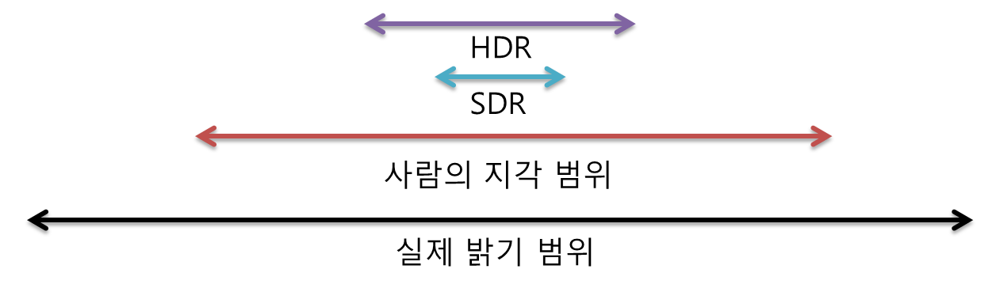
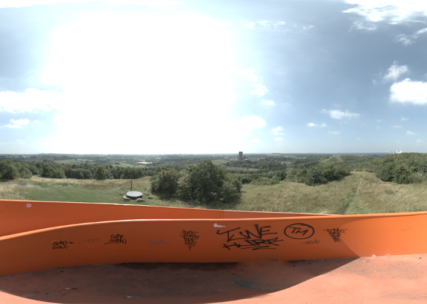

## DirectX11 - HDRI Images
일단 Imaging 이라는 의미에서 보면, High Dynamic Range 라는 말이 빛의 강도(level) 에 따라서, Scene 이 얼마나 변경되느냐? 라는 말이다. Wiki 에서도 "The dynamic range refers to the range of luminosity between the brightest area and the darkest area of that scene or image" 라고 한다. 

실제 세상의 광도(Luminance) 범위는 넓다. 하지만 Digital Image 로서는 (JPEG, PNG, LDR) 같은 경우는 RGB 각 채널당 8 Bit 이고, 256 단계를 거치면서, 0 ~ 1 사이의 상대적인 밝기 값만 표현한다. 하지만 현실의 밝기는 그것보다 더넓으며, 표현하는데있어서 한계가 있기 때문에 HDR Imaging 이 나왔다.

그래서 비교를 하자면 

| 특징         | LDR(SDR) | HDR |
|--------------|-------------------------------------|-------------------------------------------|
| 비트 깊이     | 8-bit per channel (24-bit RGB)   | 16-bit float / 32-bit float per channel|
| 표현 범위     | 0 ~ 1 (상대 밝기)                  | 0 ~ 수천 (절대/상대 광도)                  |
| Format 예시  | PNG, JPEG                        | OpenEXR, HDR (.hdr), FP16 textures     |

이러한식으로 표현이 된다. 그래서 Graphics 에서는 어떻게 사용되고, Environment Mapping 할때 어떻게 설정이 되는지를 알아보는게 오늘 이 Post 의 목표이다.

그리고 아래의 그림이 조금더 자세하게 나타내준다. 



---
기존 Enviornment Mapping 을 했을시에는 LDR 이나 SDR 에서 하나 Pixel 에 대한 색깔을 표현할때에, `R8G8B8A8_UNORM` 기본 적으로 32 bits(8 x 4) 를 사용했고, 0 - 255 까지의 unsigned integer 의 값을 사용했으며, 그 범위를 Normalize 해서 사용했었다. 그리고 기존에 문제라고 하면 문제가, 환경의 Light 들이 많아서, Pixel Shader 에서 값을 처리 Color 값을 Return 할때 1 보다 큰값들을 처리를 못했었다. 즉 내부적으로는 output.pixelColor = saturate(..., 0.0, 1.0) 이런식으로 처리가 된다고 보면 됬었다.

하지만 HDR (High Dynamic Range Rendering): HDRR 또는 High Dynamic Range Lighting 은 HDR 에서 Lighting 을 계산하는것이며, 더 넓은 범위에 대한 조명에 대해서 Rendering 을 할수 있다는 말... 넓은 범위라는건, 사용하는 숫자의 대한 범위가 넓고, `DXGI_FORMAT_R16G16B16_FLOAT` 이 포맷을 사용한다.

그래서 CPU 쪽에서 SwapChaing 을 생성할때, BufferDesc Format 옵션을 아래와 같이 설정을 해줘야한다.

```c++
DXGI_SWAP_CHAIN_DESC sd;
ZeroMemory(&sd, sizeof(sd));
sd.BufferDesc.Width = m_screenWidth;   // set the back buffer width
sd.BufferDesc.Height = m_screenHeight; // set the back buffer height
sd.BufferDesc.Format = DXGI_FORMAT_R16G16B16A16_FLOAT; // floats
sd.BufferCount = 2;                                // Double-buffering
sd.BufferDesc.RefreshRate.Numerator = 60;
sd.BufferDesc.RefreshRate.Denominator = 1;
```

이말은 BackBuffer 를 사용해서, Postprocessing 하는 Buffer Format 들은 전부다 Format 을 변경해줘야한다. (`context->ResolveSubresource` 하는곳)

### HDRI Image Copy (참고)
float 은 기본적으로 32 bits wide 인데, 최근 들어서는 16 bit 로도 충분하기 때문에 Half precision floating point 도 있다. GPU 는 최종적으로 half precision floating point 에 최적화가 잘되어있다고 한다. 그래서 대부분은 아래와 같은 방식으로 f16 library 를 사용하면 된다

```c++
vector<float> f32(image.size() / 2);
uint16_t *f16 = (uint16_t *)image.data();
for(int i =0 ; i < image.size() / 2; i++){
    f32[i] = fp16_ieee_to_fp32_value(f16[i]);
}

f16 = (uint16_t *)image.data();
for (int i = 0; i < image.size(); i++)
{
    f16[i] = fp16_ieee_from_fp32_value(f32[i] * 2.0f);
}
```

### Tone Mappings
Tone Mapping 은 Color Mapping 의 한 종류의 Technique 이라고 한다. 일단 Tone Mapping 을 하는 이유가 있다. 사실 HDRI 의 이미지는 요즘 HDR Camera 에서도 충분히 나온다. 하지만 우리가 사용하는 모니터 / 디스플레이 같은 경우 (0~1 또는 0 ~255(8bits)) 로 제한된 밝기를 표현한다. 아까 이야기 한것처럼 우리가 보는 세계는 넓은 밝기 정보를 가지고 있는데, 이걸 디스플레이에다가 다시 뿌리게 하려면, SDR(Standard Dynamic Range) 로 변환을 해줘야하는데, 현실세계의 밝기 정보를 디스플레이가 표현할수 있는 범위로 압축을 하면서도, 보기 좋은 Image 로 보정/변환 하는 작업을 Tone Mapping 이라고 한다.

Tone Mapping 이 안됬을 경우에는 어떤 Side Effect 가 있을까? 라고 물어본다면, 아래와 같이, 밝은 영역이 모두 하얗게 뭉게지거나, 너무 어두운영역도 뭉개지게 된다. 즉 숨어있는 이 Pixel 값을 잘 보정시켜서 조금 더 부드러운 Image 를 만들고, 그리고 이걸 잘? Rendering 하는게 관점이다.



Tone Mapping 도 아래와같이 여러개의 Operator 들이 있다.


### Exposure
Exposure: 카메라의 어떤 현상, 렌즈를 오래 열어 놓으면, 빛을 더 많이 받아들이는 현상이다. 예를 들어서 예제 JPG 이미지 같은 경우 (즉 SDR) 일때는 Exposure 를 키우게 되면, 그냥 화면 자체가 밝아진다. 하지만 HDRI 같은 경우, 전체 Pixel 이 선명?해지는것과 밝아지는거의 차이가 있다. 그래서 Exposure 을 낮춘다고 했을때 

아래의 그림처럼 진짜 태양 찾기가 가능해진다.


### Gamma Correction
Gamma Correction : 어떤 영역에 색을 더 넓게 보여줄지를 의미한다. 옛날 모니터 같은 경우는 cathode-ray tube monitor 라고 하고, Input Voltage 를 두배로 컴퓨터에 줬을때, 2배로 Output 이 전혀 나오지 않았다. 즉 선형보다는 비선형으로 Gamma 지수에 따라서 비선형적으로 출력을 했고, 입력신호의 2.2 제곱에 해당하는 밝기를 출력 했다.


그래서 즉 모니터의 Gamma 가 2.2 fkrh gksekrh gkaus, Image 를 Display 하기전에 Pixel 값을 Input^1/2.2 저장하거나 변환을 해줘서 Linear Tonemapping 을 만들수 있다. 그리고 이 Gamma 값을 조정할수 있는게 Gamma Correction 이라고 말을 할수 있겠다. 

## HDRI Pipeline

결국 PBR 에 가까워지려면, 환경맵이 필요하고, 그 환경맵을 HDRI (High Dynamic Range Image) 를 이용할 수 있다.

## Resource
* [High Dynamic Range Rendering](https://en.wikipedia.org/wiki/High-dynamic-range_rendering)
* [HDR Image Reconstruction and Tone Mapping](https://zhangboyu.github.io/)
* [Gamma Correction](https://learnopengl.com/Advanced-Lighting/Gamma-Correction)