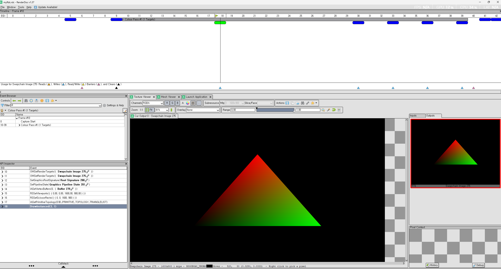
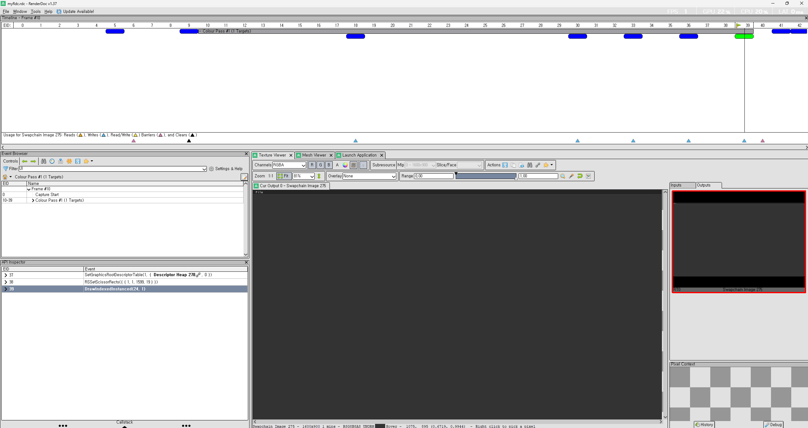
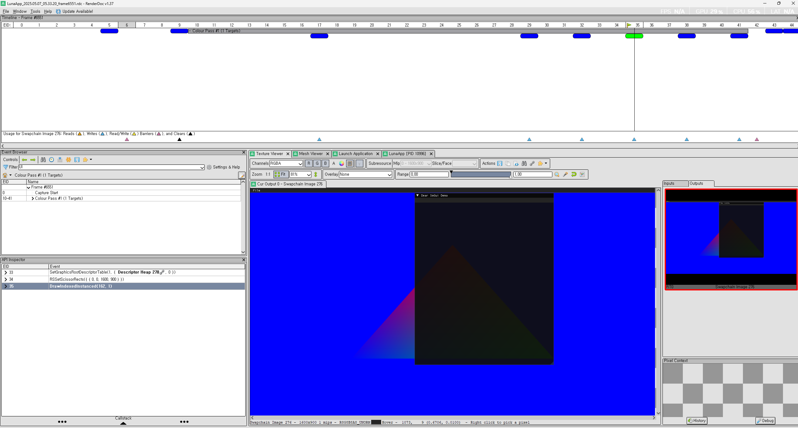

---
title: Game Engine Project - Luna Engine
layout: post
category: study
tags: [vulkan, computer graphics, shader, directX12]
published: true
--- 

## Luna Game Engine Dev History

사실상 Game Engine 을 만들고 싶은건 아니다. Game Engine 을 사용한 어떠한 Product 를 만들고 싶었고, 그 Platform 이 Unreal Engine 이 됬든, Unity 가 됬든 사용하면 된다. 하지만 이미 상용화? 된 엔진들의 확실한 장점은 있지만, 그렇다고 해도, 너무 많은 방대한 정보를 이해하기에는 쉽지 않다. 예를 들어서, DirectX11 에서는 확실히 Low Level API 라고 하지만, 거의 High Level API 이다. 특히나 드라이버(인력사무소)가 거의 많은 작업들을 처리 해주었다. 그에 반대 되서, DirectX12 는 대부분의 작업을 따로 처리해줘야한다 (RootSignature, PipelineState, etc) 그리고 병렬 지원에 대해서도 충분히 이야기할수 있다. CommandList 를 병렬 처리가 가능하다고 한다. (이부분은 실제로 해보진 않았다.)

특히나, Commit 을 하기전에 Stream 방식인지, CommandList 에 일할것과, 일의 양을 명시해서 CommandQueue 에다가 넣어준다. 그리고 `OMSetRenderTargets`, `IASetVertexBuffers` 등으로 DX11 에서는 알아서 자동 상태 전이가 되지만, DX12 에서는 `D3D12_RESOURCE_BARRIER` 를 통해서 상태를 명시적으로 지정해주어야 할 필요가 있다. 이것 말고 등등 오늘은 DX12 의 어려움 또는 DX11 와 비교를 말을 할려는 목적은 아니다. 오늘은 나의 개발 로그를 공유하려고한다. 

## Motivation

예전부터 내가 직접 만들어보고 싶고, 표현해보고 싶었던게 있었고, 그걸 표현하기위해서, Game Engine 관련되서 Youtube 를 찾아보게 되다가 우연치 않게, [Cherno](https://www.youtube.com/@TheCherno) 라는 Youtuber 를 보았다. 이 분은 EA 에서 일을 하다가 이제는 직접적으로 [Game Engine Hazel](https://hazelengine.com/) 을 만들고 있다. 꼭 그리고 다른 Contents 도 상대적으로 퀄리티가 있다. 그리고 [Walnut](https://github.com/StudioCherno/Walnut) 에 보면 아주 좋은 Vulkan 과 Imgui 를 묶어놓은 Template Engine 이 있다. 꼭 추천한다. 그리고 개발하면서 다른 Resource 도 올려놓겠다.

## Abstraction Layer

일단 나는 Multiplatform 을 Target 으로 Desktop Application 으로 정했다. 즉 Rendering 부분을 DX12 Backend 와 Vulkan Backend 로 나누어서, 추상화 단계를 거쳤다.

지금의 Project 의 구조를 설명하겠다. (전체적으로 HAL=Hardware Abstraction Layer 를 구상중)이며, 게임 엔진 내부에서 Platform 에 구애 받지 않게 설계 기준을 잡았다. 물론 추상화 계층은 삼각형 그리기 기준으로 일단 추상화를 작업을 진행하였다. 전체적으로 Resource 는 한번 추상화 작업을하고, IRenderBackend 로 부터 DirectX12 으로 할건지, Vulkan 으로 할건지 정의 하였다. 아직 작업할 일은 많지만, 한번에 하지 않으려고 진행중이다.

```bash
LunaEngine
    |   EntryPoint.cpp
    |   EntryPoint.h
    |   Layer.h
    |   LunaPCH.cpp
    |   LunaPCH.h
    |
    +---Application
    |       Application.cpp
    |       Application.h
    |       ApplicationSpecification.h
    |
    +---Graphics
    |       IBuffer.h
    |       IPipeline.h
    |       IShader.cpp
    |       IShader.h
    |       Texture.h
    |
    +---ImGui
    |       ImGuiBuild.cpp
    |       Roboto-Regular.embed
    |
    +---Input
    |       Input.cpp
    |       Input.h
    |       KeyCodes.h
    |
    +---Renderer
    |   |   IRenderBackend.h
    |   |   IRenderCommand.h
    |   |   IRenderContext.cpp
    |   |   IRenderContext.h
    |   |   RenderQueue.cpp
    |   |   RenderQueue.h
    |   |
    |   +---DX12
    |   |   +---private
    |   |   |       BindPipelineCommand.cpp
    |   |   |       DrawCommands.cpp
    |   |   |       DX12Backend.cpp
    |   |   |       DX12Buffer.cpp
    |   |   |       DX12Pipeline.cpp
    |   |   |       DX12Shader.cpp
    |   |   |
    |   |   \---public
    |   |           BindPipelineCommand.h
    |   |           DrawCommands.h
    |   |           DX12Backend.h
    |   |           DX12Buffer.h
    |   |           DX12Pipeline.h
    |   |           DX12Shader.h
    |   |
    |   \---Vulkan
    |           VulkanBackend.cpp
    |           VulkanBackend.h
```

## Issue
1. 첫번째로, ImGUI 를 같이 사용하려면, ImGUI 용 descriptor heap 을 따로 만들어줘야한다. [Example-DX12 Hook](https://github.com/ocornut/imgui/blob/master/examples/example_win32_directx12/main.cpp) 여기에 보면, 아래 처럼 descriptor 를 만드는걸 확인 할수 있다. 그리고 내 DX12Backend 쪽에서도 이러한 방식으로 진행하고 있다. 

```c++
{
    D3D12_DESCRIPTOR_HEAP_DESC desc = {};
    desc.Type = D3D12_DESCRIPTOR_HEAP_TYPE_CBV_SRV_UAV;
    desc.NumDescriptors = APP_SRV_HEAP_SIZE;
    desc.Flags = D3D12_DESCRIPTOR_HEAP_FLAG_SHADER_VISIBLE;
    if (g_pd3dDevice->CreateDescriptorHeap(&desc, IID_PPV_ARGS(&g_pd3dSrvDescHeap)) != S_OK)
        return false;
    g_pd3dSrvDescHeapAlloc.Create(g_pd3dDevice, g_pd3dSrvDescHeap);
}
```

현재 Pass 같은 경우, Unreal / Unity 와 같이, 마지막에 UI 를 그리는 방식으로 해서, Application Layer 에서 이러한 방식으로 호출 하고 있다.

```c++
void Application::Run()
{
    _running = true;
    while (ShouldContiueRunning())
    {
        glfwPollEvents();
        float time = GetTime();
        _frameTime = time - _lastFrameTime;
        _lastFrameTime = time;

        IRenderContext::BeginFrame();
        IRenderContext::StartImGuiFrame();

        if (ImGui::BeginMainMenuBar())
        {
            if (_menubarCallBack)
                _menubarCallBack();
            ImGui::EndMainMenuBar();
        }
        
        ImGui::DockSpaceOverViewport(ImGui::GetMainViewport(),ImGuiDockNodeFlags_PassthruCentralNode);
        
        for (auto &layer : _layerStack)
            layer->OnUpdate(_frameTime);
        for (auto &layer : _layerStack)
            layer->OnUIRender();
        IRenderContext::DrawFrame();
        IRenderContext::RenderImGui();
        IRenderContext::EndFrame();
    }

    Shutdown();
}
```

삼각형을 그리기만하는데, 삼각형이 그려지질 않는다. 그래서 이걸 RenderDoc 으로 체크를 해보겠다. 



삼각형은 완벽하게 그려지고 있다. 하지만 그 다음 Pass 에 보면 없어진다.



이거에 대해서 찾아보다가, RenderTarget 에 둘다 그릴려구 해서 그렇고, 마지막에 Update 하는 부분이 ImGUI 에서 Docking 또는 Viewports Enable 을 했을시에 문제가 있다고 한다. 이럴떄, 기본적으로, ImGUI 에서는 GPU Rendering 상으로 기능을 독릭접인 자원을 활용하기 위해서 따로 만든다고 말을 하였다. 기본적으로 Viewports 를 Enable 했을시에, 새로운 Viewport 의 배경색은 Gray 색깔이라고 한다. 그래서 마지막에 Rendering 을 했을시에, Gray 로 덮어버린다. 즉 ImGUI 는 Texture 기반의 UI 요소를 그린다. (즉, ImGUI 의 내부 관리가 아닌 OS 창으로 Rendering 이 된다.)

```c++
ImGuiIO &io = ImGui::GetIO();
io.ConfigFlags |= ImGuiConfigFlags_DockingEnable;
io.ConfigFlags |= ImGuiConfigFlags_ViewportsEnable;
```

이걸 해결하기위해선, 두가지 방법이 있다. 
1. ImGUI transparent Style
```c++
ImGuiStyle& style = ImGui::GetStyle();
style.Colors[ImGuiCol_WindowBg].w = 0.0f; // Fully transparent window background
style.Colors[ImGuiCol_DockingEmptyBg].w = 0.0f; // Transparent dockspace background
style.Colors[ImGuiCol_ChildBg].w = 0.0f; // Transparent child window background
```

2. ImGUI Docking Clear
```c++
ImGui::PushStyleColor(ImGuiCol_DockingEmptyBg, ImVec4(0.0f, 0.0f, 0.0f, 0.0f));
ImGui::DockSpaceOverViewport(ImGui::GetMainViewport(), ImGuiDockNodeFlags_PassthruCentralNode);
ImGui::PopStyleColor();
```

둘다 방법론은 같다. 그래서 아래와 같이 결과가 나왔다. 결국에는 해야하는 일은 하나의 RenderTarget 에 병합? (Aggregation) 이 맞는것 같다. 그리고 중요한건 RenderTarget 이 정확하게 ImGUI 와 삼각형 그리는게 맞는지 확인이 필요하다. 아래는 Aggregation 한 결과 이다. 




## Dependencies
모든 Dependency 는 PCH 에서 참조하고 있다. 참고로 vcpkg 는 premake 에서 아직 disable 하는걸 찾지 못했다. src/vendor 안에 모든 dependency 가 있다.

### Rendering API Related 
* d3d12ma -> Direct3D Memory Allocation Library
* dxheaders -> DirectX related headers
* dxc -> HLSL compiler
* volk -> Vulkan Loader
* vulkan -> you need to download sdk from vulkan webpage

### Math:
* DirectXMath: optimized directX math
* glm: OpenGL Math Library for Vulkan

### UI / Window Manage
* imgui(immediate mode gui)
* glfw (window / input manager)

### Image related
* stb_image: image loading library.

### Resource
* [Online Virtual World Tutorials](https://www.rastertek.com/tutovw.html)
* [DirectX / OpenGL Tutorial](https://www.rastertek.com/tutindex.html)
* [Ray Tracing in One Weekend](https://raytracing.github.io/books/RayTracingInOneWeekend.htmls)
* [Cherno](https://www.youtube.com/@TheCherno)