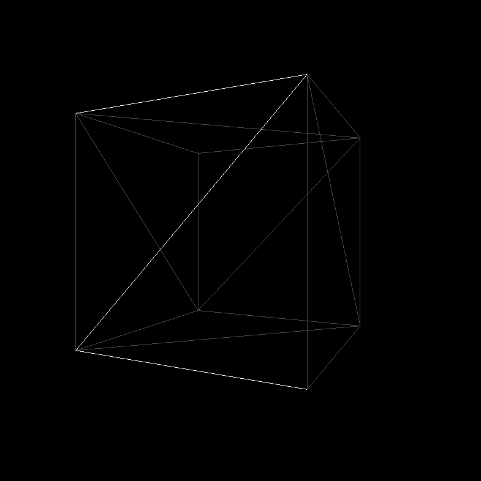

### DirectX11 - Drawing Wire Frame

가끔 우리는 어떤 Mesh를 사용하고 있는지, 그리고 그 Mesh가 얼마나 많은 삼각형으로 이루어져 있는지를 파악해야 할 필요가 있다.. 이는 성능 최적화나 실시간 렌더링 가능 여부를 평가할 때 중요하고 특히, 고해상도 Terrain이나 복잡한 조각상 같은 모델이 있는 경우 (물론 다른 stage 에서..), 런타임에서 모델을 사용할 수 있는지 판단하는 데 중요한 기준이 됩니다.

예를 들어, Unreal Engine의 Nanite System은 매우 많은 Vertex를 활용하여 고도로 디테일한 모델을 실시간으로 렌더링할 수 있다.. 이는 LOD(레벨 오브 디테일)를 효율적으로 관리하여 성능 저하 없이도 높은 품질의 그래픽을 제공할 수 있게 해줍니다. 그렇다면, 실제로 삼각형 개수를 확인하려면 어떻게 해야 할까요? 정답은 Rendering Pipeline의 상태를 확인하는 것입니다. 특히, Rasterizer 단계에서 어떻게 삼각형을 그릴 것인지 결정하는 RasterizerState를 통해 설정할 수 있다. 그리고 나중에 Rasterizer State 들을 만들어주면 된다.

```c++
// Render 
ComPtr<ID3D11RasterizerState> _rasterizerState;
m_context->RSSetStet(_rasterizerState);

// INIT()
D3D11_RASTERIZER_DESC rastDesc;
ZeroMemory(&rastDesc, sizeof(D3D11_RASTERIZER_DESC)); 
m_OnWireFrame ? rastDesc.FillMode = D3D11_FILL_MODE::D3D11_FILL_WIREFRAME : rastDesc.FillMode = D3D11_FILL_MODE::D3D11_FILL_SOLID;
rastDesc.CullMode = D3D11_CULL_MODE::D3D11_CULL_NONE;
rastDesc.FrontCounterClockwise = false;
rastDesc.DepthClipEnable = true; 
m_device->CreateRasterizerState(&rastDesc,
                                 m_solidRasterizerSate.GetAddressOf());
 
m_device->CreateRasterizerState(&rastDesc,
                                 m_wireRasterizerSate.GetAddressOf());
```

물론 더나아가서 고품질의 그림을 그릴수도 있지만, 일단 WireFrame 을 그리는거까지 해보는것이 중요한것 같다. 결과는 아래와 같다.

