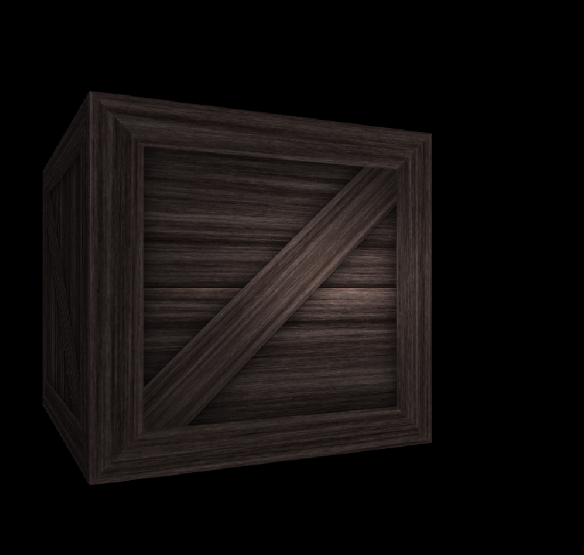

### DirectX11 - Lighting in HLSL

결국에는 우리가 직접 Lighting 을 CPU 에서 계산하는게 아닌 GPU 에서 계산하도록 해야한다, 그럴려면 Shader Programming 으로 할수 있는 방법들을 찾아야한다. 

일단 기본적인 어떤 Lighting 을 계산하기 위해서는 물체의 Normal 값이 필요하기 때문에, ModelViewProjection 이라는 Constant Buffer 에다가 InverseTransform 을 넣어줘야한다. 여기서 잠깐! 왜 Model 그대로 Normal 을 구하지 않는지를 물어볼수 있다. 그건 바로 Model 의 Scaling 이 변한다고 했을때, Normal 의 길이(크기)가 달라지기 때문에, Inverse Transpose Model Matrix 를 넣어줘야한다. 처음에는 위치값을 제거하고 (Translation), 그리고 .Invert().Transpose() 를 해주면, World Normal 값을 Shader 에서 구할수 있다.

자 일단 ConstantBuffer 를 Update 해주는 곳은 Render() 에서 매 Frame 별로 Update 를 해준다. 그러기때문에 아래의 방식처럼 CPU 에서 GPU 로 Data 넘길것들을 정의 해준다. 물론 이야기는 따로 하진 않겠지만, Model -> View -> Projection 으로 행렬을 곱하는데, 월드 좌표계에서의 Camera 의 위치를 구하기 위해서, `m_pixelConstantBufferData.eyeWorld = Vector3::Transform(Vector3(0.0f), m_vertexConstantBufferData.view.Invert());` 이부분이 들어간거다.

```c++
struct Vertex {
    Vector3 position;
    Vector3 normal;
    Vector2 texcoord;
};

struct VertexConstantBuffer {
    Matrix model;
    Matrix invTranspose;
    Matrix view;
    Matrix projection;
};

// Render() -> Constant Buffer Update
m_vertexConstantBufferData.model =
    Matrix::CreateScale(m_modelScaling) *
    Matrix::CreateRotationX(m_modelRotation.x) *
    Matrix::CreateRotationY(m_modelRotation.y) *
    Matrix::CreateRotationZ(m_modelRotation.z) *
    Matrix::CreateTranslation(m_modelTranslation);

m_vertexConstantBufferData.model =
        m_vertexConstantBufferData.model.Transpose();

m_vertexConstantBufferData.invTranspose = m_vertexConstantBufferData.model.;
m_vertexConstantBufferData.invTranspose.Translation(Vecctor3(0.0f)); // get rid of translation
m_vertexConstantBufferData.invTranspose = m_vertexConstantBufferData.invTranspose.Transpose().Invert()

m_vertexConstantBufferData.view = Matrix::CreateRotationY(m_viewRot) * Matrix::CreateTranslation(0.0f, 0.0f, 2.0f);

m_pixelConstantBufferData.eyeWorld = Vector3::Transform(
    Vector3(0.0f), m_vertexConstantBufferData.view.Invert());
m_vertexConstantBufferData.view =
    m_vertexConstantBufferData.view.Transpose();

```

이렇게 필요한 Data 가 주어졌을떄, Lighting 기반 Bling Phong with Lambert equation 을 사용해서 Shader Programming 을 해야한다. 일단 CPU 쪽의 Data 를 정의 한다. 카메라의 위치와 어떤 Light 인지를 담는, Constant Buffer 를 사용하자. Lights 의 종류는 3 가지 (Directional Light, Point Light, Spotlight) 이렇게 나누어진다.

```c++
#define MAX_LIGHTS 3
struct PixelConstantBuffer {
    Vector3 eyeWorld; 
    bool dummmy;
    Material material;
    Light lights[MAX_LIGHTS];
}

struct Light {
    Vector3 strength = Vector3(1.0f);             
    float fallOffStart = 0.0f;                     
    Vector3 direction = Vector3(0.0f, 0.0f, 1.0f); 
    float fallOffEnd = 10.0f;                    
    Vector3 position = Vector3(0.0f, 0.0f, -2.0f); 
    float spotPower = 1.0f;                        
};

struct Material {
    Vector3 ambient = Vector3(0.1f);  
    float shininess = 1.0f;           
    Vector3 diffuse = Vector3(0.5f);  
    float dummy1;                     
    Vector3 specular = Vector3(0.5f); 
    float dummy2;                     
};

class Renderer()
public:
    ComPtr<ID3D11Buffer> m_pixelShaderConstantBuffer;
    ComPtr<ID3D11Texture2D> m_texture;
    ComPtr<ID3D11ShaderResourceView> m_textureResourceView;
    PixelConstantBuffer m_pixelConstantBufferData;
    float m_materialDiffuse = 1.0f;
    float m_materialSpecular = 1.0f;
```

그리고 Render() 하는 부분에서, ConstantBuffer 값을 Update 를 한다. 빛의 종류에 따른 Update. Directional Light = 0, Point Light = 1, Spot Light = 2. 이렇게 되어있으며, 내가 필요한 Light 만 사용할수 있게끔 다른 Light 들을 꺼주는것이다. (.strength *= 0.0f)

```c++
m_pixelConstantBufferData.material.diffuse = Vector3(m_materialDiffuse);
m_pixelConstantBufferData.material.specular = Vector3(m_materialSpecular);
for (int i = 0; i < MAX_LIGHTS; i++) {
    if (i != m_lightType) {
        m_pixelConstantBufferData.lights[i].strength *= 0.0f;
    } else {
        m_pixelConstantBufferData.lights[i] = m_lightFromGUI;
    }
}
```
CPU 쪽에서 Data 를 만들었다면 이제 GPU 에다가도 똑같이 Resource Binding 을위해서 정의를 한다.

```hlsl
// Common.hlsli
#define MAX_LIGHTS 3 
#define NUM_DIR_LIGHTS 1
#define NUM_POINT_LIGHTS 1
#define NUM_SPOT_LIGHTS 1

struct Material
{
    float3 ambient;
    float shininess;
    float3 diffuse;
    float dummy1; 
    float3 specular;
    float dummy2;
};

struct Light
{
    float3 strength;
    float fallOffStart;
    float3 direction;
    float fallOffEnd;
    float3 position;
    float spotPower;
};

float CalcAttenuation(float d, float falloffStart, float falloffEnd)
{
    // Linear falloff
    return saturate((falloffEnd - d) / (falloffEnd - falloffStart));
}

float3 BlinnPhong(float3 lightStrength, float3 lightVec, float3 normal,
                   float3 toEye, Material mat)
{
    float3 halfway = normalize(toEye + lightVec);
    float hdotn = dot(halfway, normal);
    float3 specular = mat.specular * pow(max(hdotn, 0.0f), mat.shininess);
    return mat.ambient + (mat.diffuse + specular) * lightStrength;
}

float3 ComputePointLight(Light L, Material mat, float3 pos, float3 normal, float3 toEye) {
    float3 lightVec = L.position - pos;
    float d = length(lightVec);

    if (d > L.fallOffEnd) {
        return float3(0.0, 0.0, 0.0);
    } else {
        lightVec /= d;
        float ndotl = max(dot(ligthVec, normal), 0.0f); // Light STrength related
        float3 lightStrength = L.strength * ndotl;
        float attenutationFactor = CalcAttenuation(d, L.fallOffStart, L.fallOffEnd);
        lightStrength *= attenutationFactor;
        return BlingPhong(lightStrength, lightVec, normal, toEye, mat);
    }
}
```

위를 코드를 사용해서, 각각의 Directional Light / Point Light / Spot Light 를 구현할수 있을것이다. 추가적으로 Spot Light 같은경우에는, Pow 를 사용해서, Alpha 값을 제곱을 해주는 작업도 필요하다.



### Resource
* [ScratchPixel](https://www.scratchapixel.com/)