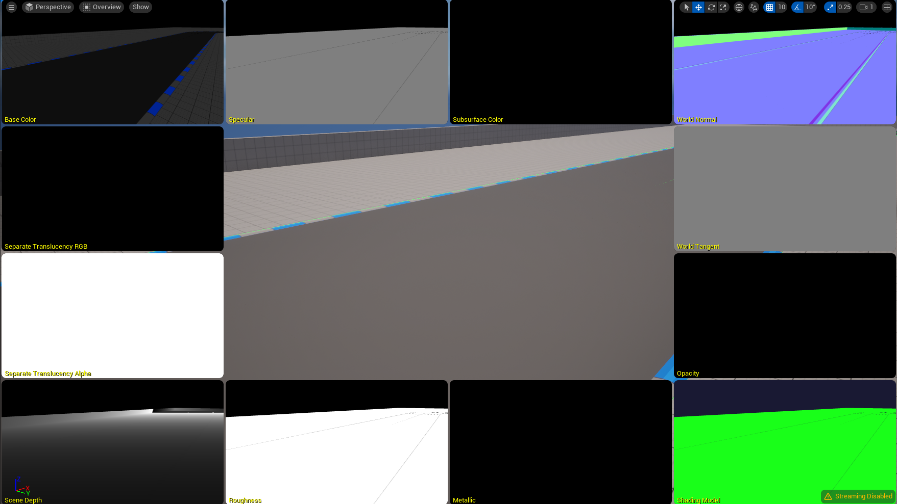
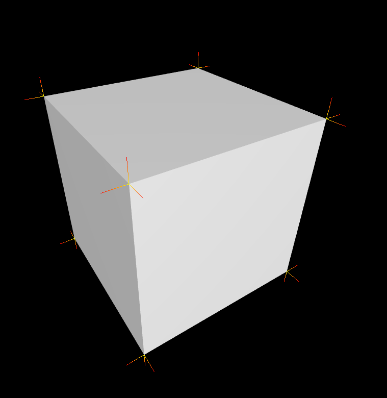
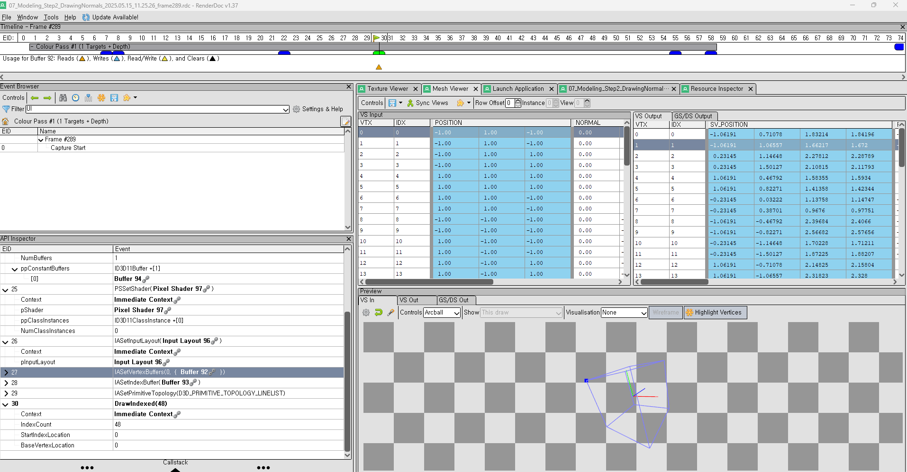
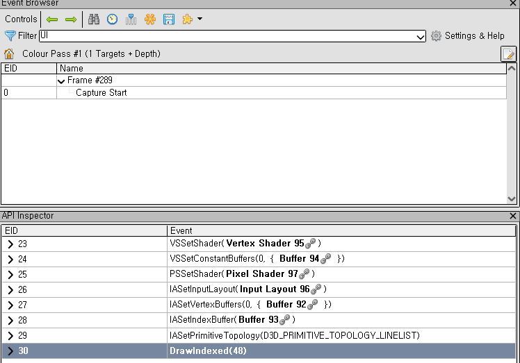
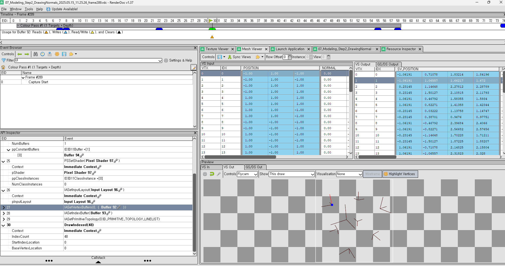
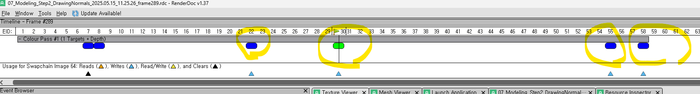

### DirectX11 - Drawing Normal

이전 Post 와 마찬가지로, 목적은 우리가 그려야할 Mesh 들의 Wireframe 도 봐야하지만, 각 면에 있는 Face Normal 값을 확인하는것도 Graphics Tool 로서는 중요하다. WireFrame 같은 경우는 DirectX 에서 는 RasterizerState 으로 해주었었다. 하지만 Normal 같은 경우 직접 그려야한다. 그래서 각 Vertex 별 Normal 값을 구하는게 중요하다. 물론 Unreal Engine 같은 경우 아래처럼 World Normal 을 볼수 있게끔 되어있다. 



그렇다면 일단 만들어보자. 간단한 Box 의 Vertex 와 Normal 값들을 직접적으로 넣어주는 코드는 생략하겠다. 단 여기서 Point 는 HLSL 에서 어떻게 사용되는지를 알아보는게 더 중요하다.

일단 ConstantBuffer 에 들어가 있는걸로도 충분하니 아래의 코드를 일단 봐보자.
```c++

struct VertexShaderInput {
    float3 modelPos: POSITION;
    float3 normalModel: NORMAL;
    float2 texcoord : TEXCOORD0;
}

struct PixelShaderInput {
    float4 posProj : SV_POSITION;
    float3 posWorld: POSITION;
    float4 normalWorld : NORMAL;
    float2 texcoord : TEXCOORD;
    float3 color : COLOR;
}

cbuffer MyVertexConstantBuffer : register(b0)
{
    matrix model;
    matrix invTranspose;
    matrix view;
    matrix projection;
}

PixeShaderInput main(VertexShaderInput input) {
    PixelShaderInput output;
    float4 pos = float4(input.posModel, 1.0f);

    float4 normal = float4(input.normalModel, 0.0f);
    output.normalWorld = mul(normal, invTranspose).xyz;
    output.normalWorld = normalize(output.normalWorld);

    pos = mul(pos, model);

    float t = input.texcoord.x;

    pos.xyz += output.normalWorld * t * scale;

    output.posWorld = pos.xyz;

    pos = mul(pos, view);
    pos = mul(pos, projection);

    output.posProj = pos;
    output.texcoord = input.texcoord;

    output.color = float3(1.0, 1.0, 0.0) * (1.0 - t) + float3(1.0, 0.0, 0.0) * t;

    return output;
}

float4 main(PixelShaderInput input) : SV_TARGET
{
    return float4(input.color, 1.0f);
}
```

일단 Shader 코드를 살표 보자면, View 로 Transform 하기 이전에, Model 좌표계에서 의 Normal Vector 들을 World 좌표계로 구한다. 그런다음에, 시작점과 끝점을 확실히 하기위해서, texcoord 를 CPU 쪽에서 넘겨줄때 .x 값을 넘겨서 시작과 끝을 알려주는거를 넣어주면 될것 같다. 그리고 t 가 1 면 normal vector 의 원점 (노란색) 그리고 t 가 0 이면, normal vector 의 끝점인 (빨간색) 으로 표시할수 있게한다. 

이제 CPU 쪽 작업을 해보자. CPU 에서 보내줄 정보는 GPU 에서의 보내줄 정보와 같다. CPU 쪽에서는 새로운 Normal 값들을 집어넣어야 하기에 정점 정보와 Normal 의 Indices 정보를 넣어서, Buffer 안에다가 채워넣어준다. 그리고 말했던 Normal 의 시작과 끝을 알리는 정보로서 texcoord 에 Attribute 로 집어 넣어준다. 마찬가지로 ConstantBuffer 도 Model, View, Projection 을 원하는 입맛에 맛게끔 집어넣어주면 될것 같다. 그리고 마지막으로 ConstantBuffer 를 Update 만해주면 내가 바라보는 시점에 따라서 Normal 도 같이 움직이는걸 확인할수 있다. 

```c++
struct MyVertexConstantBuffer
{
    matrix model;
    matrix invTranspose;
    matrix view;
    matrix projection;
}

MyVertexConstantBuffer m_MyVertexConstantData;
ComPtr<ID3D11Buffer> m_vertexConstantBuffer;
ComPtr<ID3D11Buffer> m_vertexBuffer;
ComPtr<ID3D11Buffer> m_indexBuffer;
ComPtr<ID3D11VertexShader> m_normalVertexShader;
ComPtr<ID3D11PixelShader> m_normalPixelShader;
UINT m_indexCount = 0;

//-----------------------------------------------------//
// Init ()
std::vector<Vertex> normalVertices;
std::vector<uint16_t> normalIndices;
for (size_t i = 0; i < vertices.size(); i++){
    auto data = verticies[i];
    data.texcoord.x = 0.0f;
    normalVertices.push_back(data);
    data.texcoord.x = 1.0f;
    normalVertices.push_back(data);

    normalIndices.push_back(uint16_t(2*i));
    normalIndices.push_back(uint16_t(2*i + 1));
}

CreateVertexBuffer(normalVertices, m_vertexBuffer);
m_indexCount = UINT(normalIndices.size());
CreateIndexBuffer(normalIndicies, m_indexBuffer);
CreateConstantBuffer(m_MyVertexConstantData, m_vertexConstantBuffer);

// Then you need to Create Vetex / InputLayout & PixelShader to bind the resources.

//-----------------------------------------------------//
// Update ()
// occluded the (M)odel(V)iew(P)rojection Calculation
UpdateBuffer(m_MyVertexConstantData, m_vertexConstantBuffer);

//-----------------------------------------------------//
// Update ()
m_context->VSSetShader(m_normalVertexShader.Get(), 0, 0);
ID3D11Buffer *pptr[1] = {m_vertexConstantBuffer.Get()};

m_context->VSSetConstantBuffers(0, 1, pptr);
m_context->PSSetShader(m_normalPixelShader.Get(), 0, 0);
m_context->IASetVertexBuffers(
    0, 1, >m_vertexBuffer.GetAddressOf(), &stride,
    &offset);
m_context->IASetIndexBuffer(m_indexBuffer.Get(),
                            DXGI_FORMAT_R16_UINT, 0)
m_context->IASetPrimitiveTopology(D3D11_PRIMITIVE_TOPOLOGY_LINELIST);
m_context->DrawIndexed(m_indexCount, 0, 0);
```
결과는 아래와 같다.


RenderDoc 으로도 돌려봐야하지 않겠냐? 싶어서, Vertex 의 Input 정보들을 확인할수 있다. 그리고 내가 어떠한 Parameter 로 넣어줬는지에 대한 State 들도 왼쪽에 명시 되어있다.




그리고 Vertex Shader 로 부터 Output 이 생성이 되면 아래와 같이 각 Vertex 과 면에 대해서 Normal 값이 나오는걸 확인할수 있다.



그리고 이건 DrawIndexed 의 호출을 동그라미 친것이다. ImGUI 도 쓰기때문에 저 뒤에 두번째는 ImGUI 가 현재 RenderTarget 에 DrawIndexed 를 해주고, 내가 Rendering 하고 싶은 결과는 노란색 두개 이다.



이렇게해서 RenderDoc 을 사용해서 검증을 하고 내가 Pipeline 에잘 넣었는지도 확인할수 있다.