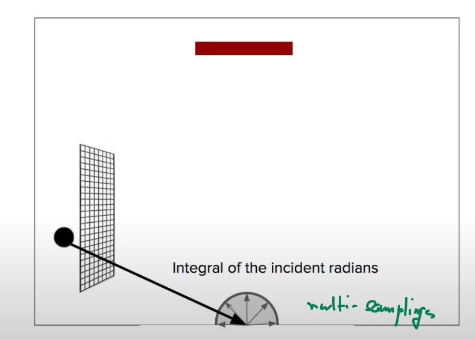

### DirectX11 - Cylinder Modeling

이제껏 해본걸 종합해보자. Plane 도 만들어보았고, Box Mesh 도 만들어보았다. 근데 Cylinder 는? 사실 Cylinder 는 앞에 Grid 의 평면을 말아 놓은거라고 볼수 있다. 그렇다면, 어떻게 해야할까?가 고민일텐데, Texture 좌표 때문에 Vertex 를 + 1 을 해줘야한다. 그 이유는 Texture 좌표계 때문이다. (0~1) 로 반복되는거로 되어야하기때문에 그렇다.

그리고 앞서서 배웠듯이 Normal Vector 는 inverse transpose 값을 해줘야 Scale 값에 영향이 없는 결과를 가지고 올수 있다.

일단 이거는 살짝의 코드의 방향성을 생각을 해보면 좋을것 같다. 월드좌표계에서 Cylinder 를 만든다고 가정을 했을때, 화면 안으로 들어가는 좌표 z, Right Vector 는 X 축, Up Vector 는 Y 축이라고 생각을하고. 모델링을 만들때는 Y 축을 기준 회전 (즉 x-z 평면에서 만든다고 볼수있다.)

그렇다고 하면, 모든 Vertex 를 얼마나 회전을 하느냐에 따라서, 각도를 `const float dTheta = -XM_2PI / float(sliceCount);` 결국에는 얼마나 잘라내는지에 따른것에 따라서 더 부드러운 원동모형을 만들수 있을것 같다. 그리고 Y 축의 회전이다 보니, 모든 Vertex 를 Y 축을 통해서 Rotation 값을 누적해가면 된다.

그러면 위의 Radius 와 아래의 Radius 를 x-z 평면으로 시작점으로 해서 돌리면 된다. 결과는 아래와 같다. 원통을 그리려면 Vertex 의 정보를 SimpleMath 에 있는 CreateRotationY 로 충분히 해도 되지만, sin, cos 을 사용해서 원통을 만들어도 똑같은 결과를 나타낸다.

