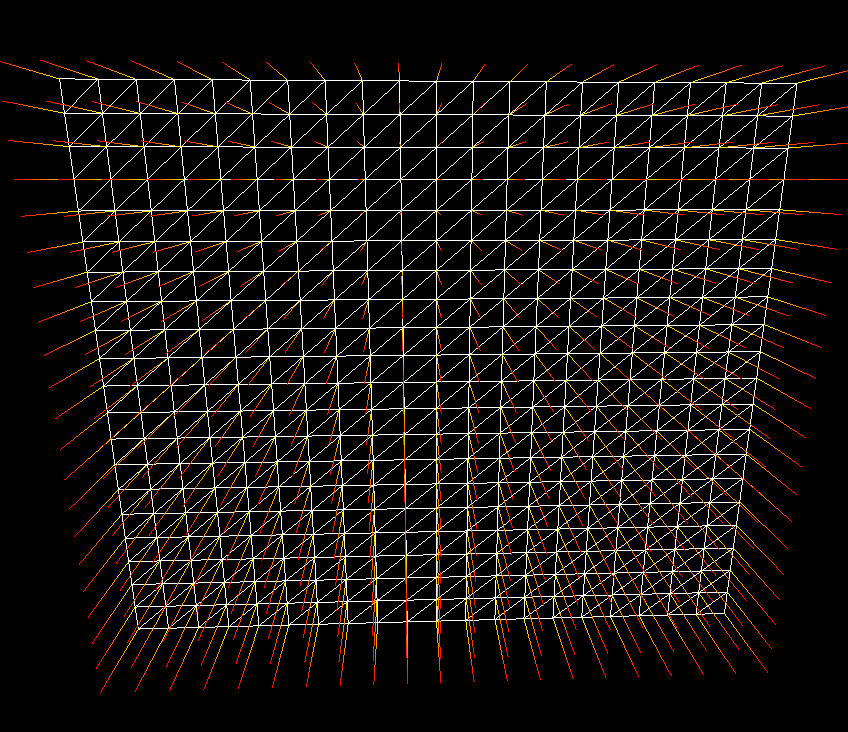

### DirectX11 - Drawing Grid Plane

이제껏, WireFrame 과 Normal 을 봤다. 또한 중요한 부분중에 하나는 Model 이 우리가 봤던 박스처럼 모든 모델이 그렇게 생겨있지 않다. 예를 들어서 구, Cylinder 등의 모형들은 격자 무늬로 이루어져 있으며, 특히나 지형 같은 경우도 Grid Plane 이라고 볼수 있다. 그럼 Grid Plane 은 어떻게 생겨 먹은 친구 인지 한번 봐보자. 아래를 보면, 저런 격자 모양인 Mesh 가 결국엔 Grid Mesh 라고 볼수 있다. 여러개의 박스 (triangle mesh 2개) 가 여러개 모여서 격자 모형의 Plane 을 만들수 있다고 할수 있다.

결국에는 너무 쉽게도 Mesh 의 Vertex 정보와, Normal 정보, 그리고 Vertex 들의 관계 (index) 정보들을 가지고 만들수 있다. 일단 Texture 를 준비해보자. 그리고 현재 Game Engine 에 올려보자. 아래의 Texture 는 물을 표현한 Texture 이다.

그리고 격자를 그리기위해서, 결국에는 Vertex 의 정보가 필요하다. 격자를 그리기위해나 Parameter 로서는 Width, Height, Stack, Slice 라고 보면 될것 같다.

Width & Height 는 격자의 총길이, 그리고 stack 몇개의 Box 를 위쪽으로 쌓을건지와, Slice 는 Width 에서 얼마나 자를건지를 표현한다. 

코드는 따로 공유는 하지 않겠다, 하지만 격자는 아래와 같이 그려낼수 있다. 결국에는 평면이기 때문에 임의 Normal 값을 -z (모니터가 나를 바라보는 쪽) 으로 되어있고, 그리고 격자의 Vertex 의 정보는 Slice 와 Stack 으로 Point 를 Translation 해줬으며, 그리고 Index 들은 간단한 offset 으로 구현을 했었다.

재밌으니까, 물결 Texture 니까, 물결을 나타내는 Texture 를 한번 구부려보자. z 축을 x 의 sin graph 로 그려내보자. 그리고 이거에대한 Normal 값도 따로 적용한다고 하면 두개의 Image 를 확인할수 있다. x 에 대한 변화량에 대한 z 값을 그려냈기때문에, 편미분을 통해서 결과값을 도출해낼수 있다.

