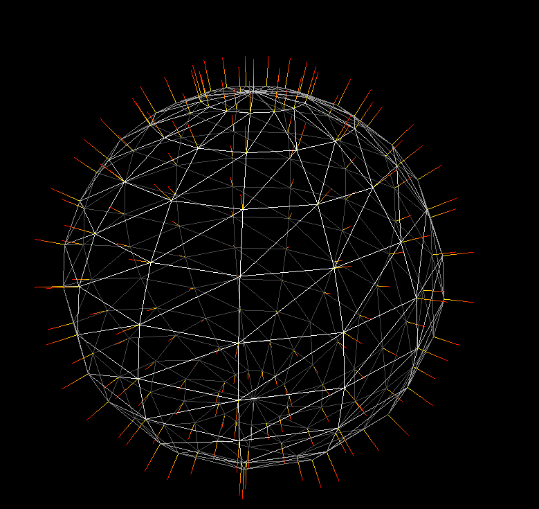
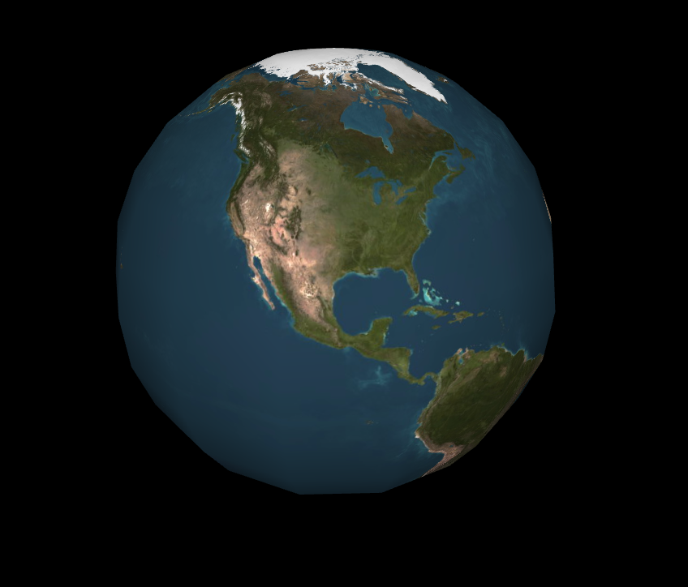
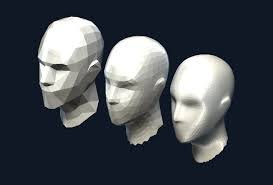
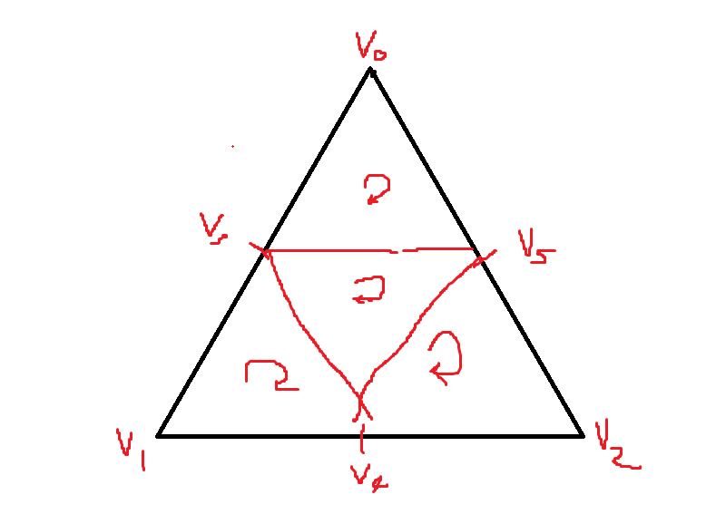
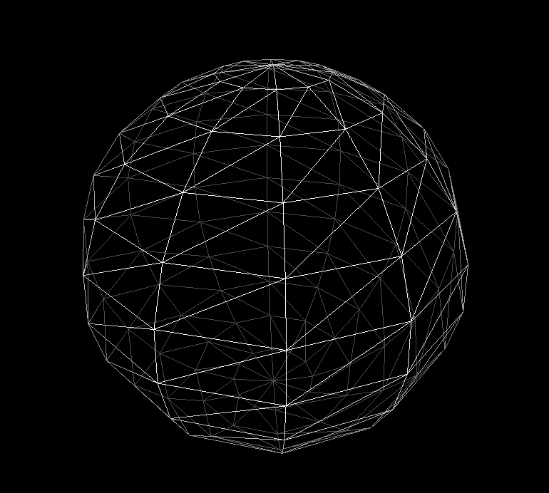
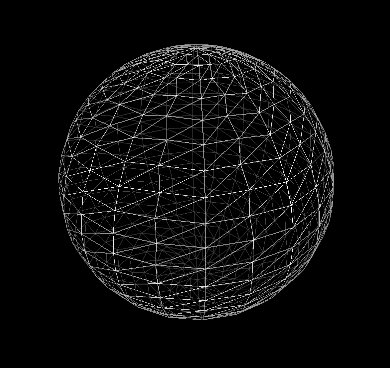
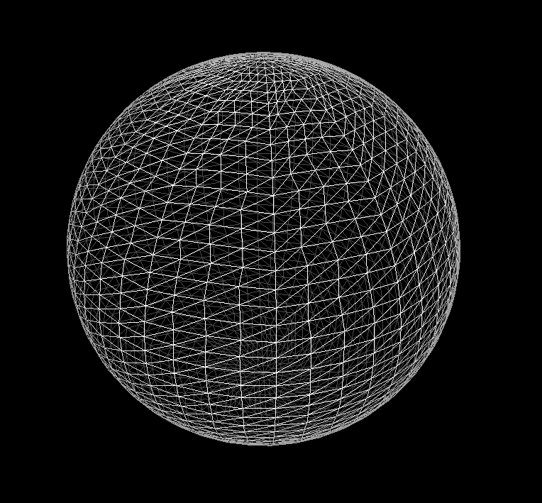

### DirectX11 - Sphere Modeling

앞에 Post 를 봤더라면, 이제 Sphere 는 cylinder 의 맨위와 아래의 radius 를 묶으면 되지 않느나라는 질문을 할수 있다. 맞다! 그리고 Stakc 이 총 6개라면, 6 개만큼을 아래서부터 각도를 줘서 구처럼 구부리면 될수 있다.

그러면 수식으로 세우면 이렇다, Vector 의 위치 (0, -radius, 0) 부터 시작해서, Z 축 으로 해서 높이를 쌓고, y 축으로 Vertex 를 돌리면 된다. 그말은 첫 Vertex Point 로 부터 Phi 각도를 점차 점차 올라가면서, Transform 을 해주면 된다. 그래서 간단하게 SimpleMath 를 사용한다면 아래의 코드처럼만 변경하고, Indices 와 Normal 은 Cylinder 와 마찬가지로 하면 된다.

```c++
// loop in stacks
const flaot dTheta = -XM_PI / float(numSlices);
const float dPhi = -XM_PI / float(numStacks);
Vector3 startPoint = Vector3::Transform(Vector3(0.0, -radius, 0.0), Matrix::CreateRotationZ(dPhi * i));

// loop in slice
// from x-z plane, rotate
Vertex v;
v.position = Vector3::Transform(stackPoint, Matrix::CreateRotationY(dTheta * float(j)));
```



### Subdivision
Subdivision 은 여러 방법이 있을텐데, 제일 기본적인 방법은 Triangle Mesh 를 4 개 만들어주는거다. 즉 Vertex Point 들을 부풀려서 준다고 생각을 하면된다. 근데 굳이? 왜 CPU 단에서 부풀리려고 하냐? 굳이 이렇게 만들 필요가 있냐? 라고 하면, Subdivision 같은 경우는 GPU 에서도 충분히 돌릴수 있다. 그래서 아래의 그림을 보면 모형의 조금더 부드럽게 더 늘려서, 물체의 형태를 실제와 같이 Vertex 를 늘려주는 역활이라고 할수 있다.





앞서 말했다 싶이, 제일 기본적인 아이디어는 아래와 같다. 하나의 Triangle Mesh 가 있다고 하면, Vertex 와 Vertex 사이에 중간의 Vertex 를 둬서 다시 연결해줘서 삼각형을 1개에서 4개로 증가 시켜주는 알고리즘이라고 볼수 있다. 그래서 알고리즘은 이렇다. 만약 기존의 Mesh Data 의 Normal 값을 radius 와 곱한다. 즉 vertex position 을 다시 구의 표면위에 작업하는 작업이라고 볼수 있다.

그리고 이러한 방식이 필요한데, 이건 Subdivison 을 할때마다, Texture 들의 좌표가 깨질수도 있으니, 이음매를 엮어주는 형식이다. 그리고 새로운 Mesh Data 에 순서대로 넣어준다고 하고, Indices 들도 정하면, 아래처럼 여러개의 Step 을 돌렸을때 구형이 더 구형처럼 보이게 될것이다.

```c++
const float theta = atan2f(v.position.z, v.position.x);
const float phi = acosf(v.position.y / radius);
v.texcoord.x = theta / XM_2PI;
v.texcoord.y = phi / XM_PI;
```

### Result




### Resource
* [Sphere](https://www.songho.ca/opengl/gl_sphere.html)