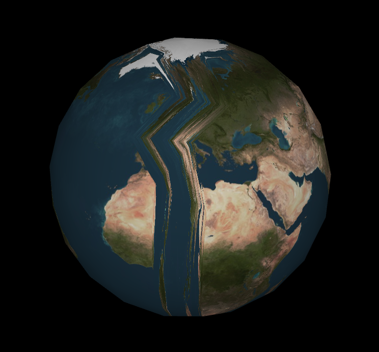
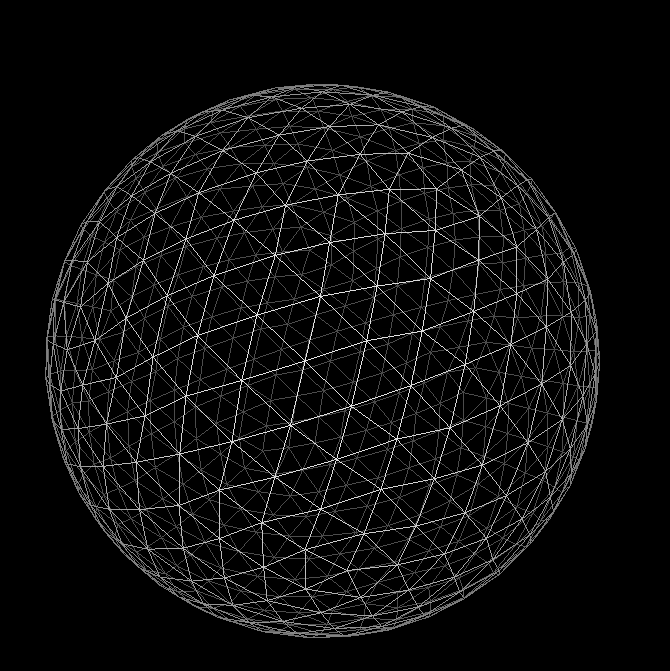
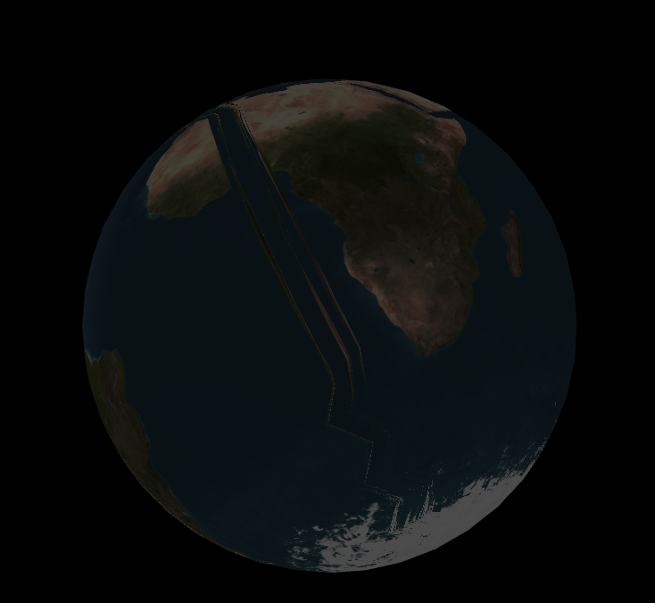
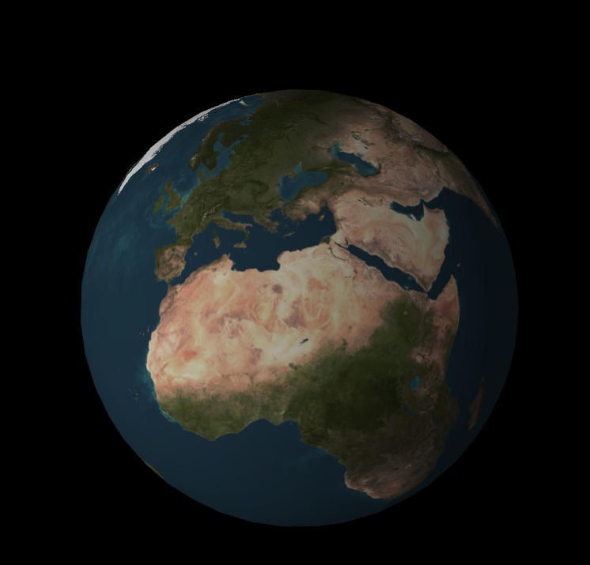

 
### Sphere Mapping

아마 전에 Sphere Modeling 을 Post 를 봤다고 한다면, 약간의 더러움이 보였을거다. 그게 뭔말이냐면... 삼각형이 균일하게 만들어지지 않았다는 점이다. 그리고 아무리 저번처럼 Texture Mapping 에 필요한 공식을 썻더라고 한더란들, 문제는 해결되지 않는다.

일단 그림 부터 한번 참고를 해보는게 좋을것 같다. 일단 최악의 상황일때, 즉 Subdivision 을 안했을때를 한번 봐보자. 이상태에서 보면 저렇게 끊겨져 있는걸 볼수 있을거다. 그 이유중에 하나는, 바로 Texture 의 삼각형안에서 Interpolation 을 하려고 보니 생기는 이슈이다. 



그래서 다시 Subdivision 을 해서 일단 완벽한 구형의 모델을 만들어보자. Wireframe 을 볼수 있다. 아래처럼 일정하게 삼각형들을 그리게 된다고 하면, 아래처럼 똑같이 나온다.

 


이거에 대한 원인은 Cylinder 를 조금 다시 돌아보면 좋을것 같다. Subdivision 을 했을시에 결과값이 Texture 좌표계에서 0 과 1 로 딱떨어지는 경우에는 잘 Mapping 이 될거다. 하지만, 만약에 Texture 좌표에 애매하게 들어가있더라고 하면 0 과 1 사이를 Interpolation 을 시켜버려서, 저렇게 Pixel 값이 흐트러지는 현상이 나온다. 그래서 해결방법은 그렇다. Texture Coordinate 를 Vertex 단위로 Mapping 하는게 아니라, Pixel 단위로 넘기게 된다면 해결이 될문제이다. 즉 다시 uv 값을 계산해서 Pixel Shader 에서 그리게 하면 된다. uv 값을 계산하는식은 전 Post 에 있으니 그 코드를 Shader 코드로 넘기면 된다.

그걸 해결하기위해서는 이제 Shader Programming 으로 들어가는거다. 이제까지 PixelShader 에서 받는 Input 같은 경우에, projection, world, normalworld, texcoord, color 값을 Parameter 로 CPU 에서 GPU 쪽으로 넘기고 있었다. 이때 model 에 대해서 position 값을 같이 넘겨주면 일단 첫번째 Step 이다. 그리고 Pixel Shader 에서 계산을 할때, uv 를 다시 계산해서, 아래처럼 Sampler 을 시키면 해결이 된다.

```
struct PixelShaderInput
{
    float4 posProj : SV_POSITION;
    float3 posModel : POSITION0;
    float3 posWorld : POSITION1;
    float3 normalWorld : NORMAL;
    float2 texcoord : TEXCOORD;
    float3 color : COLOR; 
};

float2 uv;
uv.x = atan2(input.posModel.z, input.posModel.x) / (3.141592 * 2.0) + 0.5;
uv.y = acos(input.posModel.y / 1.5) / 3.141592;

return float4(color, 1.0) * g_texture0.Sample(g_sampler, uv);
```

결과는 아래와 같다. 발생했었던 그 끊기는 현상이 깔끔하게 사라지는걸 확인할수 있다.

