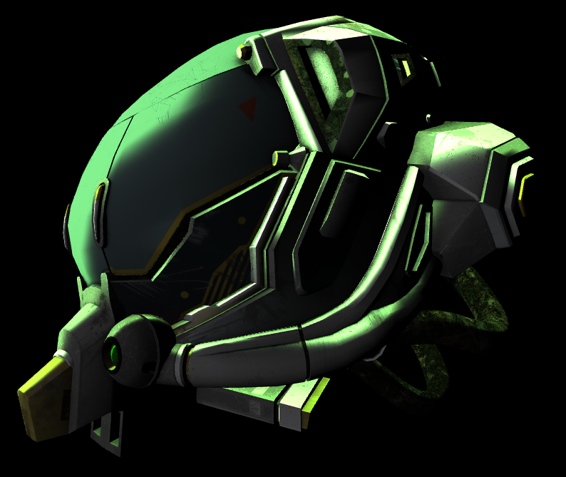

## Introduction to Rim Effect

이제는 조금은 재밌는 장난을 더해서, Lighting 을 개선해보는게 좋을것 같다. Rim Effect 는 물체의 가장자리 (Edge) 에 빛이 강조되어 반사되는 효과를 뜻한다. 주로 역광 (Backlighting) 상황에서 발생하여, 물체의 윤곽을 강조한다. 즉, 빛이 물체를 직접 비추지 않아도 가장자리에서 빛이 새어 나오는 현상을 뜻한다.

사용되는 용도를 조금 찾아보니, 캐릭터의 윤곽을 강조하거나, 뭔가 환상적인 분위기를 연출하거나, Material 을 표현 할때, 투명하거나 빛을 산란시키는 재질의 특성을 표현한 것이다.

그렇다면 Edge 를 찾으려면 어떻게 해야하는걸까? 일단 생각을 해보면, Model 의 Normal Vector 와 카메라 시점에서 바라본 Vector 의 Normal 값이 90 도가 됬을때, Edge 라고 판별을 할 수 있을것같다. 이제 HLSL 에 적용을 해보자.

이미 이제껏 VertexShader 에 넣어준 ConstantBuffer 의 느낌은 Model, InverseTranspose, view, projection 이 있다. 그리고 각각의 Shader 에서 `main` 함수의 Parameter 같은 경우는, 아래와 같다.

```
cbuffer ModelViewProjectionConstantBuffer : register(b0)
{
    matrix model;
    matrix inverseTranspose;
    matrix view;
    matrix projection;
};

struct VertexShaderInput {
    float3 posModel : POSITION;
    float3 normalModel : NORMAL;
    float2 texcoord : TEXCOORD0;
}

struct PixelShaderInput {
    float4 posProj : SV_POSITION;
    float3 posWorld : POSITION;
    float3 normalWorld : NORMAL;
    float2 texcoord : TEXCOORD;
    float3 color : COLOR;
}
```

결국엔 Rasterization 이 끝난 이후 Pixel Shader 에서 색상의 값을 결정해줘야 하므로, Pixel Shader 에서 처리가 가능하다.

```
cbuffer PixelShaderConstantBuffer : register(b0)
{
    float3 eyeWorld;   // 12 bytes
    bool dummy;        // 4 bytes (16 bytes alignment)
    Material material; // 48 bytes
    Light light[MAX_LIGHTS]; // 3 x 48 bytes = 144 bytes
    float3 rimColor;   // 12 bytes
    float rimPower;    // 4 bytes (16 bytes alignment)
    float rimStrength; // 4 bytes (padding: 12 bytes)
};

float4 main(PixelShaderInput input) : SV_TARGET 
{
    float3 toEye = normalize(eyeWorld - input.posWorld);
    float3 rim = pow(1.0 - saturate(dot(input.normalWorld, toEye)), rimPower);
    // It is optional to use `smoothStep`.
    float3 rimColor = rimStrength * rimColor;
    color += rimColor;
    return float4(color, 1.0);
}
```

항상 조심해야 하는건, ConstantBuffer 는 16 의 배수여야한다! 그리고 Specular 를 계산을 할때, pow() 라는걸 사용했었다. 그걸 적절하게 사용을하고, 1.0 - dot(input.normalWorld, toEye) 를 하는데에 있어서는, 각도의 90 도 일때, dot product 값은 0 이다. 이걸 확대하게하기 위해서, 1 을 빼주는것이다. 다른 방법으로는 Saturate 대신에, smoothstep 을 사용해도 괜찮은 결과가 나오는것 같았다.

결과는 아래와 같다.

