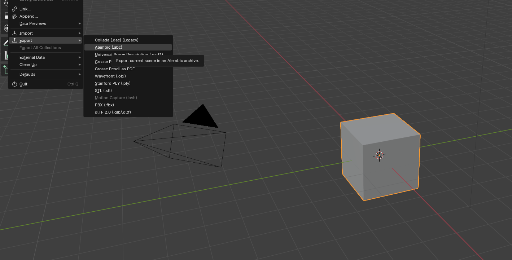
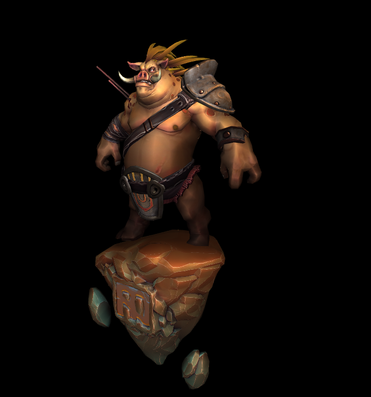

## DirectX11 - How to import Model Import in DirectX11.

처음으로, Model Import 코드를 짜보고 테스트를 해보았아. Library 는 Assimp 로 3D Model 을 Load 를 하면 된다. 일단 기본적으로 Modeling 에 앞서서 Blender 를 확인 해보자. 

이러한식으로 Blender 에서, Model 을 Import 할때 여러가지의 Formats 이 보인다. 내가 다뤄봤던건 아래와같다.
* Standford Rabit (.ply) => Point Cloud Data 옮길때
* glTF 2.0 (.glb/.gltf) => 이건 기억이 잘안나지만, 이게 최신인걸로 알고 있다.
* Wavefront (.obj) => 이건 정말 많이 다뤄본것 같다. (차량 Model, Radar Model, etc..)

일단 3D Modeling Import 는 Assimp Library 로 충분하다. 각 모델을 확인해보면 각 Format 별로 Vertex, Index, Normal 값들이 존재하며, 또 Parts 별 Texture 가 존재한다. 가끔씩은 Normal 값이 존재 안할수도 있는데, 이건 따로 처리해야할필요가 있다. 그리고 확실히 std::fileSystem `c++17` 부터 나와서 훨씬 Path 정리하는게 편하다.

코드는 StackOverflow 나 GameDev 에서 작성하였다. 

결과를 한번 보자면 아래와 같다. 이런저런 Free Model 이 있는데, `sketchFab`, [glTF](https://github.com/KhronosGroup/glTF-Sample-Models), [CesiumGS](https://github.com/KhronosGroup/glTF-Sample-Models), and [f3d](https://github.com/f3d-app/f3d) 이렇게 있다. 

나는 어렸을때, Dota 를 좋아해서, 진짜 Dota Character 인지는 모르겠지만, F3D 에서 Dota 캐릭터를 가지고 왔다. 충분히 Animation 도 있는것 같은데, 아직 Animation 의 구현은 멀어서,,, 일단 Import 된것 까지 한번 봐보자.

