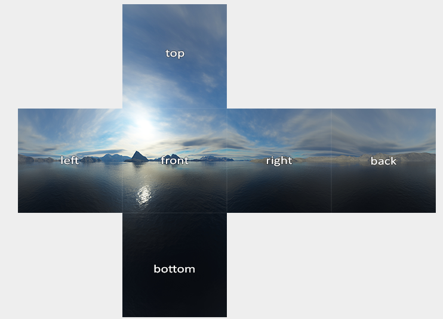
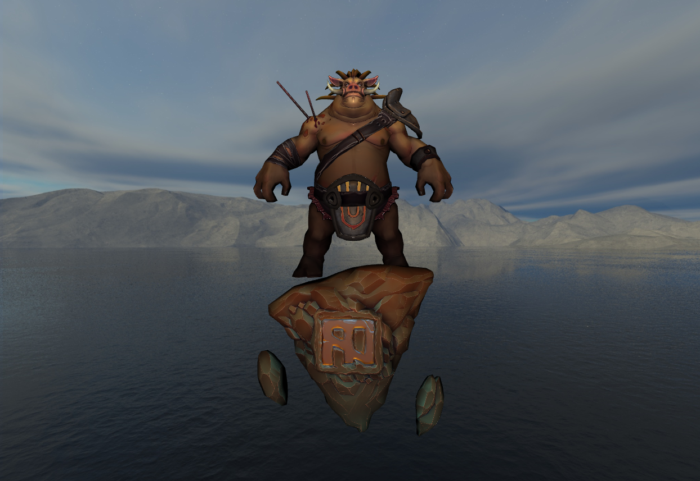
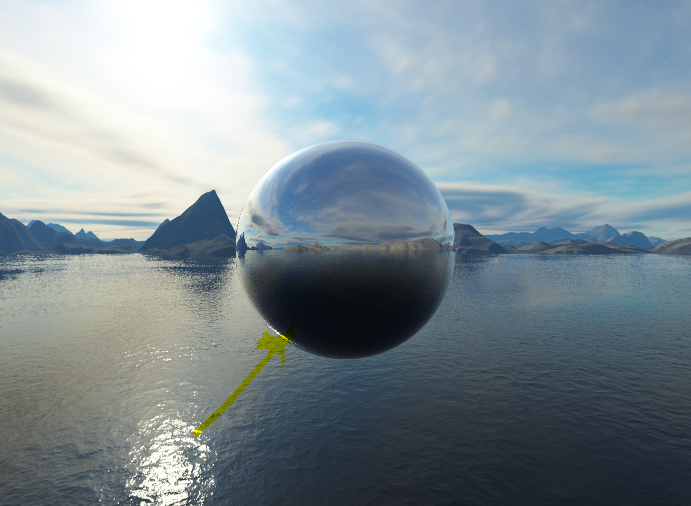

### DirectX11 - Cube Mapping

환경적 요소를 다루기 위한 한걸음인것 같다. Cube Mapping 이란건 쉽게 말해서 카메라가 거대한 상자 안에 있는것과 같다. 즉 아래의 그림처럼, 거대한상자는 십자가 패턴으로, 총 6 개의 Textures 로 이루어져있다. 일반 Texture 와 다른 부분이 하나 있다. 전에 같은 경우는 Texture 를 입힌다라고 했을때 Mesh 에다가 Texture 좌표계를 입혔어야했다. Cube Mapping 같은 경우에는 DirectX 내부에서 알아서 해준다고 볼수 있다. 



그러면 DirectX 에서 어떻게 Cube Mapping 을 하는지 해보자. 

CPU Side
---
```c++

auto skyBox = L"./CubemapTextures/skybox.dds"
ComPtr<ID3D11ShaderResourceView> cubemapResourceView; 
ComPtr<ID3D11Texture2D> texture;

HRESULT hr = CreateDDSTextureFromFileEx(
    m_device.Get(), filename, 0, D3D11_USAGE_DEFAULT,
    D3D11_BIND_SHADER_RESOURCE, 0,
    D3D11_RESOURCE_MISC_TEXTURECUBE,
    DDS_LOADER_FLAGS(false), (ID3D11Resource **)texture.GetAddressOf(),
    cubemapResourceView.GetAddressOf(), nullptr);

if (FAILED(hr)) {
    std::cout << "Failed To Create DDSTexture " << std::endl;
}
// -----

// ConstantBuffer
BasicVertexConstantBuffer {
    Matrix model;
    Matrix inverseTranspose;
    Matrix view;
    Matrix projection;
};

static_assert((sizeof(BasicVertexConstantBuffer) % 16) == 0,
              "Constant Buffer size must be 16-byte aligned");

std::shared_ptr<Mesh> cubeMesh;
cubMesh = std::make_shared<Mesh>();
BasicVertexConstantBuffer m_BasicVertexConstantBufferData;
m_BasicVertexConstantBufferData.model = Matrix();
m_BasicVertexConstantBufferData.view = Matrix();
m_BasicVertexConstantBufferData.projection = Matrix();

ComPtr<ID3D11Buffer> vertexConstantBuffer;
// This is custom Method
CreateConstantBuffer(m_BasicVertexConstantBufferData, cubeMesh->vertexConstantBuffer);

MeshData cubeMeshData = MeshGenerator::MakeBox(20.0f);
std::reverse(cubeMeshData.indicies.begin(), cubeMeshData.indicies.end());

CreateVertexBuffer(cubeMeshData.vertices, cubeMesh->vertexBuffer);
CreateIndexBuffer(cubeMeshData.indices, cubeMesh->indexBuffer);

ComPtr<ID3D11InputLayout> inputLayout;
ComPtr<ID3D11VertexShader> vertexShader;
ComPtr<ID3D11PixelShader> pixelShader;

vector<D3D11_INPUT_ELEMENT_DESC> basicInputElements = {
    {"POSITION", 0, DXGI_FORMAT_R32G32B32_FLOAT, 0, 0,
     D3D11_INPUT_PER_VERTEX_DATA, 0},
};


CreateVertexShaderAndInputLayout(
    L"CubeMappingVertexShader.hlsl", basicInputElements,
    vertexShader, inputLayout);

CreatePixelShader(L"CubeMappingPixelShader.hlsl", pixelShader);

// Render omit: But this is just update the constant buffer.

// Update: Pipeline for cube mapping
m_context->IASetInputLayout(inputLayout.Get());
m_context->IASetVertexBuffer(0, 1, cubeMesh->vertexBuffer.GetAddressOf(), &stride, &offset);
m_context->IASetIndexBuffer(cubeMesh->indexBuffer.Get(), DXGI_FORMAT_R32_UINT, 0);
m_context->IASetPrimitiveTopology(D3D11_PRIMITIVE_TOPOLOGY_TRIANGLELIST);
m_context->VSSetShader(vertexShader.Get(), 0, 0);
m_context->VSSetConstantBuffers(0, 1, cubeMesh->vertexConstantBuffer.GetAddressOf());
ID3D11ShaderResourceView *views[1] = { cubemapResourceView.Get() };
m_context->PSSetShaderResources(0, 1, views);
m_context->PSSetShader(pixelShader.Get(), 0, 0);
m_context->PSSetSamplers(0, 1, m_samplerState.GetAddressOf());

// Start Drawing
m_context->DrawIndexed(cubeMesh->m_indexCount, 0, 0);
```

1. CubeMap Mesh 를 불러온다. (이때 Cubemap 은 Box Mexh, 단 주의점은 너무 크다보면, Camera 시점에서, Far Point 의 조정이 필요하다.)
2. 그 이후에는 CubeMap Texture 를 불러온다. 위의 십자가 모형을 만든 Format (.dds) 를 불러온다. 
   - 다른 Tool 도 존재한다. - [Cubemap](https://github.com/dariomanesku/cmft) & [Programming in DDS](https://learn.microsoft.com/en-us/windows/win32/direct3ddds/dx-graphics-dds-pguide)
   - [DirectX Texture Loader](https://github.com/microsoft/DirectXTK/wiki/DDSTextureLoader)
   - 참고로 dds 는 DirectX 에서 한 Image 의 Format 인데, 주로 Graphics 용도로 사용한다고 한다. 
3. Cubemapping 을 하기위해서는, Shader 가 따로 필요하다 (VertexShader & PixelShader). 그리고 기존에 사용하던 Constant Buffer 도, 일단 수정하지말고 그대로 불러오는 작업을 한다.
4. **Important**: CubeMap 같은 경우 카메라가 큐브맵 안에 있으니, 큐브맵이 BackFace 를 바라보는건데, 큐브맵이 Front Face 로 돌려줘야한다. 그러기위해선 기존에, 정점 CCW 로 되어있는게 Front Face 이므로, BackFace(CW) 에 있었던 정점정보들을 CCW 려 돌려줘야한다. (조그만더 정리하자면, 원래 카메라에서 물체를 바라볼때, DirectX 에서는 CCW 로 정점이 생성되서, FrontFace 라고 확인이 되지만 뒤로 봤을때는 이게 CW 로 되어있다. 그래서 Culling 이라는게 존재하는것이다.) 또 다른 방법은 `D3D11_CULL_MODE::D3D11_CULL_NONE` 을 하면된다.
5. BackFace 에서 FrontFace 로 변경이후, vertex 와 index 의 정보를 Buffer 에다가 넣어준다.
6. 새로운 Shader 에서 정의를 하니, InputLayout 도 정의를 하고, VertexShader 와 PixelShader 를 생성해준다.
7. Render 부분에서는 ConstantBuffer Model 의 Position 만 Update 해주는 방식으로 해주는 대신에, 빈 Matrix 를 넣어줘야한다. 왜냐하면 카메라 시점이 바꾼더라도, Mesh Model 은 변경이 안되어야하므로... 
8. 그리고 Update 하는 부분쪽이서는 모든 Resources 들을 Shader 에서 볼수 있도록 Binding 을 해준다.

GPU
---
```c++
PixelShaderInput main(VertexShaderInput input)
{
    PixelShaderInput output;
    float4 pos = float4(input.posModel, 1.0f);

    pos = mul(pos, model); // Identity
    output.posWorld = pos.xyz;
    pos = mul(pos, view);
    pos = mul(pos, projection);
    output.posProj = pos;
    output.color = float3(1.0, 1.0, 0.0);
    return output;
}

TextureCube g_textureCube0 : register(t0);
SamplerState g_sampler : register(s0);

float4 main(PixelShaderInput input) : SV_TARGET
{
    return g_textureCube0.Sample(g_sampler, input.posWorld.xyz);
}
```
- Vertex Shader 에서는 output 에 pos 를 직접 넣어주고, 그리고 Pixel Shader 에서는 Sampling 만 하면 된다.

결과는 아래와 같다.

 
이러다보면 이상한 점이 있기는한데, 그게 Texture 의 고화질이라고 하면, 사실상 Texture 에 있는 빛처럼 보이는 Source 도 있기 때문에 실제로 어디에 Light Source 가 있는지를 모른다. 그리고, Light Source 로 인해서, Model 의 색깔이나, Shadowing 이런게 잘 보이질 않는다 이걸 해결할수 있는 기법 중에 하나가 `Environment Mapping` 이다.

### DirectX11 - Environment Mapping

결국에는 mapping 을 잘된 결과를 가지고 오기위해서는 Texture 의 Quality 가 좋아야, 그만큼의 조명이 돋보이고, 더 사실적인 Rendering 이 비춰질수 있을것 같다는 생각이든다. 그렇다면 어떻게 하는게 좋을까? 다시 생각을 해보자. 모델이 있다고 하면, 내가 바라보는 시점으로 부터 Model 의 Normal 을 타고 들어간다고 하고, **반사**되었을때의 CubeMap 의 Texture 의 값을 가지고 오면 될것 같고, 바라보는 방향과 상관없는것들은 CubeMap 의 Texture 를 그대로 가지고 오면될것 같다.

그러면 변화해야할것들은 무엇인가? 하면, 바로 CubeMap 의 ResourceView 를 넘겨주면 될것 같다. 그러면 다시 CPU 쪽에서 작업을 해주자. 그말은 즉슨 Model 에 우리가 그리는 정보를 줘야하니. Model 에다가 CubeMap 이 그려진 ResourceView 를 Binding 해주면 된다는 의미이다. 그러면 기존의 Pixel Shader 에가 TextureCube 를 넣어주면 된다.

```c++
// When Render is Called.
// 1. Drawing the CubeMapping on cubmapResourceView
// 2. For each Mesh, you set pixel shader for binding two resesources.
ID3D11ShaderResourceView *resViews[2] = {
    mesh->textureResourceView.Get(), cubemapResourceView.Get() };
m_context->PSSetShaderResources(0, 2, resViews);

// Updating the constant buffer is omitted for simplicity

// Then on GPU
Texture2D g_texture0 : register(t0);            // Texture on Model
TextureCube g_textureCube0 : register(t1);      // Cubemap Texture
SamplerState g_sampler : register(s0);          // Sampler State

struct PixelShaderInput
{
    float4 posProj : SV_POSITION; // Screen position
    float3 posWorld : POSITION;
    float3 normalWorld : NORMAL;
    float2 texcoord : TEXCOORD;
    float3 color : COLOR;
};

cbuffer BasicPixelConstantBuffer: register(b0)
{
    float3 eyeWorld;
    bool dummy1;
    Material material;
    Light light[MAX_LIGHT];
    float3 rimColor;
    float3 rimPower;
    float3 rimStrength;
    bool dummy2;
}

float4 main(PixelShaderInput input) : SV_TARGET 
{
    float3 toEye = normalize(eyeWorld - input.posWorld);
    // Lighting ... 
    
    return g_textureCube0.Sample(g_sampler, reflect(-toEye, input.normalWorld));
}
```

위의 방식대로 Sample 을 많이 다루다 보면, Sample 의 두번째 Parameter 는 Location 이다. 즉 GPU 에게 Texture 의 어느 위치를 Sampling 할건지를 물어보는거다. 그리고 reflect(...) 같은 경우는 toEye 가 결국에는 Camera 에서 Model 로 향하는 벡터라고 하면, Incident Vector 로 바꿔줘야한다(-toEye) 그리고 Model 의 Normal 을 World 좌표계에서 보여지는걸 넣어주면, 결국엔 그 반사된 Vector 로 부터 Sampling 을 할수 있다는것 이다.

결과는 아래와 같다. 아래 Cubemap 에 위치해있는, 빛의 일부분이 그대로 반사되서 구에 맺히는걸 볼수 있다. 굉장히 아름다운 Graphics 인것 같다.



### Resource
* [Example Cubemap](https://github.com/microsoft/DirectX-Graphics-Samples)
* [Cube Map](https://learnopengl.com/Advanced-OpenGL/Cubemaps)
* [Cube Map Resource](https://www.humus.name/index.php?page=Textures)
* [Cube Map in Unity](https://docs.unity3d.com/kr/2018.4/Manual/class-Cubemap.html)
* [Texassemble](https://github.com/microsoft/DirectXTex/wiki/Texassemble)