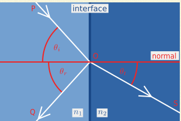
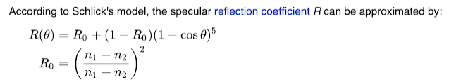

### DirectX11 - Fresnel & Schlick Approximation

"Fresnel Reflection describe the behavior of light when moving between media of differing refractive indices". 결국 말을 하는건 빛이 다른 굴절률(Refractive Index) 가지고 있는 물질(Media) 에 어떻게 표현하는지를 나타낸다고 한다. 아래의 그림처럼, 다른 n1, n2 물질이 있다고 하면, 빛은 일부는 반사하고, 일부는 굴절한다. 그걸 표현한게 아래의 그림이다. 그리고 Snell's law 를 통하면, 각 Incident Angle 과 Refractive Angle 의 관계를 표현을 하면 `sin(theta(i)) / sin(theta(t)) = n2/n1` 표현을 할수 있다. 



그렇다면, 이 식을 어떻게 이제껏 사용했던걸로 사용하자면, Specular(반사광) 에다가 곱해주면 된다. 일단 물질의 고유의 값을 표현할 NameSpace 로 묶어 준다. 그리고 결국엔 이 값들을 Material 값들을 ConstantBuffer 안에다가 같이 넣어주면 된다.

```c++
namespace FresnelConstant {
constexpr Vector3 Water(0.02f, 0.02f, 0.02f);
constexpr Vector3 Glass(0.08, 0.08, 0.08);
constexpr Vector3 Plastic(0.05, 0.05, 0.05);
constexpr Vector3 Silver(0.95, 0.93, 0.88);
constexpr Vector3 Copper(0.95, 0.64, 0.54);
}; // namespace FresnelConstant

struct Material {
    Vector3 ambient = Vector3(0.0f);  // 12
    float shininess = 0.01f;           // 4
    Vector3 diffuse = Vector3(0.0f);  // 12
    float dummy1;                     // 4
    Vector3 specular = Vector3(1.0f); // 12
    float dummy2;                     // 4
    Vector3 fresnelR0 = FresnelConstant::Water; // 12
    float dummy3;
};
```

그이후에 CPU 에서 어떻게 Resource 가 Binding 되는건 생략을 하도록 하자.

HLSL 쪽을 한번 보자. SchlicFresnel 의 공식은 아래와 같다.



그리고 HLSL 에서 표현을 하면, 아래와 같이 표현이 가능하다. 여기에서 1 - cosTheta 가 결국에는 내가 바라보는 각도에따라서 Normal 과 90 도라고 한다면, 0 이 되므로, 가장자리쪽이고, 0 에 가까우면 가장자리가 아니라는것이다, 즉 가장자리라고 함은 빛을 더많이 받고, 그렇지 않는 경우에는 값이 작은 값들이 들어오고, Cubemap 에 있는걸 그대로 빛출것이다.

```hlsl
float3 SchlickFresnel(float3 fresnelR0, float3 normal, float3 toEye)
{
    float cosTheta = saturate(dot(normal, toEye));
    return fresnelR0 + (1.0 - fresnelR0) * pow(1 - cosTheta, 5.0);
}
```

결과는 아래와 같다. 아래의 그림처럼, 가장자리 쪽에는 굉장히 많은 빛을 받아서, Specular 값이 쎄고, 안쪽은 빛을 덜받기에 약간의 Diffuse 를 얻는것을 확인 할 수 있다.


### Resource
* [Fresnel Equations, Schlick Approximation, Metals, and Dielectrics](https://psgraphics.blogspot.com/2020/03/fresnel-equations-schlick-approximation.html)
* [Artist Friendly Metallic Fresnel](chrome-extension://efaidnbmnnnibpcajpcglclefindmkaj/https://jcgt.org/published/0003/04/03/paper-lowres.pdf)