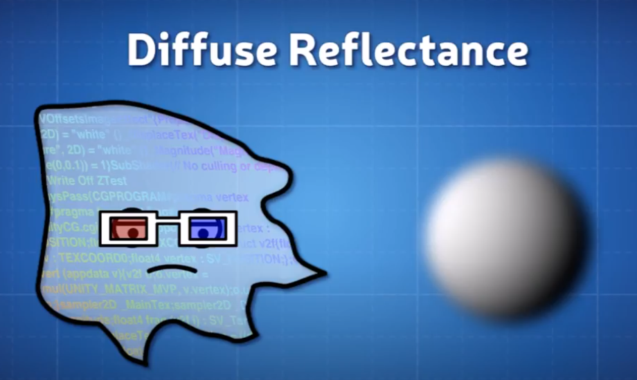
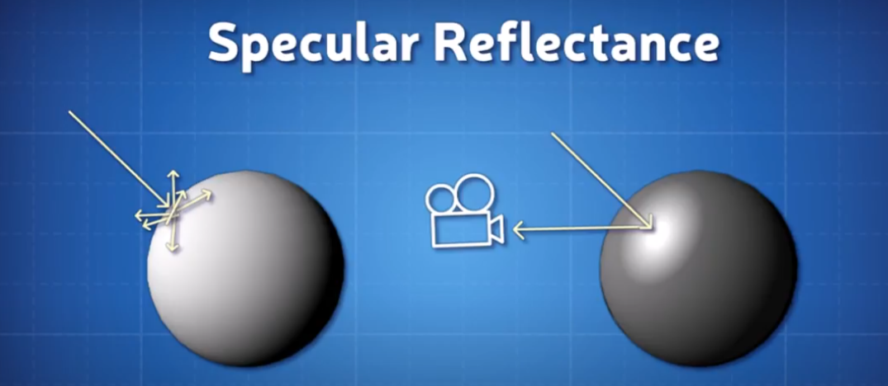
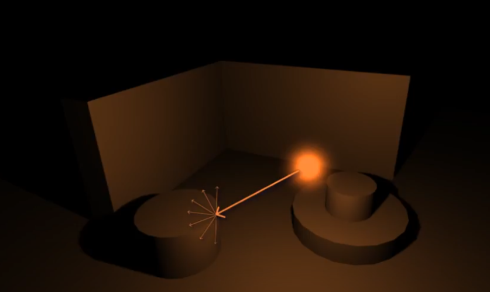
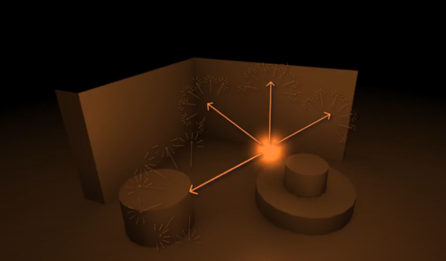
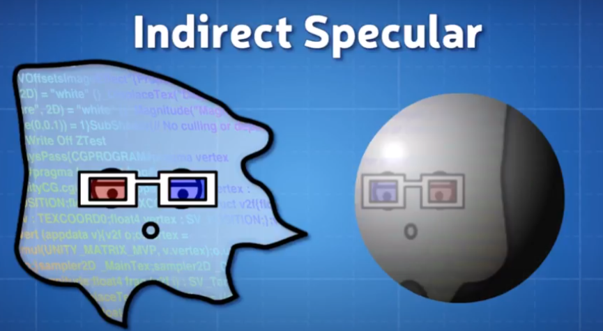
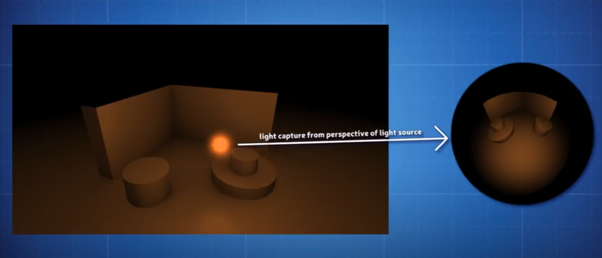
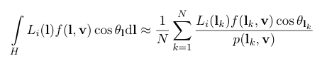
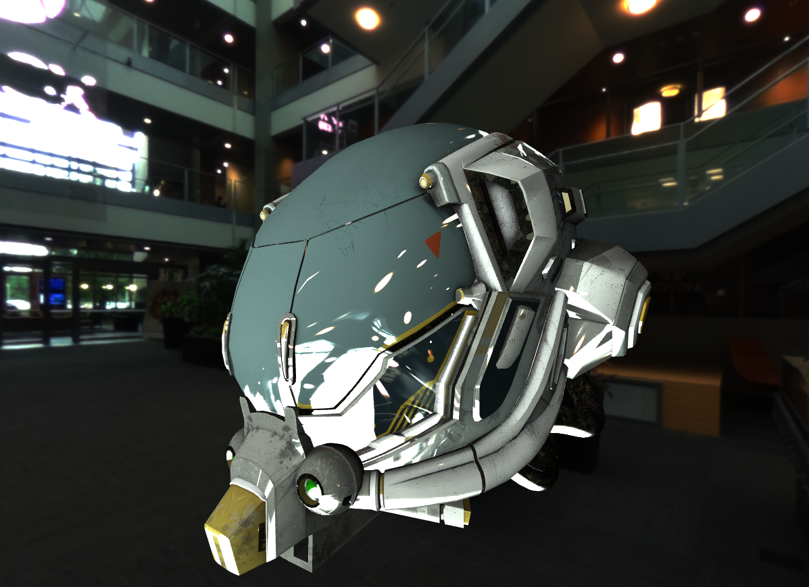

### DirectX11 - Image Based Lighting

이미지 기반 Lighting 도 결국엔 Physically Based Rendering 과 비슷한 Technique 이다. Unreal Engine 에서도 사용이 된다고 한다. 결국에는 "Lighting Based on Data Stored in An Image" 라고 생각을 하면 된다. 

Physically Based on Shading 안에서 일단, Lighting 에는 두개의 정보가 있다. Direct Diffuse, Direct Specular, Indirect Diffuse, Indirect Specular Term 이 있다. 일단 Diffuse 자체는 얼마나 빛이 Scatter 되는지를 나타낸다. (그래서 Labertian Reflectance) 하지만 아래의 그림 처럼 Material Definition 을 정확하게는 알지못한다. (하지만 Roughness 과 matte 는 판단 가능하지만, Glossy 는 모른다.) 



이걸 판단하기 위해서는, Specular Reflectance 가 필요하다. 아래처럼 matte 같은 경우에는 대부분 Bounce 되지만, Glossy 인 물체에는 Camera Align 되면서 Single Direction 인 빛을 반사한다. 이말은 결국에는 카메라 시점에 따라서 빛이 물체에 어디에 빛을 비추는지가 Tracking 이 된다는 소리이다.



Direct 와 Indirect 의 차이를 보자면, 결국엔 DirectLight 과 PointLight 이 대표적인 Source 인것 같다. Indirect 같은 경우에는 DirectLight Source 가 어떠한 물체에 부딫혔을때, 반사광들이 Indirect Light Source 라고 말할수 있다. 아래의 그림을 보자면, Point Light 은 결국엔 Diffuse Direct Light 이며, 물체에 부딫혔을때 반사되는 빛들이 Indirect Light 이라고 할수 있다. 그 다음 이미지가 Indirect Diffuse Lighting 에 의해서 주변이 밝아지는 현상을 뜻한다. (즉 이말은 Directional Light 보다 더 밝게 주변이 빛춰진다.)




Indirect Specular 같은 경우는 High Glossy 에서 나타내는 현상중에 하나이다. 아래 처럼 glossiness 가 높으면 높을수록 반사되는게 보인다? 반사되는게 보인다는건, Model Mesh 주변(Enviornment) 를 볼수있다 라고 말할수 있다.



이제 IBL 하고 연관되게 설명을 하자면, 이렇게 Indirect 를 모두 계산을 할수는 있지만 아무래도 한계점이 있다. 그래서 하나의 Light Source 가 있다고 가정하고, 모든 면에서 사진을 찍어서, Lookup Texture 로 만들면 좋지 않을까? 라는 형태가 Cubemap 형태 인것이다.



그리고 Unreal 에서 사용되는 Image-Based Lighting 의 공식은 아래와 같다. 그리고 이 공식에 대한 HLSL 에 대한 설명은 [여길](chrome-extension://efaidnbmnnnibpcajpcglclefindmkaj/https://cdn2.unrealengine.com/Resources/files/2013SiggraphPresentationsNotes-26915738.pdf) 찾아보면 좋을것 같다.



---
위 처럼 결국에는 Cubemap 이 어떻게 생성이됬고, 어떤게 IBL 을 어떻게 계산하는지는 Environmental Mapping 에서 보았다. 그럼 구현 단계를 생각을 해보자.

일단 IBL Texture 같은 경우, 위에서 이야기한것처럼 specular / diffuse IBL DDS Files [예제](https://freepbr.com/) 들이 존재 할것 이다.
 
그리고 코드로서는, CubeMapping Shader 에서는 Specular (빛이 잘 표현되는) Texture 만 올리고, Model 을 나타내는 Pixel Shader 에서는 Specular 와 diffuse texture 을 둘다 올리면 된다. (CPU 쪽 Code 는 생략)

그래서 HLSL 에서는, Cube Texture 를 받아서, Sampling 을 하고, 평균을 내서 Specular 는 표현을 하고, Texture 를 사용한다고 했을시에는 아래 처럼 분기처리해서 Diffuse 값에다가 은은하게 표현이 가능하다.

```
Texture2D g_texture0 : register(t0);        // model texture
TextureCube g_diffuseCube : register(t1);   // cube (diffuse)
TextureCube g_specularCube : register(t2);  // cube (specular)
SamplerState g_sampler : register(s0);

float4 main(PixelShaderInput input) : SV_TARGET
{
    float4 diffuse = g_diffuseCube.Sample(g_sampler, input.normalWorld);
    float4 specular = g_specularCube.Sample(g_sampler, reflect(-toEye, input.normalWorld));
    specular *= pow((specular.x + specular.y + specular.z) / 3.0, material.shininess);
    
    diffuse.xyz *= material.diffuse; // separtae r, g, b   
    specular.xyz *= material.specular;
    
    if (useTexture)
    {
        diffuse *= g_texture0.Sample(g_sampler, input.texcoord);
    }
    return diffuse + specular;
}
```

결국에는 마지막은 Phong-Shading 처럼 덧셈(aggregate)을 해준다. Parameters 를 잘섞어서, 내가 이 Model 을 잘 표현했다는 결과는 아래와 같다.



### Resource
* [Youtube](https://www.youtube.com/watch?v=xWCZiksqCGA&ab_channel=DanMoran)
* [OldWatch - IBL](https://www.shadertoy.com/view/lscBW4)
* [CMF](https://github.com/dariomanesku/cmftStudio?tab=readme-ov-file)